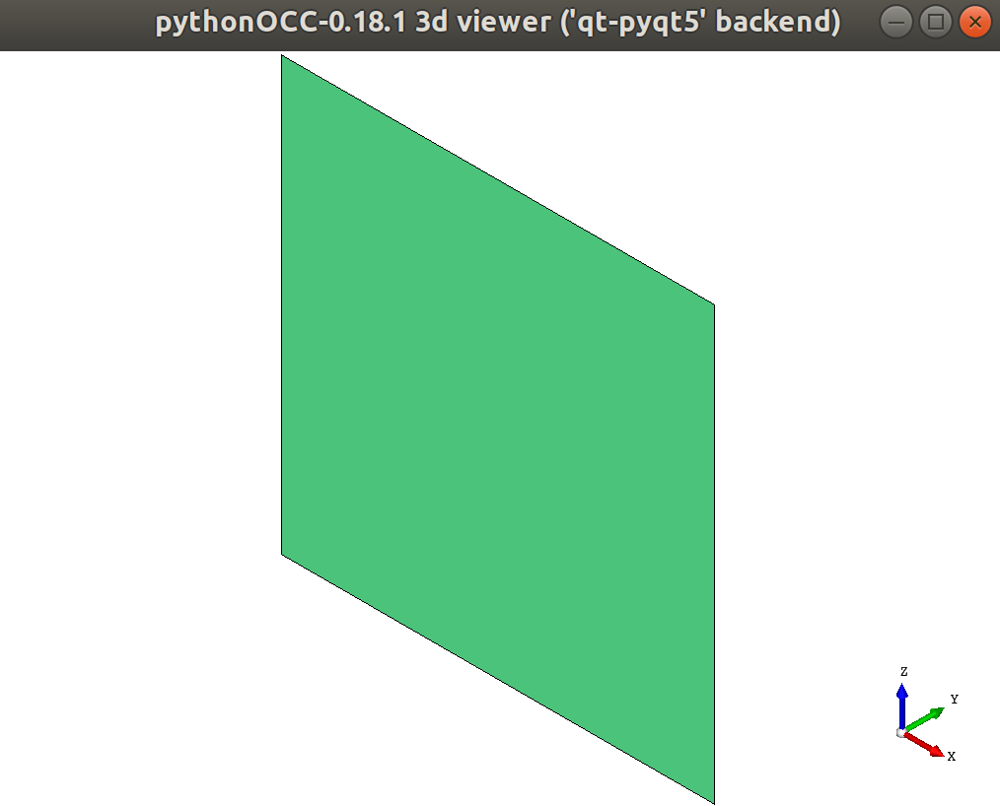
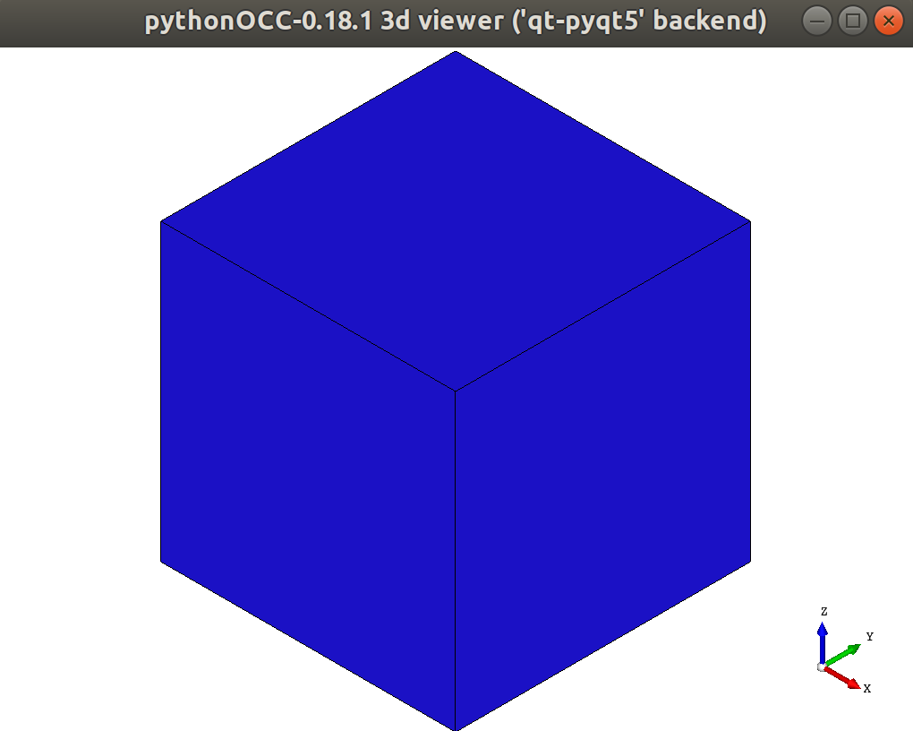
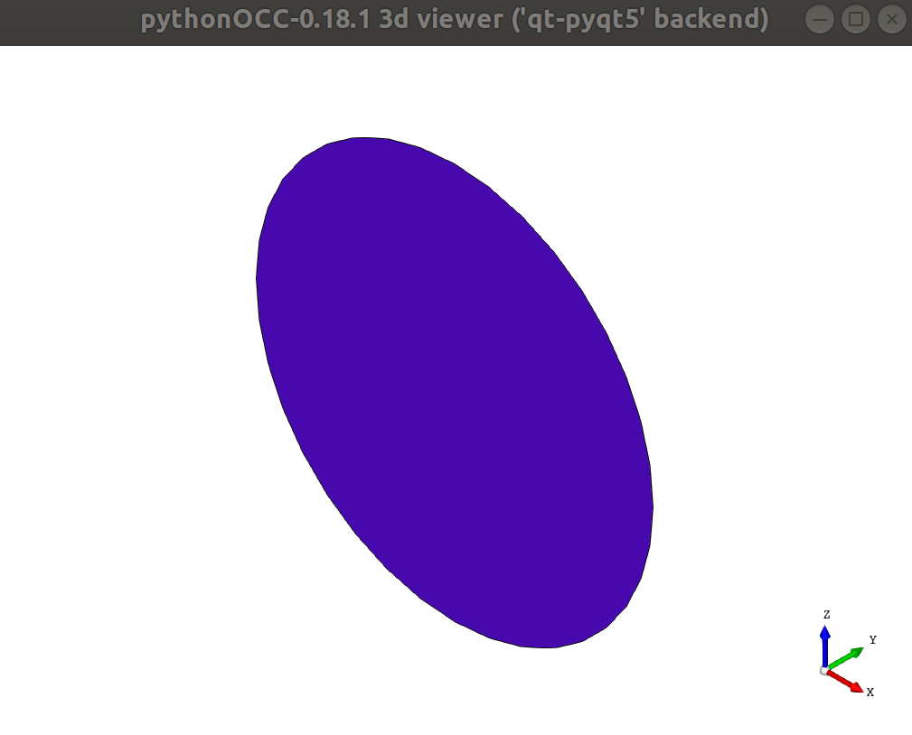
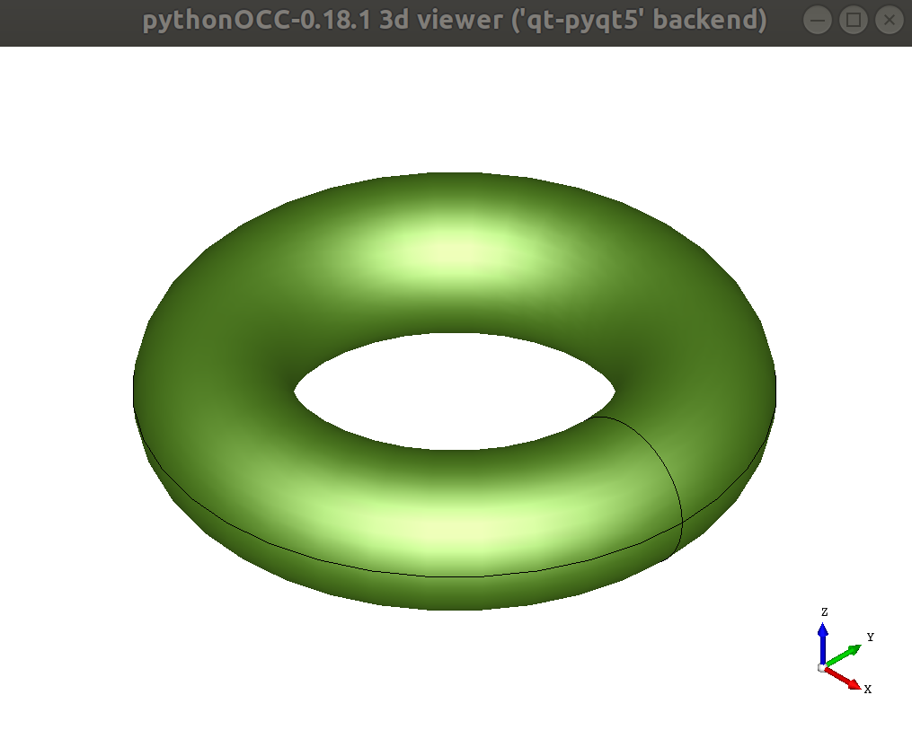
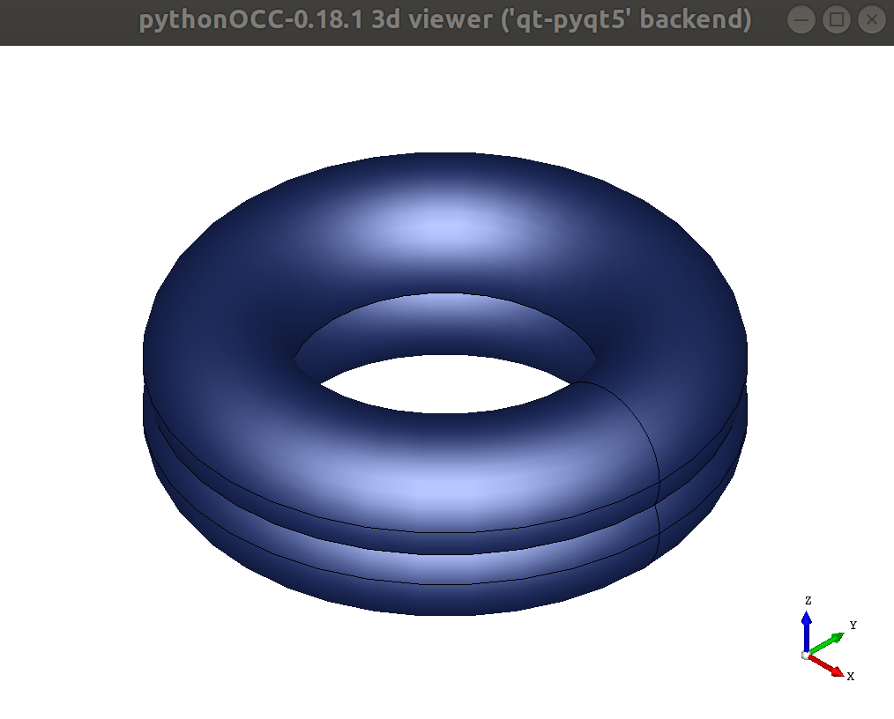
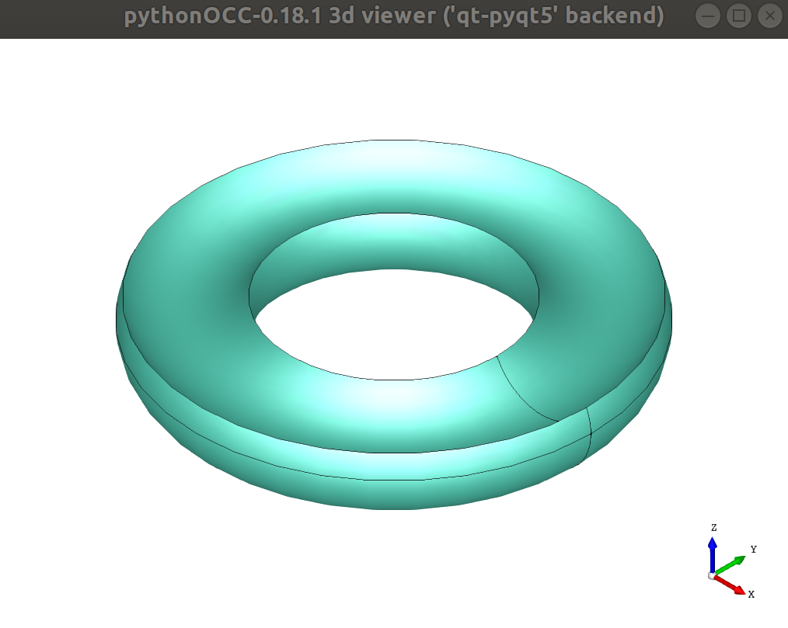
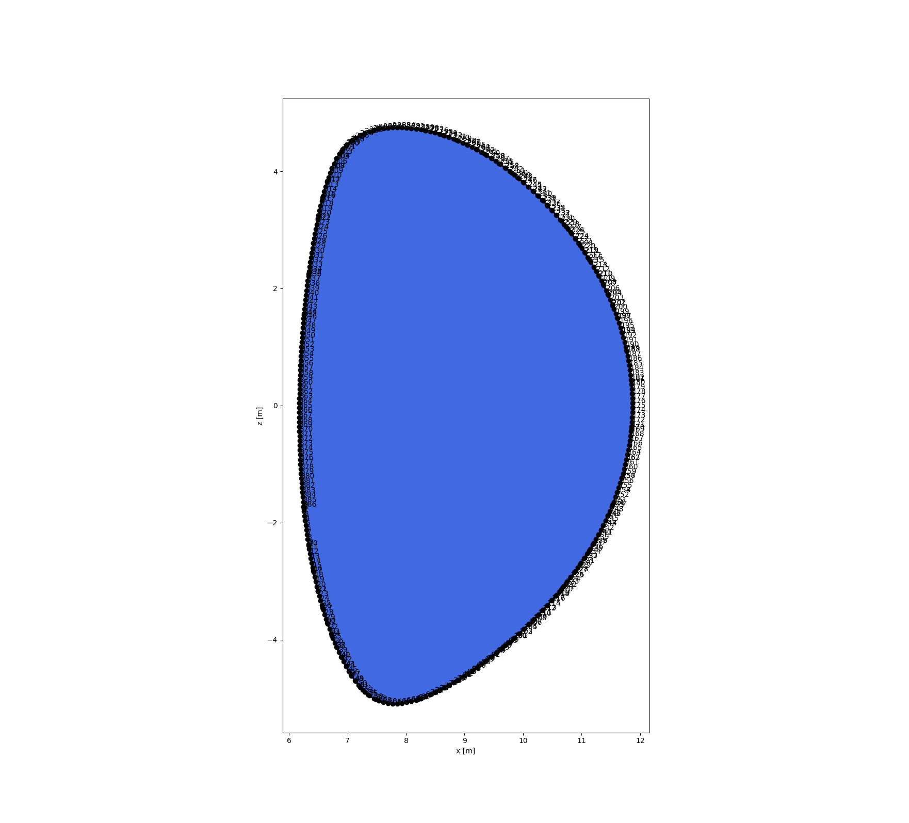
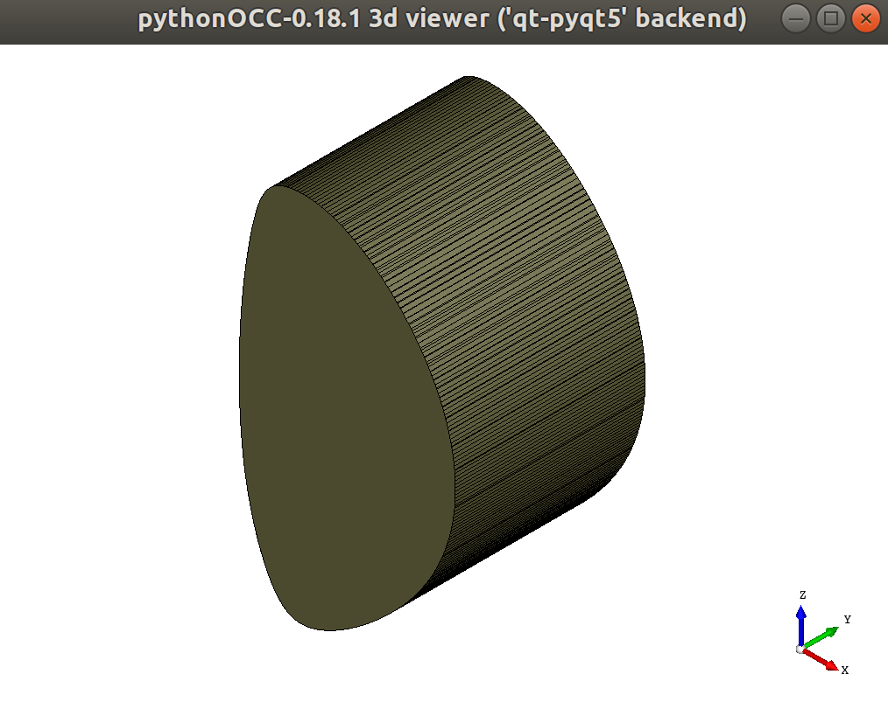
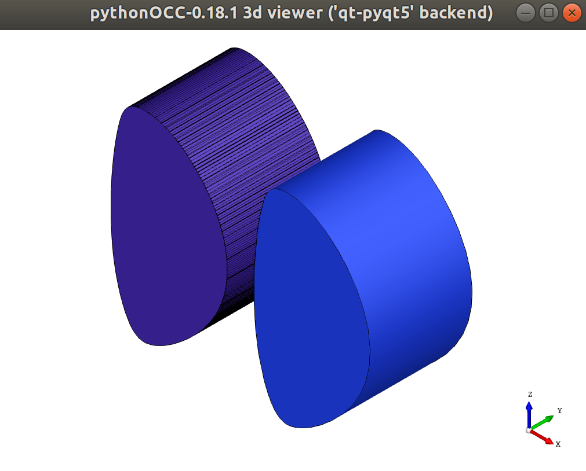

cad
===

This module was written by Matti Coleman, and is based heavily on open source software (in particular OCC, and pythonOCC (Thomas Paviot)). This module has also received contributions from the works of:

Simon McIntosh, UKAEA/ITER Organisation, United Kingdom, who's contributions to the coil CAD representations from Nova in particular are much appreciated.

The author is greatly indebted to the above.

CAD tutorial
------------

This is a little tutorial on how to make CAD in BLUEPRINT.

The cad module is basically a wrapper around an existing python interface to a much lower level library (OCE).

With it, you can convert geometry objects (Loop, Shell) into CAD objects, using terminology familiar to those who have used CAD programs in the past.

The basic idea behind any 3-D CAD is to start with some primitives (points, lines, splines, etc.) to make 2-D objects, to then make 3-D objects.

A lot of this module simplifies out the first two steps, leaving you to worry about what you want to make.

.. note::

	The `cad` module makes heavy use of the `geometry` module. I recommend you start there

First, let's load some tools:

.. code-block:: python

	import os
	from BLUEPRINT.base.file import get_BP_path
	from BLUEPRINT.geometry.loop import Loop
	from BLUEPRINT.geometry.shell import Shell
	from BLUEPRINT.cad.cadtools import (
	    make_face,
	    make_shell,
	    make_circle,
	    make_axis,
	    revolve,
	    extrude,
	    translate_shape,
	    boolean_fuse,
	    boolean_cut,
	    show_CAD,
	)

Make a cube
###########

Let's say we want to make a cube. Here's one way of doing it:
	#. make a square of size L
	#. extrude the square by length L

Step 1: make a square

.. code-block:: python

	# For this we use a geometry object: Loop, which is a collection of coordinates
	square = Loop(x=[2, 4, 4, 2, 2], z=[2, 2, 4, 4, 2])

	# Now, we need to make a 2-D CAD representation of the square. This kind of
	# object we will call a "face". "make_face" takes a Loop object

	face = make_face(square)

	# Now let's say you want to look at your square face.

	show_CAD(face)

Step 2: extrude the square

We use the extrude function for this, and there are different ways of specifying the extrusion:

.. code-block:: python

	# 2.1: specifying the length and axis
	cube1 = extrude(face, length=2, axis="y")

	# 2.1: with the "vec" argument,
	cube2 = extrude(face, vec=[0, 2, 0])

	# Let's check that these produced the same result...

	show_CAD(cube1, cube2)

Huh? only one cube? They are on top of each other! So let's move one away a little bit

.. code-block:: python

	cube2 = translate_shape(cube2, [4, 0, 0])

	show_CAD(cube1, cube2)

.. image:: ../images/cad/show_CAD3.png

Make a torus
############

Let's say we want to make a torus. Here's one way of doing it:
	#. make a circle of radius R2, at centre (0, R1)
        #. revolve the circle by 360 degrees

Step 1: make a circle

For this we have to proceed a little differently, as making a circle with lots of individual points (like in a Loop object) isn't very good for CAD. We use a direct implementation of a circle in OCC/OCE. This directly gives us a face object

.. code-block:: python

	face = make_circle(centre=[R1, 0, 0], direction=[0, 1, 0], radius=R2)
	# (note the 3-D coordinate interface)

	show_CAD(face)

Step 2: revolve the circle

But... about what? We need to make an axis object first:

.. code-block:: python

	axis = make_axis([0, 0, 0], [0, 0, 1])  # about the z-axis

	torus = revolve(face, axis)

	show_CAD(torus)

Boolean operations
##################

Let's say your boss is really impressed by lots of CAD. You're going to need to stick your CAD bits together...

Let's take our torus, make a copy, move that to the side a little, and stick them together... to make a doublet torus shape.

.. code-block:: python

	torus2 = translate_shape(torus, [0, 0, 2.5])

	doublet = boolean_fuse(torus, torus2)

	show_CAD(doublet)

What about the opposite result?

.. code-block:: python

	cutlet = boolean_cut(torus, torus2)

	show_CAD(cutlet)

More complex shapes
###################

For this we're going to load some Loop shapes from files.

.. code-block:: python

	path = get_BP_path("cad/test_data", subfolder="tests")
	name = "plasmaloop.json"
	filename = os.sep.join([path, name])

	plasma = Loop.from_file(filename)

	# OK, but how many points are we dealing with here?
	print(f"number of points in plasma: {len(plasma)}")
	>>> number of points in plasma: 387

	# That's starting to be a lot... what does it mean in practice?

	plasma.plot(points=True)

When we make a face from a Loop, it draws lines between all the individual points. Let's try it:

.. code-block:: python

	face = make_face(plasma)
	# Just extrude it a little bit to see a bit more of what is going on...
	plasma_block = extrude(face, vec=[0, 5, 0])

	show_CAD(plasma_block)

OK, so that's some really nasty CAD... Lines everywhere. Large object/file size. What can we do about it?

In general, for curvy shapes, Bezier splines are much better for CAD than lots of points:

.. code-block:: python

	face = make_face(plasma, spline=True)
	plasma_block2 = extrude(face, vec=[0, 5, 0])
	plasma_block2 = translate_shape(plasma_block2, [7, 0, 0])
	show_CAD(plasma_block, plasma_block2)

