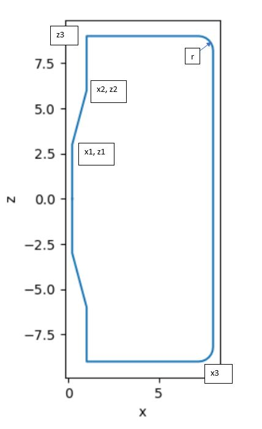

Tapered TF coils
================

This document refers to the ``CurvedPictureFrame`` or ``CP`` coil type in ``tfcoils.py``.  

Overview
--------
The Curved Pictureframe (“CP”) shape of TF coils is a variant of the regular Pictureframe
coils with either one or both of the top and bottom legs domed. This is mainly to make 
room for a long-legged divertor, while keeping the PF coils as close as possible to the 
plasma. 

    

    CP Coil Parameterisation

The  list of inputs parameters follows the pattern from the Tapered picture frame  coils, 
with additional inputs for the location of the Centrepost-Outer Legs joint (xcurve) and the 
dome height from midplane (zmax  ). It should be noted that the tapered centrepost is only 
present for Resistive Coils (with a bucking cylinder, like TP coils), to keep the plasma 
closer to the inboard coils and reduce the radial size of the overall reactor. 
Superconducting SC coils have a flat inboard leg, reflected in the variable values below. 

The parameters can be mapped to BLUEPRINT input variables as follows:
    *   x_in: r_tf_inboard_out + tk_tf_ob_casing (Resistive Coils)
  
            *	(radial position of winding pack plasma facing side of inboard leg + casing thickness)

        *	r_tf_in + tk_tf_inboard (Superconducting Coils)

            *	(radial position of start of inboard leg + inboard leg full thickness)

    *	x_mid: r_cp_top + tk_tf_ob_casing (Resistive coils)

        *	(radius of top of taper + casing thickness)

        *	x_mid = x_in (Superconducting Coils)

    *	x_curve_start = r_tf_curve

    *	z_in = h_cp_top (Resistive)

            *	(height of top of tapered section)

        *	= 0 (Superconducting)

    *	z_mid_up = Keep Out Zone (KOZ) max height

    *	z_mid_down = KOZ min height

    *	z_top = h_tf_max_in

            *	(max height of coil)

    *	z_bottom = h_tf_min_in

            *	(min height of coil)

    *	r_c = 0.5 (hard coded)

    *	x_out = floating (for optimiser) 

Note that that these represent the innermost (or closest to plasma centre) x-z loop in accordance 
with the TF coil build procedure, and therefore may not represent the ‘true’ coil dimensions. For 
example, the casing around the centrepost for Resistive coils is removed later in build procedure.
As is evident from the variable list, the radii and angular extent of the centrepost tapering (if 
applicable) and the top/bottom leg arcs is not specified as an input. The parameterisation must 
therefore construct these arcs from the given inputs. The maths for this is described below.

Parameterising a Circle from a Chord Length   
-------------------------------------------

The Chord height and length can be evaluated from the input parameters
    :math:`\alpha =tan^(-1)⁡(0.5*w/h)`
With the angle swept by the arc calculated as:
    :math:`\theta = 2(\pi - 2\alpha)`
And the radius:
    :math:`r = 0.5*w / sin⁡(\theta/2)` 

Top/Bottom Leg Domes:

For the top and bottom legs, first a ‘basic’ arc is defined as above, with the chord height and width 
defined below as:

    h = z_top - z_mid

    w = x_out - x_curve_start

This, alone, would result in a sharp corner between the straight portion at the inboard side of the 
of the top/bottom leg and the curved section  as show in Fig. xa. A second curve must be defined to 
smooth out this corner , resulting in a smooth curve like in Fig xb.
  
Figure 2

Smoothing Curve
To  define the smoothing curve a tangency condition is defined between the end point of the transitioning 
curve and some point ‘A = (x_A, z_A)’ on the ‘basic’ Top/Bottom Leg arc. The basic curve is then ‘clipped’ 
so that it starts at ‘A’ instead of its original point, with the transitioning curve occupying the remaining 
space. The radius of the joint curve must be set as an input.

The Joint Curve and Final Dome arc swept angles can therefore be defined:
    :math:`\theta_j = cos^(-1)⁡((r_leg  cos⁡(0.5θ_(leg_basic ) )  + r_j)/(r_leg+ r_j ))`
    :math:`\theta_leg_final = \alpha_leg  - (\theta_leg_basic/2   -\theta_j )`

The above parameters define the CP coil loop. The innermost loop is then offset and built in accordance with 
the TF coil build procedures.

