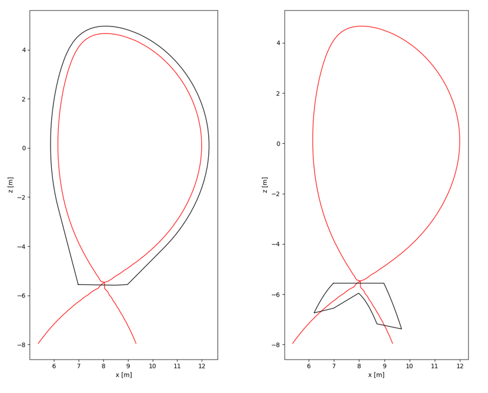
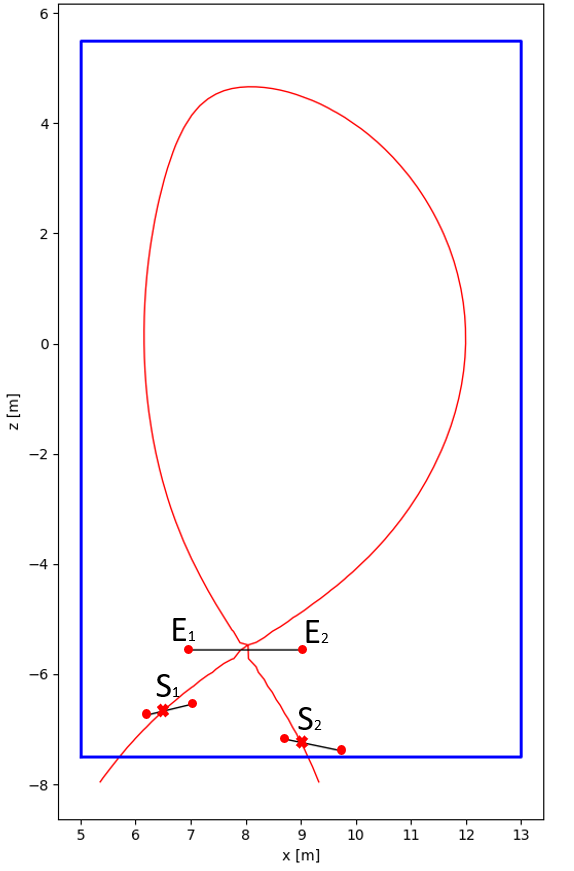
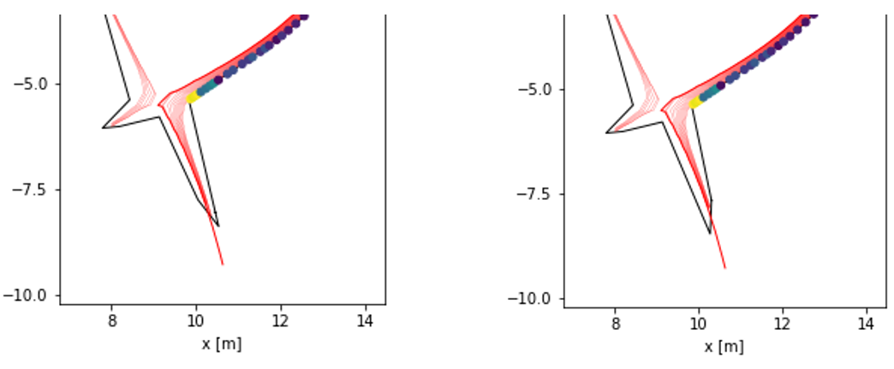
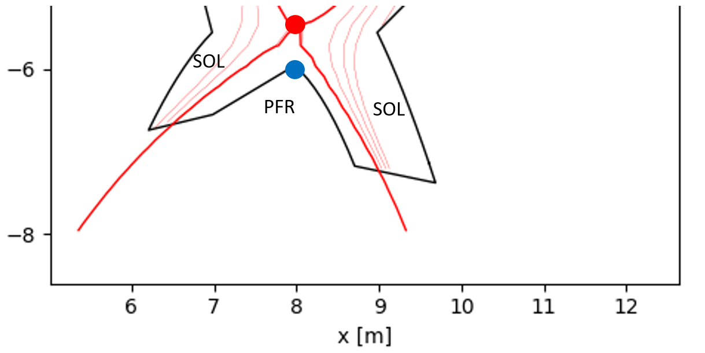
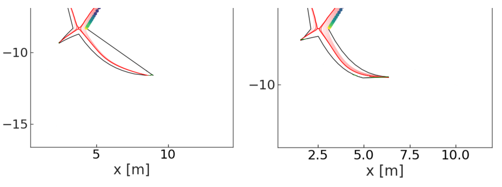

Divertor Shaping
================

This document refers to the ``DivertorBuilder`` class in ``firstwall.py``.  

Overview
--------
The divertor profile shaping can be seen as a geometrical parametrisation. 
Such parametrisation is obtained via external geometrical inputs, and the 
according equilibrium configuraion. Specifically, separatrix and flux 
lines in the divertor region. 
The top limit is a xz plane passing through the x-point(s).

   The two separate first wall profile and divertor profile 

Divertor entrance
-----------------
The divertor profile starts to be drawn from the x-point. 
Hence the divertor entrance has the z coordinate of the x-point. 
The lower threshold of how wide this aperture should be, is decided by the user 
through two inputs:

* xpt_outer_gap: Gap between x-point and outer wall
* xpt_inner_gap: Gap between x-point and inner wall

From the first wall profile optimisation, if the aperture needs be wider to handle 
the heat loads, the abovementioned inputs are overwritten accordingly.

Divertor target plates
----------------------
How long the divertor should be is decided by the divertor strike point position.
As first input, the user has to decide the strike points, meaning where the separatrix
has to intersect inner and outer target. The two unique points are set giving:

* outer_strike_r: Outer strike point major radius
* inner_strike_r: Inner strike point major radius

However, these inputs can be constrained, shifting from independent to dependent variables.
This is the case if a "keep out zone" (koz) is given in input. If so, this draws a border 
outside of which the entire first wall profile cannot be extended.

Alternatively, the strike points can be determined using the intersection between a 
Keep out Zone 2D loop, and the separatrix. In such case, it should be noted that there is 
no guarantee for any is any intersection to occur. It may happen that, even though the 
strike point falls with the koz, the target plates extends to the outside.

Two functions, namely ``find_strike_points_from_koz`` and ``find_strike_points_from_params`` 
sort the options.

Once identified the strike points, the user can decide how long the plates should be, 
giving:

* tk_outer_target_sol: Outer target length between strike point and SOL side
* tk_outer_target_pfr: Outer target length between strike point and PFR side
* tk_inner_target_sol: Inner target length between strike point and SOL side
* tk_inner_target_pfr: Inner target length between strike point and PFR side

   Schematic of key points to draw the divertor. :math:`E_1` and :math:`E_2` are the divertor entrance end points.
   :math:`S_1` and :math:`S_2` are the strike points. The target plates are within the keep out zone (blue line).

Additionally, the function ``make_divertor_target`` gives the option of selecting 
between vertical and horizontal target. The key parameter is ``vertical_target`` 
and by default the boolean ``True`` is assigned. Giving ``vertical_target=False`` 
the option horizontal target is selected.

   On the left, the divertor configuration with the horizontal outer target. 
   On the right, the divertor configuration with the vertical outer target.

Finally the plates can be tilted. The user can assign an angle between flux 
line and target plate:

* theta_outer_target: Angle between flux line tangent at outer strike point and SOL side of outer target
* theta_inner_target: Angle between flux line tangent at inner strike point and SOL side of inner target

To be noticed, the abovementioned :math:`\theta` is not the glancing angle, 
commonly indicated with :math:`\gamma`, but its component over a poloidal plane.
A further, and better description should accept the actual glancing angle as input.

Divertor legs
-------------
Once top limit (divertor entrance) and bottom limit (divertor targets) are defined, 
these need to be connected, thus the divertor legs need to be drawn.

Firstly, the user has to input where outer leg and inner leg will meet in the 
private flux region (below the x-point), providing ``xpt_height``, the x-point vertical gap.

The divertor legs are drawn using "guide lines". 
Both outer leg and inner leg have an "internal guide line" and an "external guide line".
The internal guide lines have in common the starting point. This is the "middle point", 
which has same x coordinate of the x-point and z coordinate which is shifted from the 
x-point by the above mentioned ``xpt_height``.
The guide lines reach the relative target end, and close the divertor profile in the
private flux region (PFR) side.
The external guide lines start from relative divertor aperture side, and reach relative 
target end, closing the divertor profile at the scrape-off layer (SOL) side.

   Schematic of the last divertor building step. The red dot (x-point) and the blue dot 
   (middle point) are spaced by "xpt_height". 

The guide lines have a curvature that is extrapolated by 
interpolating either the separatrix or a specific flux line function.
The curvature is tuned by changing the degree of the fitting polynomial, in order to 
keep the wall as close as possible to the scrape-off layer, and at the same time 
avoiding the intersection between flux lines and wall before they reach the divertor targets.
The degree can vary between 1 and 3. Degree uqual to 1 corresponds to a straight line.

   Divertor shape with different degree of the fitting polynomial at the outer leg. 
   On the left, the degree is equal to 1. On the right, the degree is equal to 3.

The inner leg is commonly shorter, and the separatrix and the last flux line in the 
scrape-off layer have similar curvature. Thus the function that describes the separatrix is 
interpolated to draw both "internal guide line" and "external guide line".
The outer leg is commonly longer, especially in a long leg divertor configuration, 
and the separatrix and the last flux line in the scrape-off layer can have divergent curvature. 
Thus, in the latter case, the function that describes the separatrix is interpolated to draw 
the "internal guide line", and the function that describes the last flux line in the scrape-off 
layer is interpolated to draw the"external guide line".

Although in the majority of cases, this procedure prevents from having intersections between 
wall and flux lines of the scrape-off layer, such unwanted scenario can still occur. 