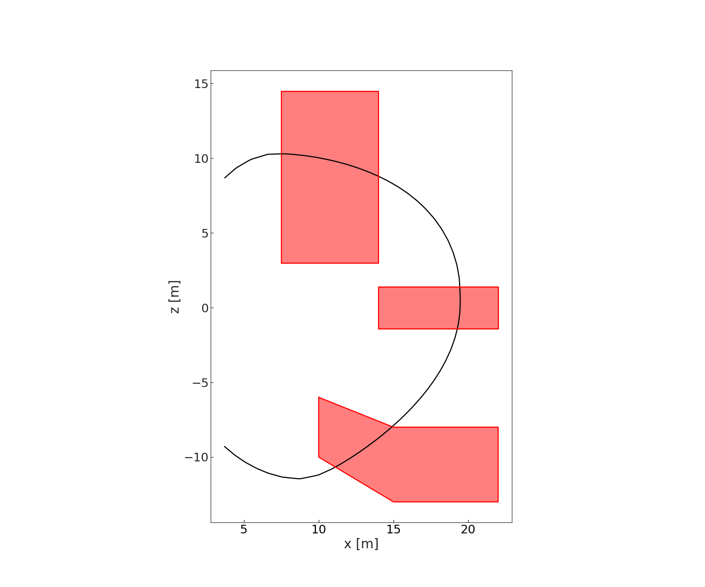
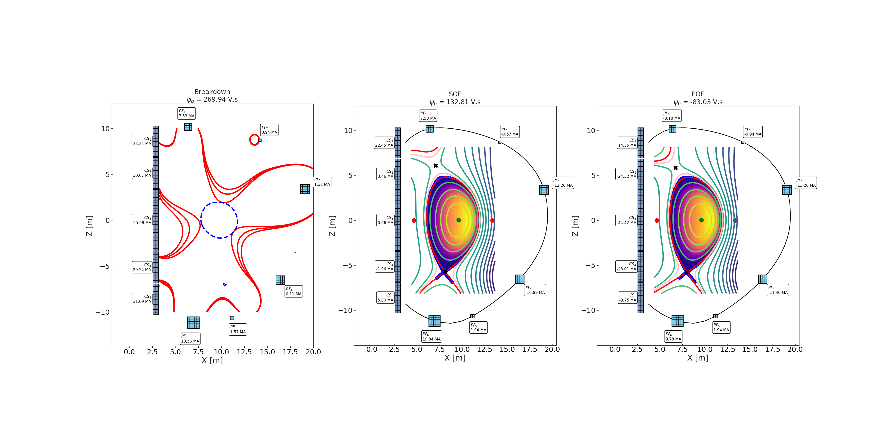

Practice
========

Many, many objects are used in order to create and optimise plasma MHD equilibra and poloidal field coilsets in BLUEPRINT.

The equilibria and PF system design problem has been boiled down as much as possible to an external interface, where many of the underlying steps are automated and parameterised.

Equilibrium design is a bit of a dark art, so "families" of solutions are specified, for e.g. a single-null or double-null, etc.

This page will walk you through the highest-level external interface to the `equilibria` module

First, in a Python console, let's load up some objects we will need:

.. code-block:: python

	import os
	import numpy as np
	import matplotlib.pyplot as plt
	from BLUEPRINT.base.file import get_BP_path
	from BLUEPRINT.base.lookandfeel import plot_defaults
	from BLUEPRINT.geometry.loop import Loop
	from BLUEPRINT.equilibria.run import AbInitioEquilibriumProblem
	from BLUEPRINT.equilibria.profiles import DoublePowerFunc

	# Clean up and make plots look good
	plt.close("all")
	plot_defaults()

Now, we're going to load a TF coil shape and use it as a track along which to optimise the positions of the PF coils

.. code-block:: python

	fp = get_BP_path("Geometry", subfolder="data")
	TF = Loop.from_file(os.sep.join([fp, "TFreference.json"]))
	TF = TF.offset(2.4)
	clip = np.where(TF.x >= 3.5)
	TF = Loop(TF.x[clip], z=TF.z[clip])
	TF = Loop(*TF.interpolate(200))

Choose a flux function parameterisation (with some initial values)
The shape function parameters will be optimised to meet the integral plasma parameters we specify later on

.. code-block:: python

	p = DoublePowerFunc([2, 2])

Set up an equilibrium problem (a typical sized pulsed EU-DEMO like machine)

.. code-block:: python

	SN = AbInitioEquilibriumProblem(
	    R_0=9,  # [m]
	    B_0=5.8,  # [T]
	    A=3.1,
	    Ip=19e6,  # [A]
	    betap=1.3,
	    li=0.8,
	    kappa=1.65,
	    delta=0.3,
	    r_cs=2.85,  # [m]
	    tk_cs=0.3,  # [m]
	    tfbnd=TF,
	    n_PF=6,
	    n_CS=5,
	    eqtype="SN",
	    rtype="Normal",
	    profile=p,
	    psi=None,
	)

Get an initial unconstrained solution with fixed (automatically positioned) PF coils.

.. code-block:: python
	
	# Just Tikhonov, for now
	eqref = SN.solve()

.. only:: html

	.. figure:: ../images/equilibria/unconstrained.gif

Let's look at the coilset on its own

.. code-block:: python

	SN.coilset.plot()

.. figure:: ../images/equilibria/coilset.png

Now, we're going to define some exclusion zones for the PF coils, along the TF Loop track we specified earlier

.. code-block:: python

	UP = Loop(x=[7.5, 14, 14, 7.5, 7.5], z=[3, 3, 14.5, 14.5, 3])
	LP = Loop(x=[10, 10, 15, 22, 22, 15, 10], z=[-6, -10, -13, -13, -8, -8, -6])
	EQ = Loop(x=[14, 22, 22, 14, 14], z=[-1.4, -1.4, 1.4, 1.4, -1.4])

	# Look at the "track" for the PF coil locations, and the exclusion zones:
	f, ax = plt.subplots()

	TF.plot(ax, fill=False)
	UP.plot(ax, edgecolor="r", facecolor="r", alpha=0.5)
	LP.plot(ax, edgecolor="r", facecolor="r", alpha=0.5)
	EQ.plot(ax, edgecolor="r", facecolor="r", alpha=0.5)

In `PositionOptimiser`, this is handled with the `XZLMapper` object. Let's set one up to see what it does:

.. code-block:: python

	from BLUEPRINT.equilibria.positioner import XZLMapper
	xzl_map = XZLMapper(TF)
	xzl_map.add_exclusion_zones([UP, EP, LP])
	xzl_map.plot()

.. figure:: ../images/equilibria/xzl_mapper.png
   :name: fig:exclusion_zones

   Diagram depicting the excluded areas of the track (in red) and the areas where coils (or anything else) may be positioned along the track (in black).

Now let's optimise:

* positions of the PF coils
* currents of the PF and CS coils

constraining:

* plasma shape
* plasma integral values (I_p, beta_p, l_i)
* coil positions         (L)
* coil currents          (I)
* coil forces            (F)
* field at coils         (B)
* pulse length           (tau_flattop)

The resulting equilibria will automatically be converged once the coil sizes have been fixed at their maximum (sometimes problematic for end of flattop)

.. code-block:: python

	SN.optimise_positions(
	    max_PF_current=25e6,  # [A]
	    PF_Fz_max=400e6,  # [N]
	    CS_Fz_sum=300e6,  # [N]
	    CS_Fz_sep=250e6,  # [N]
	    tau_flattop=1.5 * 3600,  # [s]
	    v_burn=0.04,  # [V]
	    psi_bd=None,
	    pfcoiltrack=TF,
	    pf_exclusions=[LP, EQ, UP],
	    CS=False,
	    plot=True,
	    gif=False,
	)

.. only:: html

	.. figure:: ../images/equilibria/pos_opt.gif

.. note::

	In the above, we didn't specify the flux at breakdown, so the `AbInitioEquilibriumProblem` automatically calculates it (with the initial coil positions). Once the coil positions have been optimised, it recalculates the breakdown flux, and warns the user if it is lower than the previously achieved breakdown flux.

.. warning::
	
	The above is fairly common... the breakdown optimiser needs a facelift.

Now look at the end result of the equilibria optimisation problem. 

.. code-block:: python

	plt.close("all")
	SN.plot_summary()

Get some summary information across the pulse

.. code-block:: python

	SN.report()
	>>> Target      SOF      EOF
	    --------  --------  -------  -------
	    R_0        9        9.01     9.01
	    A          3.1      3.12     3.13
	    kappa      1.65     1.64     1.64
	    delta      0.3      0.25     0.26
	    I_p        1.9e+07  1.9e+07  1.9e+07
	    l_i        0.8      0.81     0.8
	    beta_p     1.3      1.34     1.34
	    q_95_min   3        3.88     3.91

	

Look at the optimiser's work

.. code-block:: python

	print(SN.opt_report())
	>>> Coil / Constraint      I_max (abs) [MA]    I [MA]    I [MA]    I [MA]    B_max [T]    B [T]    B [T]    B [T]  F_z_max [MN]      F_z [MN]    F_z [MN]    F_z [MN]
	    -------------------  ------------------  --------  --------  --------  -----------  -------  -------  -------  --------------  ----------  ----------  ----------
	    PF_1                               7.53      7.53      7.53     -3.18         11.5     3.76     3.8      2.92  400.00             -201.8       -54.72       23.12
	    PF_2                               0.94      0.94     -0.67     -0.94         11.5     1.39     1.77     2.15  400.00              -10.12       10.64       14.89
	    PF_3                              13.26      1.32    -12.26    -13.26         11.5     1.62     4.48     4.79  400.00               -3.13       84.57       91.46
	    PF_4                              11.42      0.11    -10.89    -11.4          11.5     0.44     4.57     4.73  400.00                0.44     -155.94     -163.34
	    PF_5                               1.94      1.57      1.94      1.94         11.5     1.78     0.96     1.15  400.00               14.73       25.02       25.02
	    PF_6                              19.84     10.56     19.84      9.78         11.5     5.25     6.73     3.14  400.00              283.3       139          68.52
	    CS_1                              33.31     33.31     22.45     14.35         13      11.76     6.6      2.33  N/A                -645.13      -46.26      -29.57
	    CS_2                              33.31     30.67      3.46    -24.32         13      11.62     2.59     8.57  N/A                  40.78       -9.93       69.75
	    CS_3                              66.62     55.98      0.66    -44.42         13      11.04     1.39     9.97  N/A                  14.9        -0.01        0.62
	    CS_4                              33.31     29.54     -1.96    -28.01         13      11.29     1.29     9.82  N/A                 -13.43       -5.59      -80.02
	    CS_5                              33.31     31.09      5.8      -9.75         13      11.3      2.98     4.39  N/A                 509.74       12.04      -20.25

