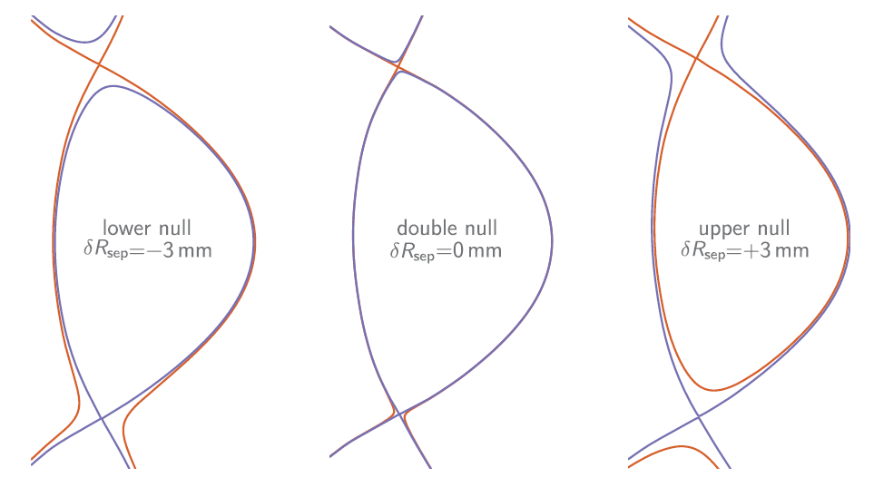
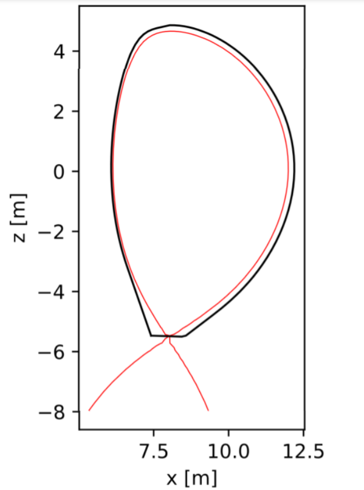
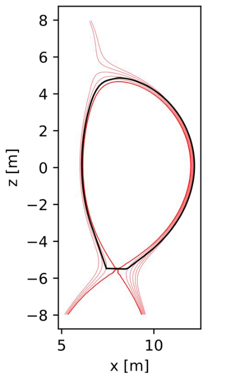
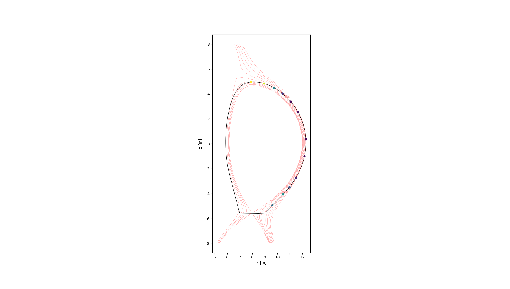
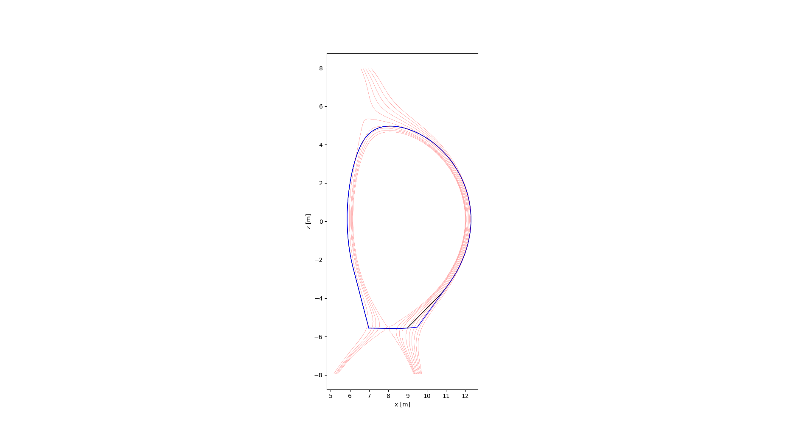
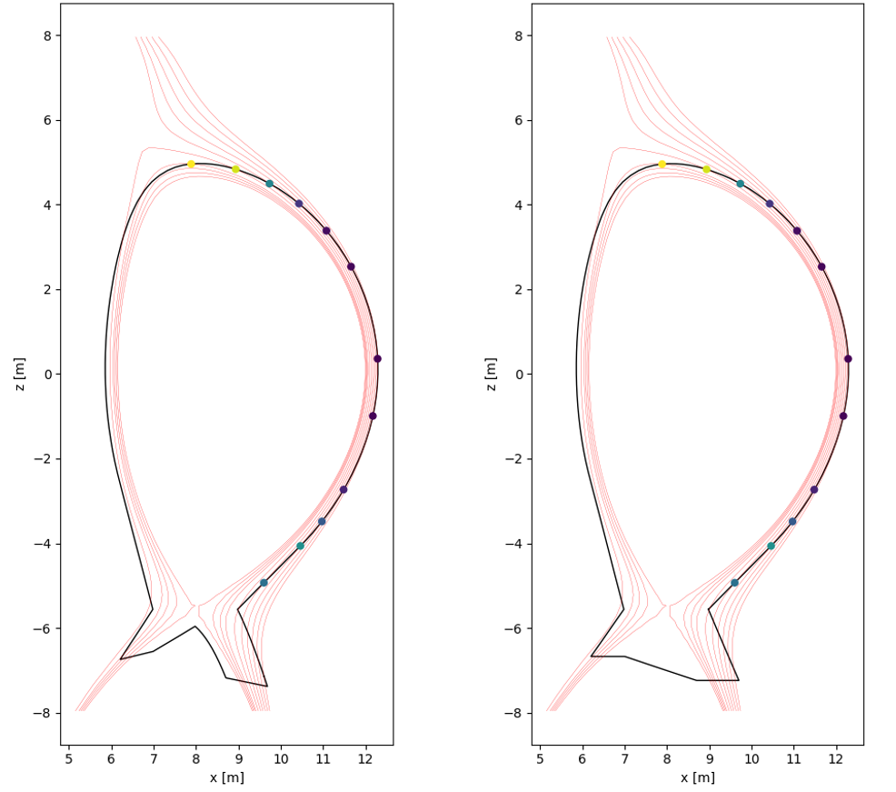

First wall profile procedure
============================

This document refers to the classes ``FirstWall``, ``FirstWallSN``, and ``FirstWallDN`` in ``firstwall.py``.  

Overview
--------
Provided a plasma equilibrium, the ``FirstWall`` class allows to design 
a first wall profile and optimise it, in order to reduce the heat flux values 
within prescribed limits. 
The first wall profile can be made either for the Single Null (SN) or the 
Double Null (DN) divertor configuration.

For SN configurations, the charged particles are predominantly released in the outbard side 
(low magnetic field driving weak confinement), hence we assume the particle source to be in 
the Outboard Mid-Plane (OMP). The particle are then assumed to travel towards 
both Low Field Side (LFS), and High Field Side (HFS).

The double-null divertor configuration has two magnetic separatrices, presenting an up-down symmetry.
In this divertor configuration, the majority of the exhaust power tends to flow to the outer legs. 
As for the SN divertor configuration, the particle source can be assumed at the OMP.
According to [Brunner_2018]_, the "null balance" is quantified by :math:`\delta R_{sep}`, distance between
the two magnetic separatrices. A negative value corresponds to lower null, a positive value to upper null,
and :math:`\delta R_{sep}` = 0 corresponds to a ideal double null.

   Equilibrium, last closed flux surface, and secondary separatrix for lower null, double null, 
   and upper null magnetic topologies [Brunner_2018]_.

The primary divertor is the one that is directly connected to the LCFS. Assuming a upper divertor, 
the power crossing only the primary separatrix goes to relevant targets. 
From the primary scrape-off layer, the power crossing the secondary separatrix is split, 
and goes towards upper and lower divertor.

In our model, we assume :math:`\delta R_{sep}` = 0, and the power shared 50%-50% between 
upper and lower divertor.
At double null, the fraction of the total power flux to the inner divertors is ~5% for L-mode, 
<20% for H-mode, and <10% for I-mode.
In our model we assume this fraction to be 10%, and in order to drive relevant power 
to lower and upper inner plates, we make the further assumption of a secondary particle source
at the Inboard Mid-Plane (IMP).

Input
-----
* Equilibrium parameters
 
 The equilibrium is either generated or read by BLUEPRINT via the ``Equilibirum`` class.
 The input is given to ``FirstWall`` as dictionary, and relevant parameters are extracted
 by the parent class ``EqInputs``.

* Type of plasma (e.g. SN, DN)
* First wall geometrical offset, :math:`\Delta_{fw}` (``fw_dx``)
  (Starting offset between plasma and wall. Either a single value 
  or two different values for inboard and outboard).
* Scrape-off layer power decay length, :math:`\lambda_{q,nearSOL}` and 
  :math:`\lambda_{q,farSOL}` (``fw_lambda_q_near`` and ``fw_lambda_q_far``)
* Power crossing the SOL, :math:`P_{SOL,near}` and :math:`P_{SOL,far}`
  (``fw_p_sol_near`` and ``fw_p_sol_far``)
* Hypothetical power sharing among targets 
  (``f_outer_target`` and ``f_inner_target``)
* Divertor baffle opening (``xpt_outer_gap`` and ``xpt_inner_gap``)

Output
------
- Heat flux values at the first intersections between flux lines and first wall

Procedure
---------
* Load equilibrium file
* Extract key attributes

  * Last Closed Flux Surface (LCFS)
  * O-point coordinates
  * X-point(s) coordinates
  * Separatrix

* Make preliminary first wall profile
  
 The preliminary first wall profile is drawn following some objects referred as "guidelines". 
 These guidelines are the flux lines chosen by the designer, according to 
 the input :math:`\Delta_{fw}` and other inputs. 
 Either the same offset or two different offsets can be used at the inboard mid-plane and 
 outboard mid-plane.

 For the single null, the guideline is a ``convex_hull`` between a first loop obtained by 
 offsetting the LCFS by :math:`\Delta_{fw}`, and a second loop, obtained by getting the 
 flux surface with a given ``fw_psi_n`` (normalised psi boundary).

 For the double null, two guide lines are selected. They are the flux lines passing through 
 the points lying on the mid-plane (IMP and OMP), and offsetted by :math:`\Delta_{fw}` from the LCFS.
 The obtained flux line(s) is cut below the X-point and/or above the upper X-point.

 As additional constraint, the preliminary first wall profile is forced by the divertor baffle opening. 

   Preliminary first wall profile with a different minimum plasma-wall clearance at inboard and
   outboard midplane.

* Make flux surfaces

 The region between the LCFS and the preliminary profile is "filled" with a set of flux surfaces.
 Thus, the SOL is discretised by flux surfaces (lines) spaced apart by a given dx. 

   SOL discretised by a finite number of flux surfaces

* Find intersections

 Each flux line intersects the first wall in at least one point.
 More likely there are several intersections but only the first one 
 correspondes to a power contribution into the wall. 
 Once a flux line hits the first wall for the first time, the rest 
 of the wall is in its own shade, and it cannot be reached by the 
 same flux line for a second time.
 To detect the first intersection point, the flux line is considered 
 to start at the OMP. Moving clockwise, the intersection point with 
 the smallest distance from the OMP is the first intersection point 
 for the LFS.
 Similarly, moving anti-clockwise, the intersection point with 
 the smallest distance from the OMP is the first intersection point 
 for the HFS.

   Each flux surface carries energy into the wall in two points, one 
   at the lfs and one at the hfs. These points shadow all the other 
   intersection points between flux surface and first wall

* Calculate heat flux

 At the first intersection point, the heat flux is calculated according 
 to the model used in the FluxSurface class and presented in relevant 
 documentation.

* First wall profile optimisation

 In the FirstWall class, a first wall optimiser method is present, 
 and the user can decide whether to use it or not.
 The optimiser detects the intersection points that are associated to a 
 heat flux higher than a limit.
 In correspondence of these points, the first wall profile is modified. 
 The "guideline", initially used to draw the "preliminary first wall 
 profile", is locally deviates, by using the next and further flux line.
 The heat flux occurring in that region is thus reduced.

   The line in black is indicative of the preliminary first wall profile.
   The line blue indicates the new and optimised first wall profile.

* Attach divertor profile

 The ultimate first wall profile is finally obtained by attaching the divertor.
 The divertor shape is not optimised in terms of heat flux onto the divertor 
 plates, and the user can design the profile through a set of geometrical parameters,
 such as

  * xpt_outer_gap: Gap between x-point and outer wall
  * xpt_inner_gap: Gap between x-point and inner wall
  * outer_strike_r: Outer strike point major radius
  * inner_strike_r: Inner strike point major radius
  * tk_outer_target_sol: Outer target length between strike point and SOL side
  * tk_outer_target_pf: Outer target length between strike point and PFR side
  * tk_inner_target_sol: Inner target length SOL side
  * tk_inner_target_pfr: Inner target length PFR side
  * theta_outer_target: Angle between flux line tangent at outer strike point and SOL side of outer target
  * theta_inner_target: Angle between flux line tangent at inner strike point and SOL side of inner target

 Additionally, the user can choose between long leg divertor configuration 
 and DEMO like divertor configuration. 

   Long leg divertor configuration and DEMO like divertor configuration

.. rubric:: References

.. [Brunner_2018] Brunner, D., Kuang, A. Q., LaBombard, B., & Terry, J. L. (2018). 
  The dependence of divertor power sharing on magnetic flux balance in near double-null 
  configurations on Alcator C-Mod. Nuclear Fusion, 58(7), 076010.

