geometry
========

Background
----------

Geometry matters. It may not be plasmsa physics, but it is not trivial. It is the source of most errors in BLUEPRINT, because of the number of funny edge and corner cases, and because when you parameterise lots of
different things in very different ways there is a combinatorial explosion of geometrical possibilities.

The CAD in BLUEPRINT is not smart. It doesn't know when there are clashes. We try to avoid clashes as much as possible in 2-D first.

The coordinate system is right-handed, Cartesian (x, y, z) and centred at (0, 0, 0): shown in black below.

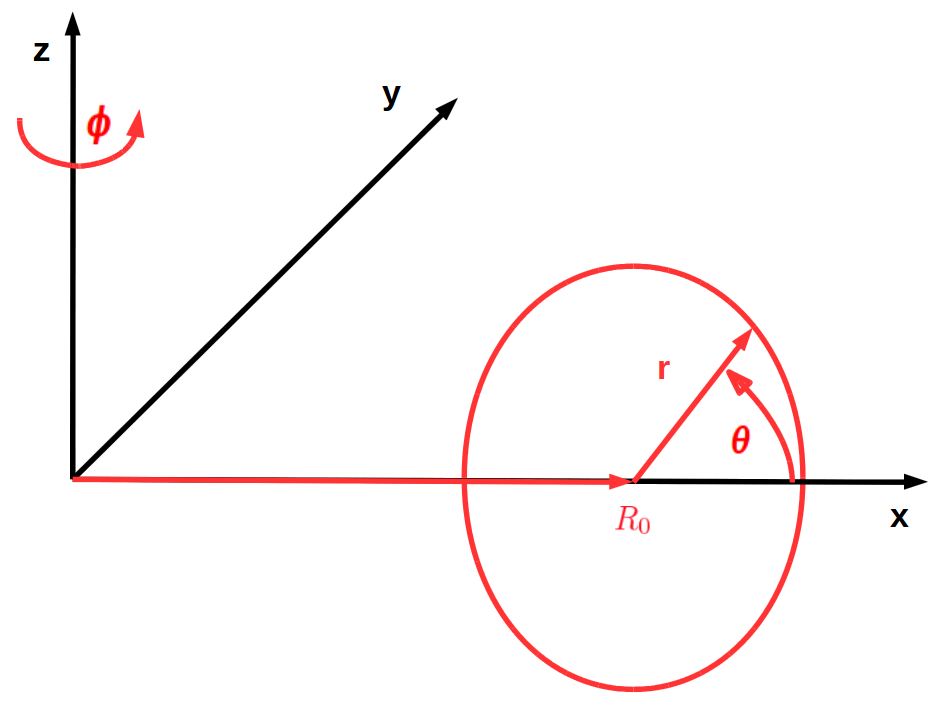

.. seealso::

	<https://mathworld.wolfram.com/Right-HandedCoordinateSystem.html>

* The default plane in BLUEPRINT is the x-z plane.
* The default axis of revolution is the z-axis.
* Rotations are counter-clockwise (positive) and clockwise (negative)
* The unit of length is the [metre]. The units in BLUEPRINT are SI (..mostly..)

So, for example, a plasma shape would have a 2-D cross-section specified in m on the x-z plane, and rotated about the z-axis to form a torus.

Loop object tutorial
--------------------

A `Loop` object in BLUEPRINT is the most basic way of storing geometry. It is an intelligent collection of ordered sets of vertices, with various methods in order to modifying the coordinates or get useful information from them.

First, let's load some tools in a Python console to get us through the following steps:

.. code-block:: python

	import os
	import numpy as np
	import matplotlib.pyplot as plt
	from BLUEPRINT.base.lookandfeel import bprint
	from BLUEPRINT.base.file import get_BP_path
	from BLUEPRINT.geometry.loop import Loop
	from BLUEPRINT.geometry.shell import Shell
	from BLUEPRINT.geometry.boolean import (
	    boolean_2d_difference,
	    boolean_2d_union,
	    boolean_2d_common,
	    simplify_loop,
	)

Loop introduction
#################

Let's make a triangle:

.. code-block:: python

	# We specify the vertices in terms of x, y, and z. If a coordinate is not specified, it will
	# default to 0.

	triangle = Loop(x=[1, 2, 0], y=[2 ** 0.5, 0, 0])

	# Let's check that the coordinates are the same as specified:
	print(f"triangle.x: {triangle.x}")
	print(f"triangle.y: {triangle.y}")

	>>> triangle.x: [0. 2. 1.]
	>>> triangle.y: [0.         0.         1.41421356]

	# They aren't the same!
	# 	They have been re-ordered; the Loop is now counter-clockwise
	#       Also, the coordinates are now floats, not integers.

These details are important when dealing with various operations, and it is important to understand that Loops are by default counter-clockwise (ccw) and have underlying numpy arrays of floats for coordinates.

You can get a quick summary of the Loop by printing it to the console:

.. code-block:: python

	print(triangle)

	>>> 2-D open ccw x-y Loop, 3 long

So let's look at the triangle, and its points:

.. code-block:: python

	triangle.plot(points=True)

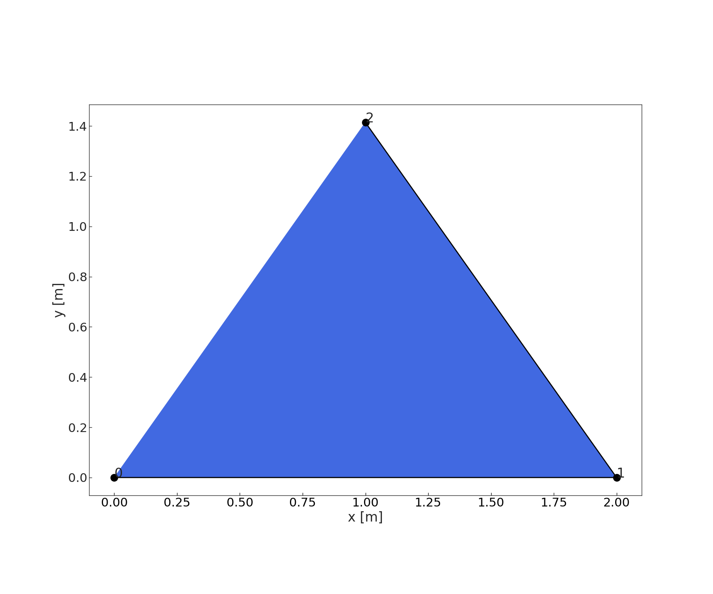

The defaults are a black line for segments, and the Loop is filled with a polygon face. Notice that the triangle only has two segments: it is an open Loop.

.. code-block:: python

	print(f"My triangle is a closed loop: {triangle.closed}")

	>>> My triangle is a closed loop: False

It is usually desirable to work with closed Loops. These are used frequently in BLUEPRINT to describe space reservation of things in 2-D.

Unlike ccw, Loops are not forced to be closed Loops.

.. code-block:: python

	triangle.close()
	print(triangle)

	>>> 2-D closed ccw x-y Loop, 4 long

Notice it is now of length = 4, and not 3 as before. The first and end points are coincident.

Now, let's plot the triangle again, and make it look a little different

.. code-block:: python

	triangle.plot(edgecolor="k", facecolor="grey")

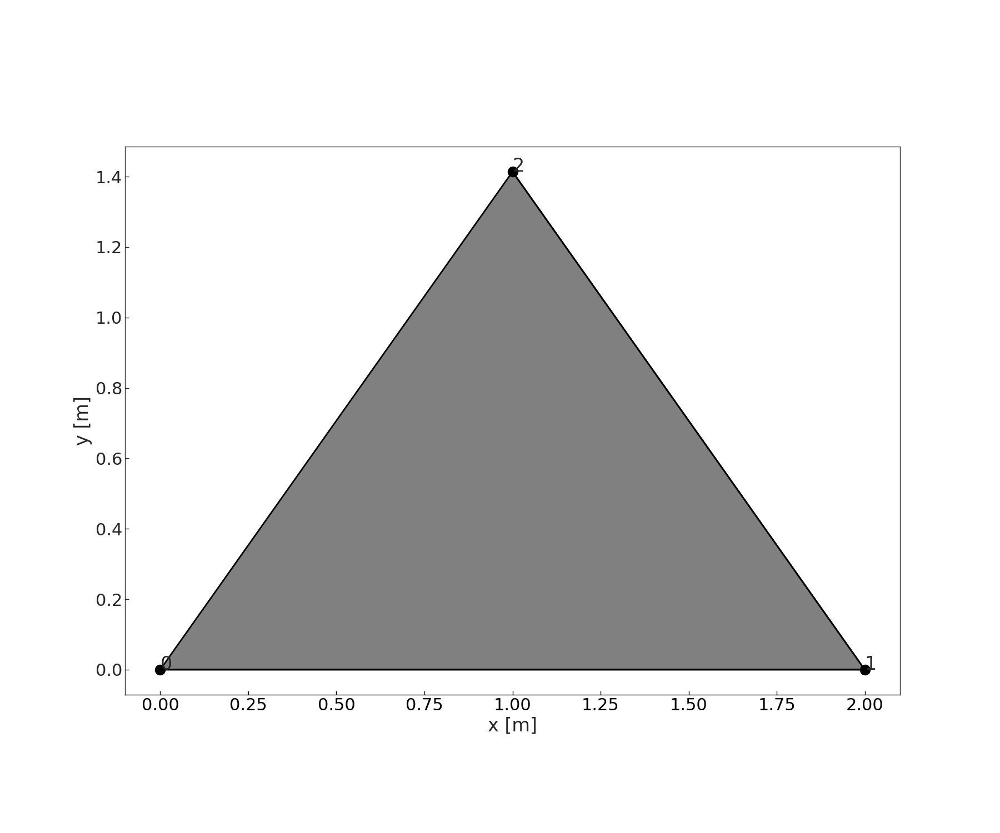

Let's see what else this thing can do:

.. code-block:: python

	bprint(f"Summary of the triangle loop:\n"
               f"|   area: {triangle.area:.2f} m\n"
	       f"|   perimeter: {triangle.length:.2f} m\n"
	       f"|   centroid: {triangle.centroid}")
	>>> +-------------------------------------------------------------------------+
	    | Summary of the triangle loop:                                           |
	    | |   area: 1.41 m                                                        |
	    | |   perimeter: 5.46 m                                                   |
	    | |   centroid: (1.0, 0.47140452079103173)                                |
	    +-------------------------------------------------------------------------+

Accessing coordinates
#####################

The underlying Loop coordinates can be accessed in a variety of ways.

For full coordinate arrays, via access to the xyz attribute.

.. code-block:: python

	print(triangle.xyz)

	>>> [[0.         2.         1.         0.        ]
	     [0.         0.         1.41421356 0.        ]
	     [0.         0.         0.         0.        ]]

For full single coordinates, via attribute access or dictionary call

.. code-block:: python

	print(triangle.x)
	print(triangle["x"])

	>>> [0. 2. 1. 0.]
	    [0. 2. 1. 0.]

For individual vertices, via indexing and slicing

.. code-block:: python

	print(f"First point in triangle: {triangle[0]}")
	print(f"First two points in triangle: {triangle[:2]}")

	>>> First point in triangle: [0. 0. 0.]
	    First two points in triangle: [[0. 2.]
	    [0. 0.]
	    [0. 0.]]

Note that when we access single points, we always get the 3 dimensions.

If we only want the "most important" 2 dimensions, then we have to do this:

.. code-block:: python

	print(f"First point x-y: {triangle.d2.T[0]}")
	print(f"First two points x-y: {triangle.d2.T[:2]}")

	>>> First point x-y: [0. 0.]
	    First two points x-y: [[0. 0.]
	    [2. 0.]]

The `d2` attribute accesses the two important coordinates in which the Loop was specified. So x-y for x-y Loops and y-z for y-z Loops, etc.

Instantiating a Loop
####################

There are other ways to instantiate a Loop:
	#. from a dictionary
        #. from a numpy array
        #. from a file

1) from a dictionary:

.. code-block:: python

	dictionary = {"x": [1, 2, 3], "y": 4.4573, "z": [0, 0, 2]}
	dloop = Loop.from_dict(dictionary)

.. note::
	If we give a single value to one of the dimensions, the Loop will assume that it is on an e.g. x-z plane, at an offset of y from the 0-x-z plane.

2) from a numpy array:

.. code-block:: python

	coordinates = np.array([0, 0, 2, 3, 4, 5, 6, 7, 5, 4, 3, 0],
		               [0, 0, 0, 0, 0, 0, 0, 0, 0, 0, 0, 0],
                               [2, 2, 4, 5, 6, 6, 7, 5, 4, 3, 2, 2]])

	aloop = Loop.from_array(coordinates)

3) from a file:

This is mostly useful for debugging, save Loops if they are nasty geometry edge cases, or passing information to people. Loops are saved in a JSON format, because it is widely-used and human readable.

.. code-block:: python

	# First we need to get the folder where some Loops are stored:
	path = get_BP_path("cad/test_data", subfolder="tests")

	print(path)

	# Then we need to pick a Loop
	name = "plasmaloop.json"
	filename = os.sep.join([path, name])

	# And instantiate a Loop from it.

	plasma_loop = Loop.from_file(filename)

	# Plot the loaded loop
	f, ax = plt.subplots()
	plasma_loop.plot(ax, edgecolor="r", facecolor="pink")

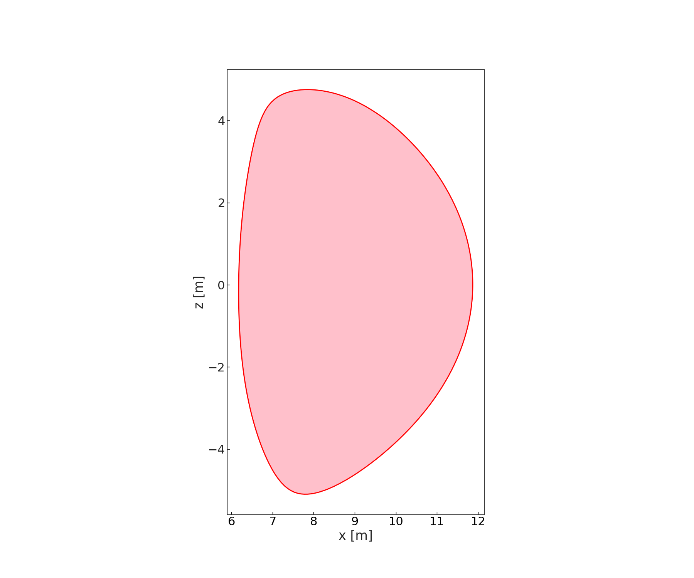

Transforming loops
##################

Obviously, we want to be able to move this stuff around, so we need to be able to modify Loops.

.. code-block:: python

	plasma_loop.translate([4, 0, 0])
	plasma_loop.plot(ax, edgecolor="r", facecolor="pink")

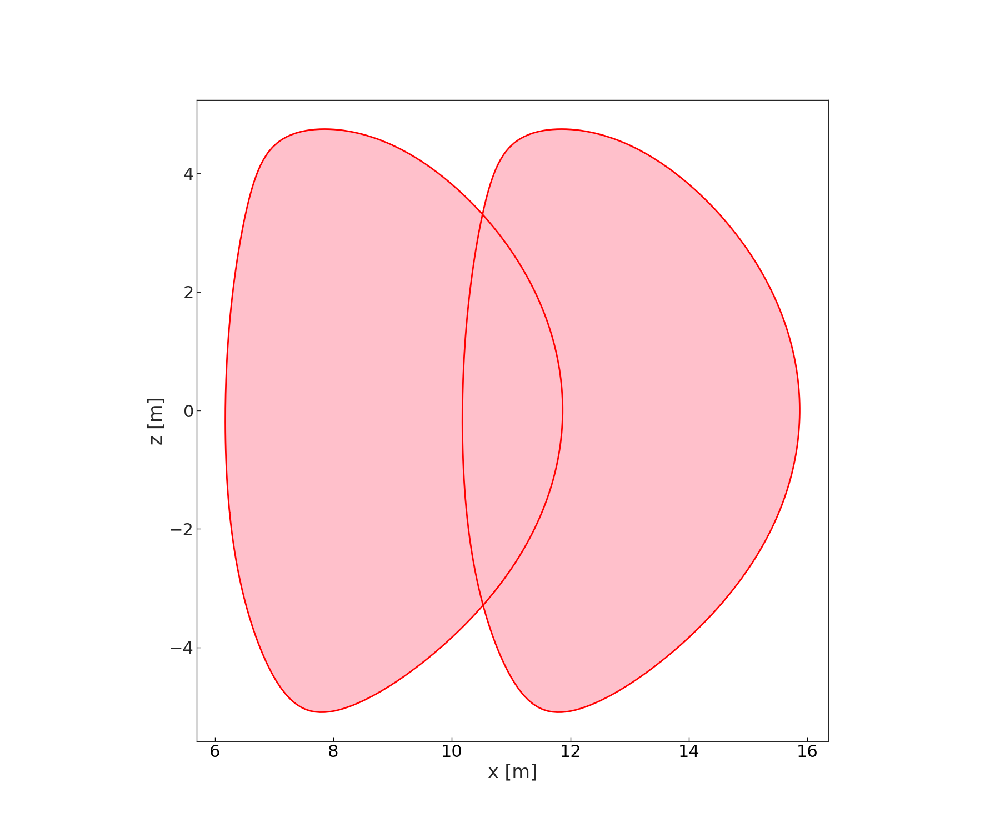

The plasma_loop has been permanantly moved. What if we want a copy?

.. code-block:: python

	plasma_loop2 = plasma_loop.translate([4, 0, 0], update=False)

Now let's rotate it (about the y-axis, clockwise by 30 degrees)

.. code-block:: python

	plasma_loop2.rotate(theta=-30, p1=[0, 0, 0], p2=[0, 1, 0])

	f, ax = plt.subplots()
	plasma_loop.plot(ax, edgecolor="b", facecolor="grey")
	plasma_loop2.plot(ax, edgecolor="r", facecolor="pink")

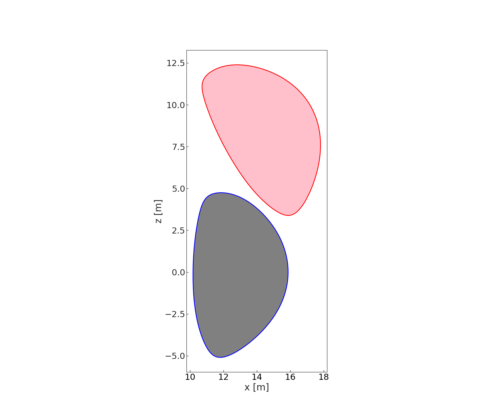

Alright, but what about 3-D? Sure, why not:

.. code-block:: python

	loop = plasma_loop.rotate(
	    theta=45, p1=[0.1, 0.254, 0.74], p2=[0.4, 0.2, 0.1], update=False
	)

	loop.plot(facecolor="g")

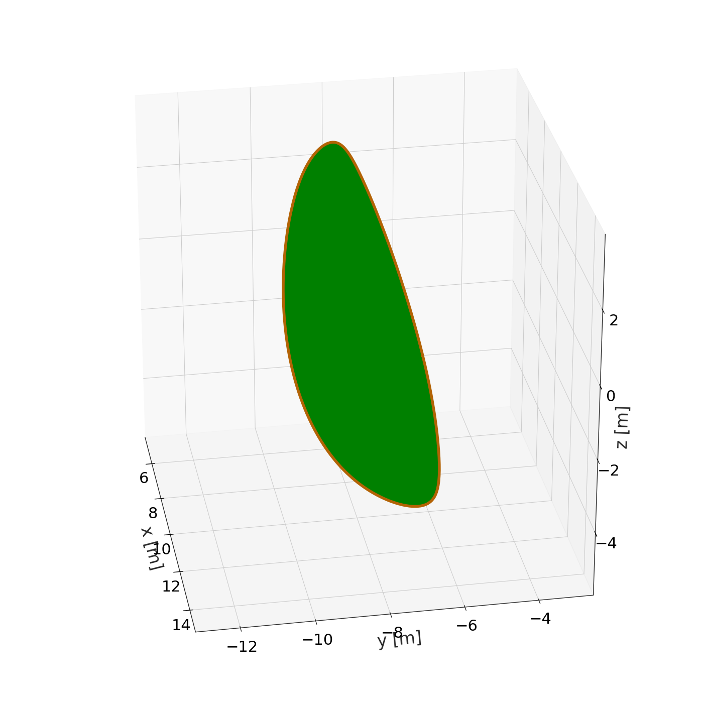

.. warning::

	matplotlib is not great at 3-D stuff.. some homebrew hacks make this work, but if you want to break it you won't have to try very hard.

Working with Loops
##################

There are lots of things we want to do with geometry... below are some helpful methods you may want to use.

Offsetting:

.. code-block::

	f, ax = plt.subplots()
	plasma_loop.plot(ax)
	# Outwards
	for offset_size, color in zip([0.2, 0.4, 0.6, 1], ["r", "orange", "g", "b"]):
	    offset_plasma = plasma_loop.offset(offset_size)
	    offset_plasma.plot(ax, edgecolor=color, fill=False)

	# Inwards
	for offset_size, color in zip([0.2, 0.4, 0.6, 1], ["r", "orange", "g", "b"]):
	    offset_plasma = plasma_loop.offset(-offset_size)
	    offset_plasma.plot(ax, edgecolor=color, fill=False)

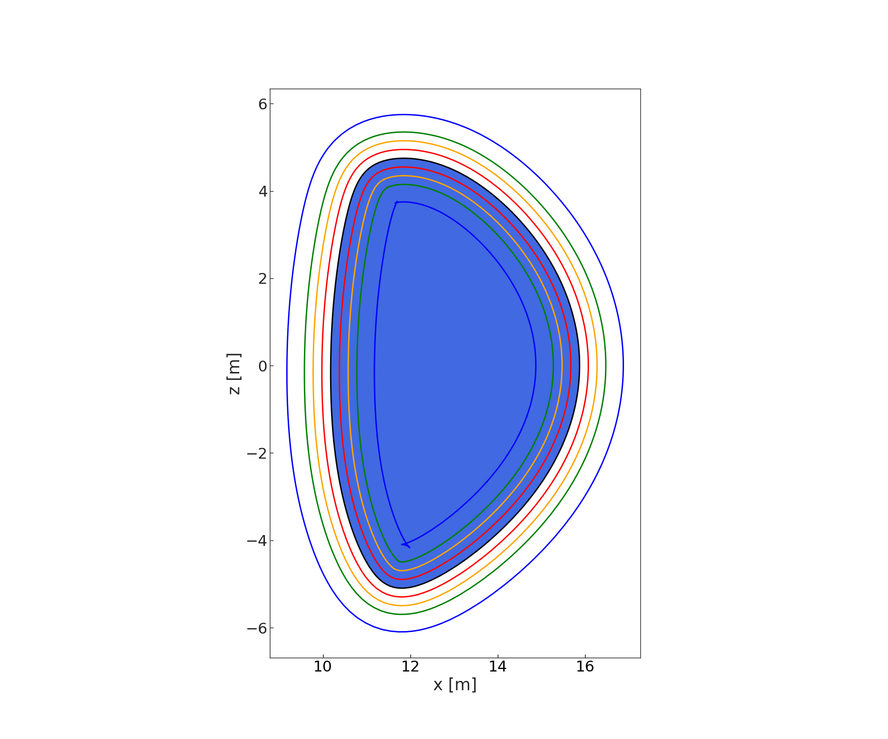

That last one looks a little funny... welcome to geometry!
Loops are not yet smart enough to detect that they are self-intersecting..
Be careful. There are ways of dealing with this, see e.g. below.

.. code-block:: python

	clean_offset = simplify_loop(offset_plasma)

	f, ax = plt.subplots()
	offset_plasma.plot(ax, facecolor="r")
	clean_offset.plot(ax, facecolor="b")
	ax.set_xlim([11.64, 11.74])
	ax.set_ylim([3.7, 3.76])

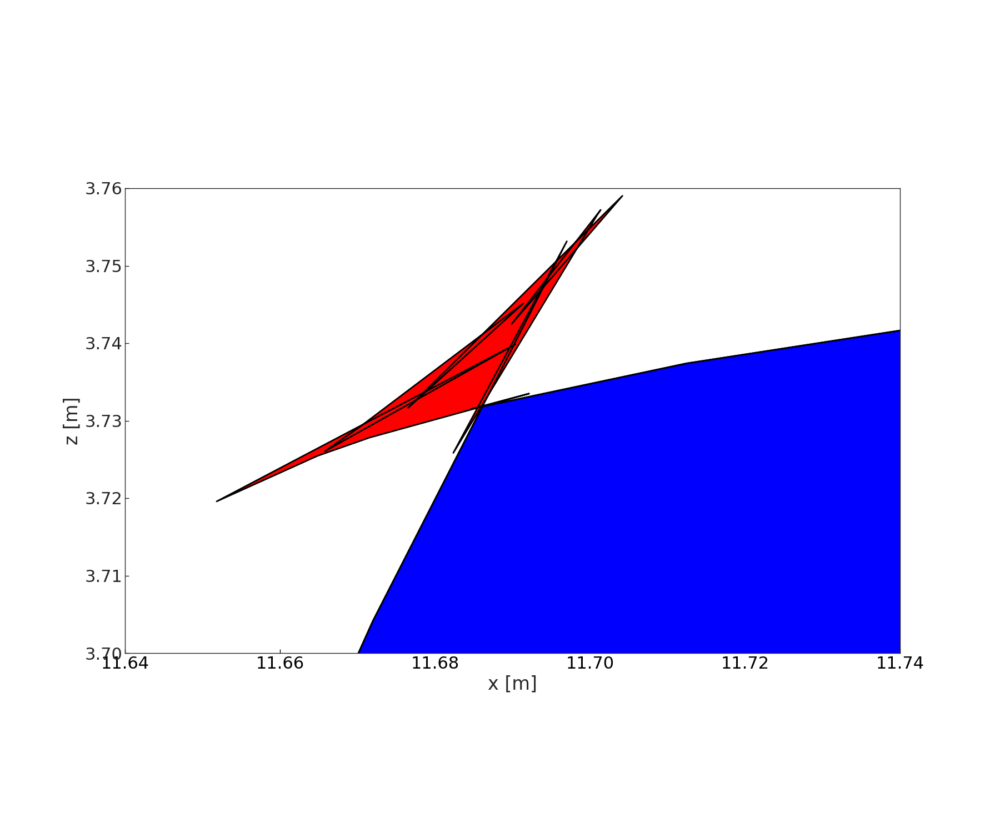

Boolean operations

Let's pick up with some fresh plasma loops

.. code-block:: python

	loop1 = Loop.from_file(filename)

	loop2 = loop1.translate([4, 0, 0], update=False)

	# We can join Loops with boolean union operations
	union = boolean_2d_union(loop1, loop2)
	f, ax = plt.subplots()
	union.plot(ax, facecolor="b")

.. image:: ../images/geometry/figure9.png

We can subtract loops with boolean difference operations
We can intersect the loops with boolean common operations

.. note::

	Note that in both the cases there can be multiple answers! (in this case there is only one, but we are expecting a list anyway (hence [0])

.. code-block:: python

	diff = boolean_2d_difference(loop1, loop2)[0]

	common = boolean_2d_common(loop1, loop2)[0]

	f, ax = plt.subplots()
	diff.plot(ax, facecolor="r")
	common.plot(ax, facecolor="b")

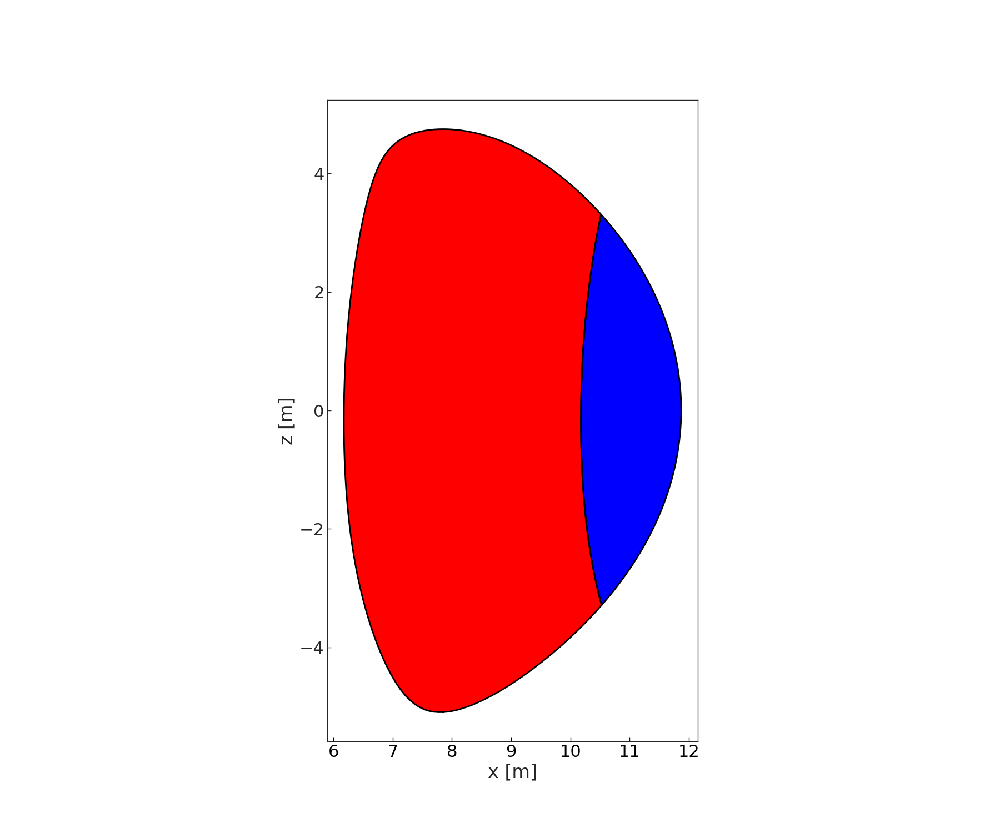

Shell introduction
##################

In BLUEPRINT, a Shell is Loop within a Loop. It is a subset of the Polygon with holes problem.

Let's make one
We have to specify an inner Loop and an outer Loop
It's not super-smart, so if you want to break it, again, you can.

.. code-block:: python

	shell = Shell(clean_offset, plasma_loop)

	# Shells work in much the same way as Loops

	f, ax = plt.subplots()
	shell.plot(ax, linewidth=8, edgecolor="k", facecolor="orange")

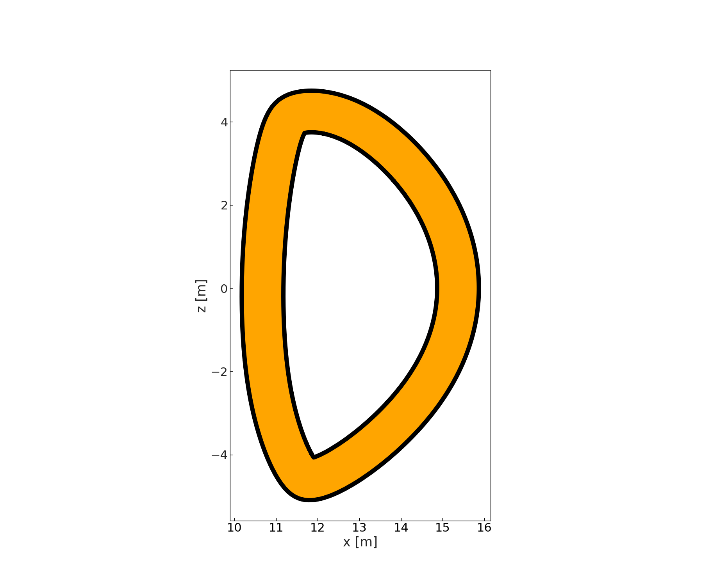

.. note::

	matplotlib kwargs will usually work.. usually

Shells can be manipulated in the same way as Loops:

.. code-block:: python

	rotated_shell = shell.rotate(theta=234, p1=[0, 23, 5], p2=[23.5, 423, np.pi], update=False)

	rotated_shell.plot(edgecolor="k", facecolor="b")

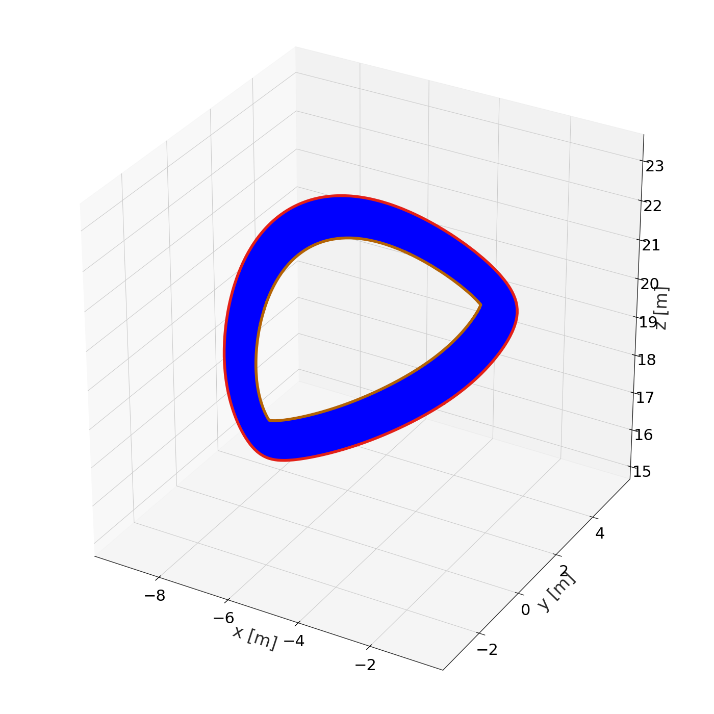
