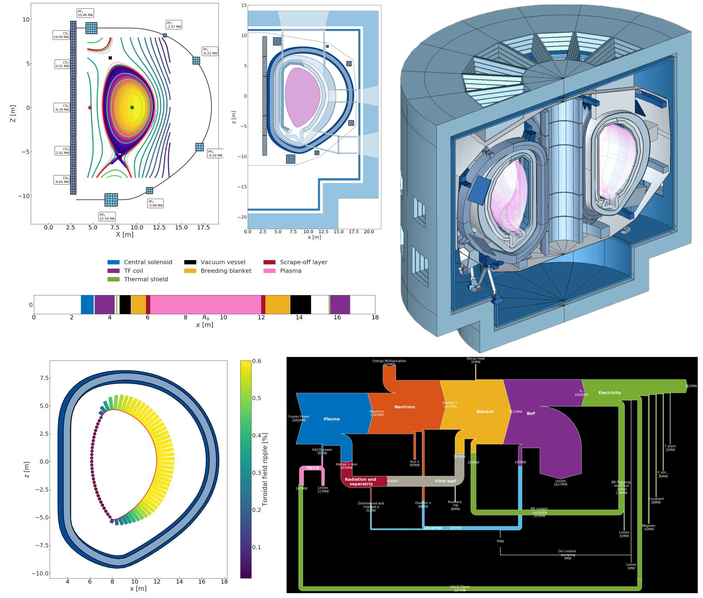

.. BLUEPRINT Documentation master file, created by
   sphinx-quickstart on Tue Dec 10 17:03:50 2019.
   You can adapt this file completely to your liking, but it should at least
   contain the root `toctree` directive.

Welcome to BLUEPRINT's Documentation!
=====================================

.. toctree::
   :maxdepth: 4
   :caption: Contents:
   :hidden:

   started
   windows
   BLUEPRINT Documentation <BLUEPRINT_documentation>
   developing
   autoapi/index

BLUEPRINT is a framework for modelling fusion reactors in Python code. The models
are executed to generate reactor designs.

BLUEPRINT is comprised of various modules (*azulejos*):

* **base**: a collection of utilities which make up the software backbone of the BLUEPRINT framework
* **beams**: a simple 3-D frame finite element model for structural analysis
* **cad**: a CAD toolbox and generator, which builds CAD artefacts for a given reactor.
* **codes**: an interface library to run external modules:

	 * The 0/1-D power reactor optimisation code `PROCESS <https://www.sciencedirect.com/science/article/pii/S0920379614005961>`_
	 * The 1.5-D transport and equilibrium code `PLASMOD <https://www.sciencedirect.com/science/article/pii/S0920379618302801>`_, by E. Fable.
* **costs**: an ultra-crude proof-of-principle cost toolbox
* **equilibria**: an ab initio equilibrium solver, used for generating reference equilibria for a given reactor, and optimising poloidal field systems.
* **fuelcycle**: a simplified dynamic Monte Carlo tritium fuel cycle model, used to calculate tritium start-up inventories, tritium release rates, and reactor doubling times.
* **geometry**: a set of tools and objects used for the creation and manipulation of 2-D geometry
* **materials**: a materials library, used for material properties in FE analyses and neutronics. Makes heavy use of `Neutronics Material Maker <https://github.com/ukaea/neutronics_material_maker/tree/master/neutronics_material_maker>`_, by J. Shimwell.
* **neutronics**: interface to build and run neutronics codes on reactor designs:

   * `Serpent II <https://www.sciencedirect.com/science/article/pii/S0306454914004095>`_
   * `OpenMC <https://github.com/openmc-dev/openmc](https://github.com/openmc-dev/openmc>`_
* **nova**: a collection of tools for equilibria and the optimisation of the toroidal field coil shape. A modest fork of the Nova module, written by S. McIntosh.
* **systems**: the home of reactor system objects and a number of simplified 0/2-D models for reactor cross-section design and analysis.
* **utilities**: collection of utility toolboxes for file IO, plotting, databases, machine learning, and misc.

The code and its modules are described in the following publications:

* `BLUEPRINT: A novel approach to fusion reactor design <https://www.sciencedirect.com/science/article/pii/S0920379618308019>`_, Coleman and McIntosh, *Fusion Engineering and Design* v **139** pp 26-38 (2019)
* `DEMO tritium fuel cycle: performance, parameter explorations, and design space constraints <https://www.sciencedirect.com/science/article/pii/S092037961930167X>`_, Coleman, Hörstensmeyer and Cismondi, *Fusion Engineering and Design* v **141** pp79-90 (2019)
* `The design and optimisation of tokamak poloidal field systems in the BLUEPRINT framework <https://doi.org/10.1016/j.fusengdes.2020.111544>`_, Coleman and McIntosh, *Fusion Engineering and Design* v **154** 111544 (2020)

Indices and tables
==================

* :ref:`genindex`
* :ref:`modindex`
* :ref:`search`
