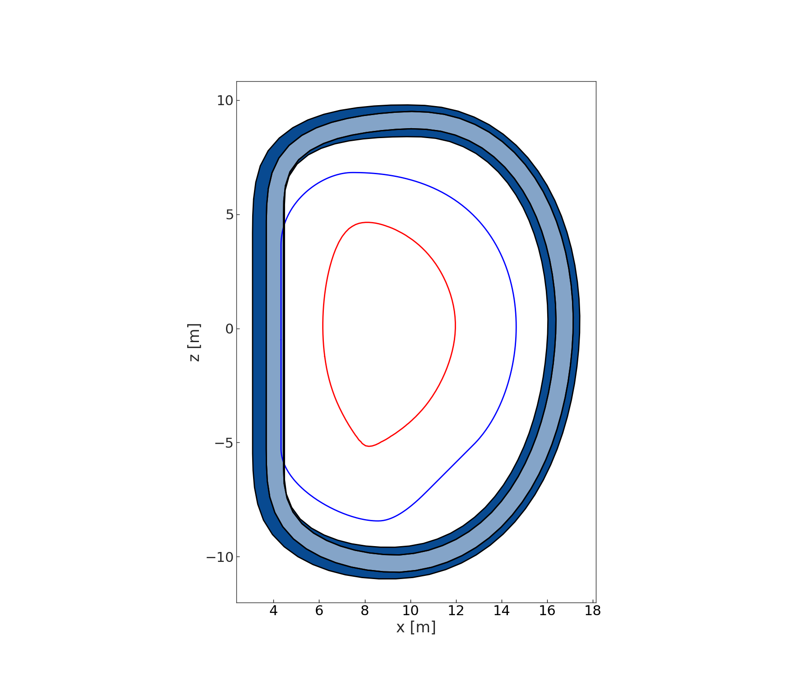
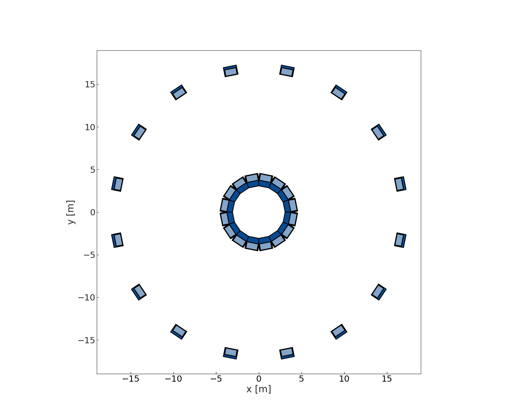
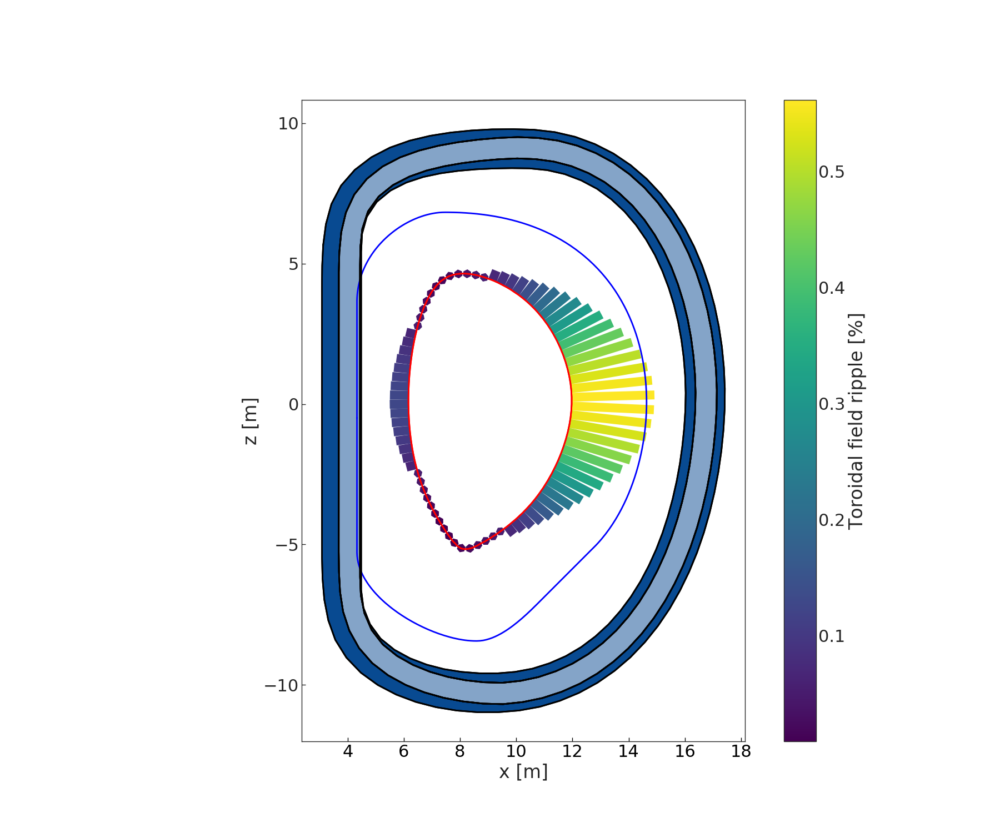
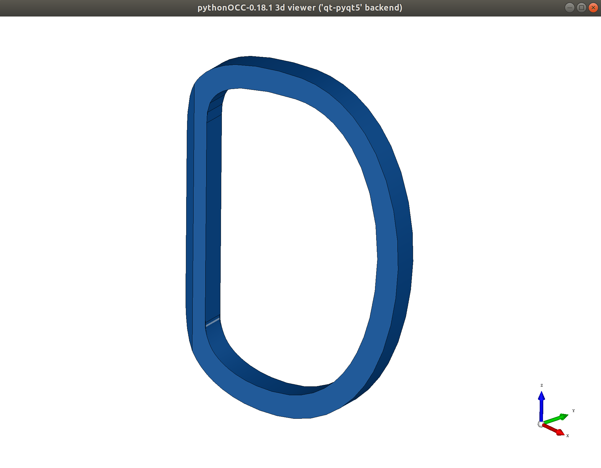

nova
====

A collection of tools for equilibria and the optimisation of the toroidal field coil and first wall shapes. A modest fork of the Nova code, written by S. McIntosh.

Designing TF coils
------------------
Nova is primarily used in BLUEPRINT for the design of the TF coil shapes.

The design problem as it is presently formulated in BLUEPRINT is as follows. A shape parameterisation is chosen, with variables :math:`\mathbf{x}`, and optimised:

.. math::

	\begin{aligned}
        	shape.\mathbf{x^{*}}~=~ & \underset{shape.\mathbf{x}}{\text{minimise}}:
        	& & shape.L\\
        	& \text{subject to}:
        	& & \delta_{\phi}(x, z) \preccurlyeq \delta_{\phi_{max}} \forall (x, z) \in LCFS\\
		&&& shape.points \not \in KOZ
	\end{aligned}

Where the ripple :math:`\delta_{\phi}` is calculated on the 2-D separatrix shape, :math:`LCFS`, defined from the last closed flux surface, :math:`\Psi_{1}`, as:

.. math::

	\delta_{\phi}(x, z) = \frac{B_{t}(x, z, \phi=0)-B_{t}(x, z, \phi=\pi/n_{TF})}{B_{t}(x, z, \phi=0)+B_{t}(x, z, \phi=\pi/n_{TF})} \forall (x, z) \in \Psi_{1} ~~~\text{where}~~~ \Psi_{1} = f(x, z,\phi) = 1

.. note::

	Other optimisation objectives are possible (:math:`V`: volume, :math:`E`: stored energy), but these have been found to produce shapes with re-entrant curvatures, which are difficult to manufacture. They are also more expensive to evaluate (stored energy in particular).

.. warning::

	No structural / stress / displacement constraints are incorporated in this optimisation problem at present. This is work in progress; please use wisely until structural constraints are included robustly.

Instantiate a TF coil object
############################

First, let's initialise a ToroidalFieldCoils object. In order to do this, we need two things:

    * ParameterFrame: (contains all of the reactor parameters we need)
    * dictionary:     (which contains some specific info for the TF coil, and some more complicated objects)

Here is a default ParameterFrame for a TF coil in BLUEPRINT:

.. code-block:: python

	p = [
	    ["R_0", "Major radius", 9, "m", None, "Input"],
	    ["B_0", "Toroidal field at R_0", 6, "T", None, "Input"],
	    ["n_TF", "Number of TF coils", 16, "dimensionless", None, "Input"],
	    ["rho_j", "TF coil WP current density", 18.25, "MA/m^2", None, "Input"],
	    ["tk_tf_nose", "TF coil inboard nose thickness", 0.6, "m", None, "Input"],
	    ["tk_tf_wp", "TF coil winding pack thickness", 0.5, "m", None, "PROCESS"],
	    ["tk_tf_front_ib", "TF coil inboard steel front plasma-facing", 0.04, "m", None, "Input"],
	    ["tk_tf_ins", "TF coil ground insulation thickness", 0.08, "m", None, "Input"],
	    ["tk_tf_insgap", "TF coil WP insertion gap", 0.1, "m", "Backfilled with epoxy resin (impregnation)", "Input"],
	    ["r_tf_in", "Inboard radius of the TF coil inboard leg", 3.2, "m", None, "PROCESS"],
	    ["ripple_limit", "Ripple limit constraint", 0.6, "%", None, "Input"],
	]

	# We need to populate a ParameterFrame from the above list of lists
	parameters = ParameterFrame(p)

Geometry is stored in Loop objects (collections of 2/3-D coordinates, and associated methods). Here we need some geometry to help us define the optimisation problem for the TF coil design. We are just going to load some existing shapes rather than make our own, to focus on the problem at hand.

.. code-block:: python

	# Load a separatrix shape, along which we will calculate the toroidal field
	# ripple.
	read_path = get_BP_path("Geometry", subfolder="data")
	write_path = get_BP_path("Geometry", subfolder="generated_data")
	name = os.sep.join([path, "LCFS.json"])
	LCFS = Loop.from_file(name)

	# Load a keep-out zone for the TF coil shape
	name = os.sep.join([path, "KOZ.json"])
	KOZ = Loop.from_file(name)

Now we need to build the dictionary, which contains some optimiser information and the shapes we just loaded that define the optimisation problem.

.. code-block:: python

	to_tf = {
	    "name": "Example_PolySpline_TF",
	    "plasma": LCFS,
	    "koz_loop": KOZ,
	    "shape_type": "S",  # This is the shape parameterisation to use
	    "obj": "L",  # This is the optimisation objective: minimise length
	    "ny": 1,  # This is the number of current filaments to use in y
	    "nr": 1,  # This is the number of current filaments to use in x
	    "nrip": 10,  # This is the number of points on the separatrix to calculate ripple for
	    "read_folder": read_path,
		"write_folder": write_path,
	}

So now we have everything we need to instantiate the TF coil object:

.. code-block:: python

	TF1 = ToroidalFieldCoils(parameters, to_tf)

In BLUEPRINT, Reactor objects and# sub-system objects all inherit from a base class: ReactorSystem
Let's take a moment to introduce ourselves to the ReactorSystem. It gives a lot of the flavour to the different sub-systems, and makes them all behave in similar ways.

Methods
     #. plotting (plot_XY and plot_XZ)
     #. CAD (build_CAD and show_CAD)
Attributes
     - 'p': the ParameterFrame of the ReactorSystem
     - 'geom': the dictionary of geometry objects for the ReactorSystem
     - 'requirements': the dictionary of requirements (I don't really use this)

.. code-block:: python

	query_subclass = issubclass(ToroidalFieldCoils, ReactorSystem)
	query_instance = isinstance(TF1, ReactorSystem)
	print(f"are ToroidalFieldCoils a ReactorSystem?: {query_subclass}")
	print(f"are my TF coils an instance of ReactorSystem?: {query_instance}")

Let's take a look at the ParameterFrame for the TF coils we instantiated.

.. code-block:: python

	print(TF1.params)

================================================  ==========  ======
Name                                                   Value  Unit
================================================  ==========  ======
Major radius                                               9  m
Toroidal field at R_0                                      6  T
Number of TF coils                                        16  dimensionless
TF coil WP current density                             18.25  MA/m^2
Wall thickness                                         0.045  m
TF coil inboard nose thickness                           0.6  m
TF coil winding pack thickness                           0.5  m
TF coil inboard steel front plasma-facing               0.04  m
TF coil ground insulation thickness                     0.08  m
TF coil WP insertion gap                                 0.1  m
TF coil inboard case minimum side wall thickness         0.1  m
TF coil case thickness on the outboard inside          0.288  m
TF coil case thickness on the outboard outside         0.352  m
TF coil winding pack radial width                       0.76  m
TF coil winding pack depth (in y)                    1.34356  m
Inboard radius of the TF coil inboard leg                3.2  m
TF coil ripple limit                                     0.6  %
Number of radial filaments                                 1  dimensionless
Number of toroidal toroidal filaments                      1  dimensionless
Number of positions to check for ripple                   25  dimensionless
Number of points                                          80  dimensionless
TF coil current                                   1.6875e+07  MA
================================================  ==========  ======

Notice that there are a few more parameters in there that we didn't specify..

Some of them were calculated upon instantiation, others, well. There are lots of parameters required for designing ReactorSystems. Often, defaults are used - and these defaults are often "good guesses" or simply engineering judgement for things we don't quite know about yet.

Let's plot our TF coils and we what we have so far

.. code-block:: python

	# We need to make a matplotlib Axes object to plot onto
	f1, ax1 = plt.subplots()

	# Now we want to see the last closed flux surface and keep out zone we loaded earlier
	LCFS.plot(ax1, edgecolor="r", fill=False)
	KOZ.plot(ax1, edgecolor="b", fill=False)

	# Now, let's look at the TF coil itself (in the x-z plane)
	TF1.plot_XZ(ax=ax1)

	# Depending on whether you are running from (console, IDE, inline plotting, etc.) you may have to call plt.show() to see the plots that are generated
	plt.show()

	# And in the x-y plane (at the midplane)
	f, ax = plt.subplots()
	TF1.plot_XY(ax=ax)

Looks weird, but that's because we haven't really designed the TF coil yet...
The "default" shape is actually just the underlying shape parameterisation populated with some dummy variables. We need to find the optimum shape.

We can see that the TF coil is also encroaching upon its keep-out zone...

What about the ripple?

.. code-block:: python

	TF1.plot_ripple(ax=ax1, fig=f1)
	plt.show()

The maximum TF ripple is lower than we specified (0.6 %)

We can also look at the CAD for our TF coil

.. code-block:: python

	# The following command will build the CAD for the TF coil and bring up a pyQt window showing the CAD.
	TF1.show_CAD()
	# You may need to close the CAD pyQt window in order to continue

Optimise a spline TF coil
#########################

Second, let's design our TF coil object. In order to do this, we need a few things (we have already done most of these when we instantiated our coil):

* we need to specify a shape parameterisation (here we are using a PolySpline parameterisation - shape_type = 'S')
* we need to specify an optimisation objective (default = winding pack length)
* we need to specify what our ripple constraint is (default = 0.6%)
* we need to specify a keep-out-zone for the TF coil
* we need to specify a shape upon which we want to contrain the ripple
* we need to optimise the TF coil shape parameterisation

Run the optimisation problem (minimise length, constrain ripple)

.. code-block:: python

	bprint("Optimising 'S' TF coil... could take about 1 min 40 s..")
	TF1.optimise()

Hmm... a warning. Our maximum ripple is a little higher than we specified.
This is because we didn't specify many points at which to check the ripple

Let's look at what is going on

.. code-block:: python

	f, ax = plt.subplots()
	TF1.plot_XZ(ax=ax)
	TF1.plot_ripple(ax=ax, fig=f)

.. image:: ../images/nova/figure4.png

.. note::

	The bigger ny, ny, and nrip are, the longer the optimisation will take (and the better the result)

In practice, we know a bit about this problem...

The TF ripple is usually the worst on the low field side (outboard portion)
So we speed up the problem by only checking points on the LFS

Let's improve this a bit, by increasing the resolution:

.. code-block:: python

	TF1.optimise(ny=2, nrippoints=20)

There, that's a bit better...
