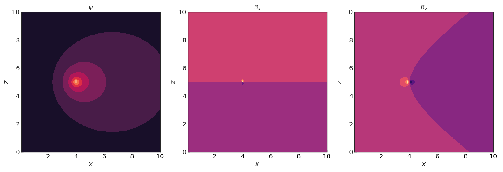

magnetostatics
==============

A collection of analytical and semi-analytical calculation tools to evaluate magnetic
field from arbitrary coils.

2-D current sources
-------------------

The following relations are for circular current sources about the :math:`z`-axis.

Green's functions
#################

The Green’s functions for poloidal magnetic flux, radial magnetic field,
and vertical magnetic field at a point :math:`(x, z)` due to a unit
current source at point :math:`(x_c, z_c)`:

.. literalinclude:: doc_greens.py
    :language: python

.. Note::
    The above Green's functions are effectively for an infinitely thin filament and 
    diverge logarithmically as the evaluation point approaches the source point. 

Semi-analytical functions
#########################

For a circular coil of rectangular cross-section, a semi-analytic reduction of the 3-D 
Biot-Savart law is used, as developed by [Zhang_2012]_. Numerical integration is used in
one dimension, and some singularities in the equations are resolved numerically and
analytically.

.. Hint::
    The above semi-analytical functions are best used for points inside or near the
    current source. If you favour speed over accuracy, for points further away from the
    current source, you are better off using some quadratures of Green's functions.

3-D current sources
-------------------

Biot-Savart
###########

Semi-analytical
###############

.. rubric:: References

.. [Zhang_2012] D. Zhang, C. S. Koh, An Efficient Semianalytic Computation Method of Magnetic Field for a Circular Coil With Rectangular Cross Section, IEEE Transactions on Magnetics, 2012, pp. 62-68