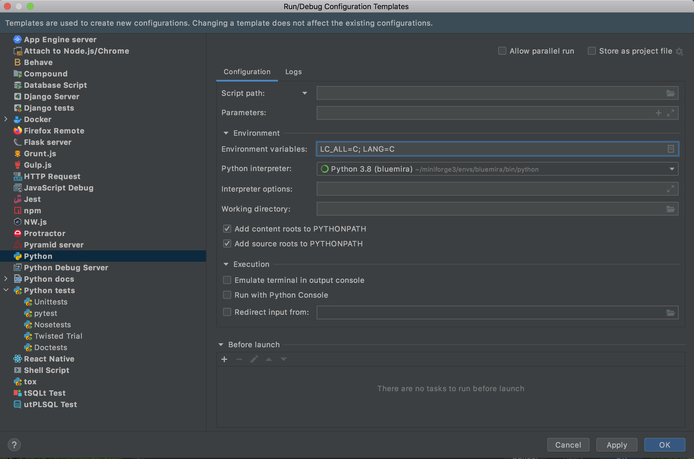

Getting Started
===============

Installation
------------

Bluemira can be installed into a conda environment using miniforge by running the
following steps in a mac or Ubuntu command terminal:

.. code-block:: bash

    # Clone bluemira
    sudo apt-get install git
    git clone git@github.com:Fusion-Power-Plant-Framework/bluemira.git
    cd bluemira

    # Run the conda installation script
    # This installs miniforge, if not already present, and sets up a bluemira environment
    bash scripts/install-conda.sh

    # To activate your environment
    source ~/.miniforge-init.sh
    conda activate bluemira

    # If you are going to be developing BLUEPRINT
    python -m pip install --no-cache-dir -e .[dev]
    pre-commit install -f

    # To test the install
    cd examples/cad
    python make_some_cad.py

When you want to activate your bluemira environment after closing your terminal (or
after ``conda deactivate``) then you can initialise miniforge and activate your
BLUEPRINT environment by running:

.. code-block:: bash

    source ~/.miniforge-init.sh
    conda activate bluemira

Setup your IDE
--------------

PyCharm
.......
Download and installation instructions for PyCharm can be found at
https://www.jetbrains.com/pycharm/

.. warning::

    Due to a bug in PyCharm (see https://youtrack.jetbrains.com/issue/PY-38751),
    compiler env variables from conda environment are not passed to console.
    For this reason, the env variables defined to create the conda environment as in
    conda/environment.yml may be not read when running scripts using the
    PyCharm GUI.
    In such a case, the needed env variables must be declared as optional
    parameters into the Run/Debug configuration interface.

