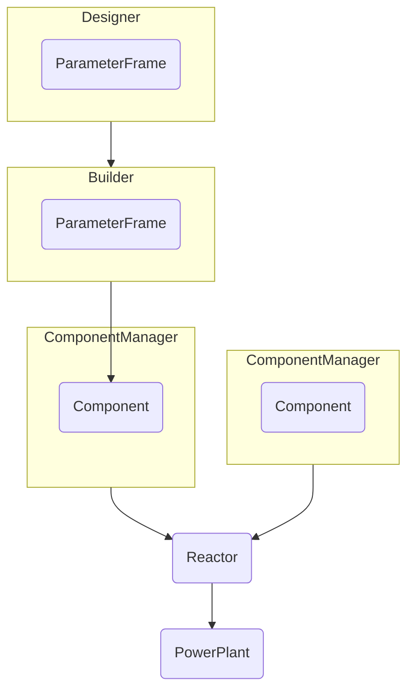

# 6. Abstraction of Reactor towards Powerplant

Date: 2023-07-31

## Status

Proposed

## Context

A Reactor should only be aware of its direct dependents.
Systems outside of the reactor are probably optimised externally (if at all).
Powercycle and balance of plant calculations are undertaken after the reactor build and could be
considered post processing tools.

This ADR proposes we add further abstractions to reactor (eg. `PowerPlant`) that would take the
reactor as input and manage properties and calculations that are not directly connected to the internals
of a reactor.

I see the tree looking like this with possible extensions to `Site`. Extrapolation to `World`, `Universe` etc. is all possible.

`PowerPlant` would contain things directly relevant to the reactor but distinct from it,
such as managing the power loads, as that acts on the whole reactor.

The addition of the possible `Site` may be a longer term thing,
using (and possibly extending) some of the building sizing data PROCESS gives us.

## Decision

TODO

## Consequences

The new powercycle module would have a consistent place to live,
and a consistent API to access the reactor through.
