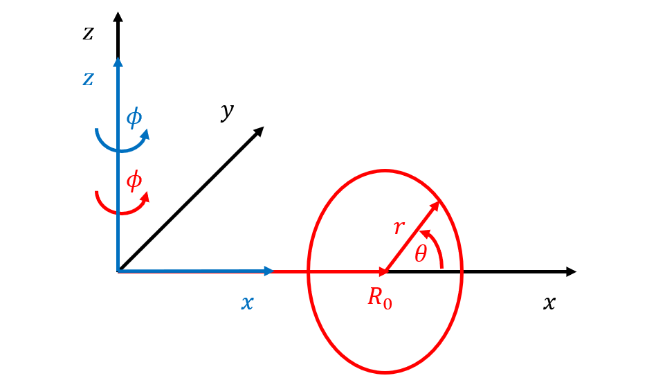
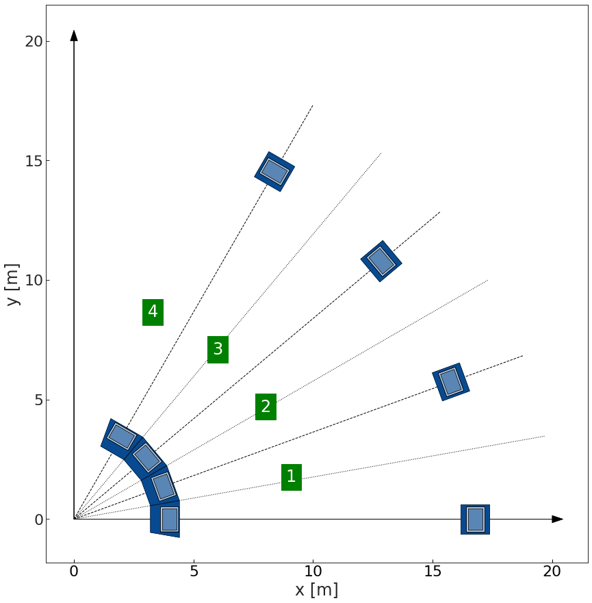

Conventions
-----------

.. _global_coordinates:

Coordinate convention
^^^^^^^^^^^^^^^^^^^^^

``Bluemira`` uses a conventional right-handed Cartesian coordinate convention for all geometry.

Occasionally, for certain modules and calculations, a quasi-toroidal coordinate system and a
cylindrical coordinate system are used. Note that to facilitate conversion between the
systems, the radial coordinate in the cylindrical coordinate system is denoted with
:math:`x` and not :math:`r`.

    The three different coordinate systems used in the ``bluemira`` framework: right-handed
    Cartesian coordinate system (:math:`x, y, z`, black), quasi-toroidal coordinate
    system (:math:`r, \theta, \phi`, red), and cylindrical coordinate system
    (:math:`x, \phi, z`, blue).

Tokamaks are largely axisymmetric devices and usually have some form of cyclic symmetry.
In ``bluemira``, by convention, tokamak sectors are numbered :math:`1 .. n`, with the first
sector ranging from :math:`0 .. 360/n_{TF}` degrees, and subsequent sectors in increasing
number, going anti-clockwise as seen from above the machine:

    Indicative sector angles and naming convention (green boxes) in ``bluemira``

Unit convention
^^^^^^^^^^^^^^^

``Bluemira`` uses the `International System of Units (SI) <https://en.wikipedia.org/wiki/International_System_of_Units>`_ convention,
with only minor deviations. As a summary, all inputs to the code should be in the following units:

.. list-table:: Unit conventions in `bluemira`
   :widths: 25 25 50
   :header-rows: 1

   * - Quantity
     - Unit name
     - Symbol
   * - time
     - second
     - [s]
   * - distance
     - metre
     - [m]
   * - mass
     - kilogram
     - [kg]
   * - electric current
     - ampere
     - [A]
   * - temperature
     - celsius
     - [C]
   * - amount of substance
     - mol
     - [mol]
   * - angles
     - degrees
     - [°]
   * - density
     - kilograms per cubic metre
     - [kg/m^3]
   * - particle density
     - particles per cubic metre
     - [1/m^3]
   * - flux density
     - particles per square metre per second
     - [1/m^2/s]
