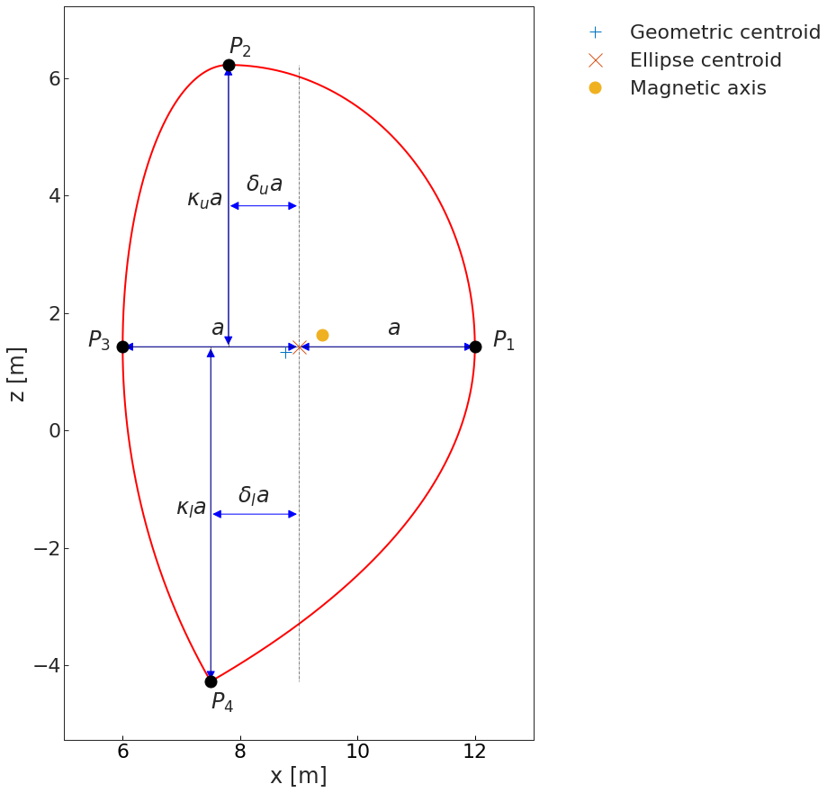
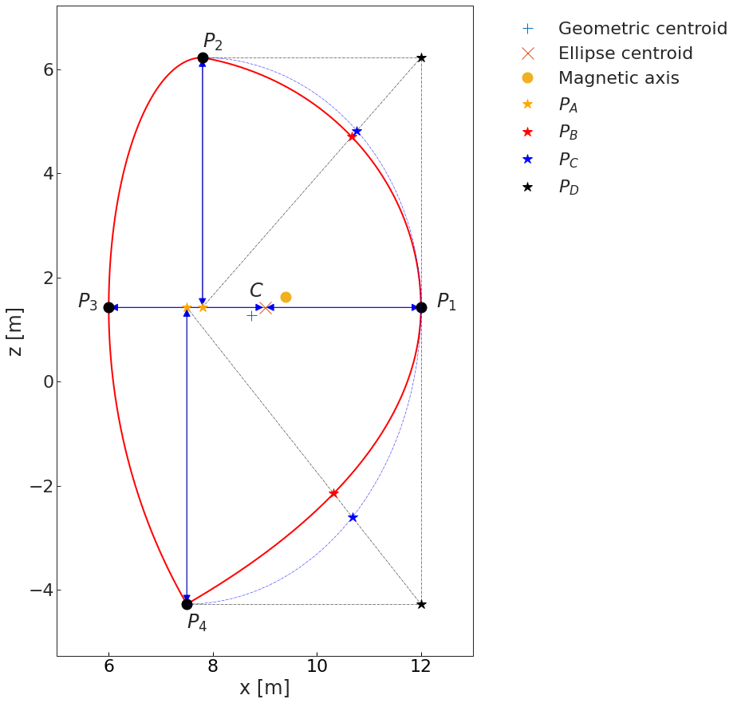

equilibria
==========

Conventions
-----------

Equilibrium coordinate conventions
^^^^^^^^^^^^^^^^^^^^^^^^^^^^^^^^^^

TBD

Flux surface geometry
^^^^^^^^^^^^^^^^^^^^^

Flux surface geometry parameters are defined with respect to the centre of the plasma,
which is defined as the centroid of the reference ellipse (assuming symmetry).

   Diagram depicting a typical flux surface, showing how key shape characteristics are
   calculated.

Note that the centroid of the reference ellipse, :math:`C\equiv(R_{0}, z_{0})`, from which the shape characteristics are
calculated, is neither the geometric centroid of the flux surface, nor the magnetic axis.

As such, the shape characteristics of a flux surface are purely geometrical.

The extrema of the flux surface are defined here (for convenience) as :math:`P_1, P_2, P_3, P_4`,
starting from the outboard midplane and heading anti-clockwise.

The major radius is calculated as:

.. math::
   :label: major_radius

   R_0 = x_{P_{3}} + \dfrac{x_{P_{1}}-x_{P_{3}}}{2}

The vertical coordinate of the centroid :math:`C`, is taken as the average vertical coordinate
of :math:`P_1` and :math:`P_3`. This is only relevant in the case of tilted flux surfaces,
and only affects the calculation of the upper and lower elongation and the vertical Shafranov
shift.

.. math::
   :label: z_0

   z_0 = \dfrac{z_{P_{1}}+z_{P_{3}}}{2}

The minor radius is calculated as:

.. math::
   :label: minor_radius

   a = \dfrac{x_{P_{1}}-x_{P_{3}}}{2}

The aspect ratio is calculated as:

.. math::
   :label: aspect_ratio

   A = \dfrac{R_0}{a}

The elongation, and upper and lower elongations are calculated as:

.. math::
   :label: elongation

   \begin{aligned}
   \kappa =& \dfrac{z_{P_{2}}-z_{P_{4}}}{a}\\
   \kappa_{u} =& \dfrac{z_{P_{2}}-z_0}{a}\\
   \kappa_{l} = & \dfrac{z_0-z_{P_{4}}}{a}\end{aligned}

By convention, lower elongation values are always given as positive.

The upper and lower triangularities are calculated as:

.. math::
   :label: triangularity

   \begin{aligned}
   \delta_{u}&=\dfrac{x_C-x_{P_{2}}}{a}
   \delta_{l}&=\dfrac{x_C-x_{P_{4}}}{a}\end{aligned}

By convention, triangularities are signed, such that it is possible to have negative
triangularity.

The outer upper and lower squarenesses are calculated with respect to reference ellipse
arcs:

.. math::
   :label: squareness

   \zeta=\dfrac{P_{A}P_{B}-P_{A}P_{C}}{P_{C}P_{D}}

Note that this calculation is done with respect to the reference ellipses of each quadrant
(and their centroids). Typically, squareness values are of interest on the low-field side
quadrants. By this definition of squareness, :math:`\zeta=0.0` indicates a pure ellipse shape,
:math:`\zeta=1.0` indicates a pure square shape, and negative values indicate a shape that
that is "flatter" than an ellipse.

The Shafranov shift is defined from the centroid of the reference ellipse to the magnetic
axis, :math:`O`.

.. math::
   :label: shafranov_shift

   \begin{aligned}
   \Delta_{{shaf}_{x}} &= x_{O} - R_{0}\\
   \Delta_{{shaf}_{z}} &=z_{O} - z_{C}\end{aligned}

Theory
------

.. include:: <isonum.txt>

The following documentation is mostly an extract from: `The design and optimisation of tokamak poloidal field systems in the BLUEPRINT framework <https://doi.org/10.1016/j.fusengdes.2020.111544>`_, Coleman and McIntosh, *Fusion Engineering and Design* v **154** 111544 (2020).

The ideal MHD plasma equilibrium problem
^^^^^^^^^^^^^^^^^^^^^^^^^^^^^^^^^^^^^^^^

The two-dimensional axisymmetric ideal magneto-hydrodynamic (MHD) plasma
equilibrium in cylindrical coordinates (:math:`X, \phi, Z`) is described
by the well-known Grad-Shafranov equation [Shafranov_1957]_, [Grad_1958]_,
in which the contribution of external coil currents can be included:

.. math::
   :label: GS1

   \Delta^{*}\psi = -\mu_0 X J_{\phi}

.. math::
   :label: GS2

   J_{\phi} = J_{\phi,pl}+J_{\phi,coils}

.. math::
   :label: GS3

   J_{\phi,pl} = X\dfrac{\partial{p(\psi)}}{\partial{\psi}}+\dfrac{F(\psi)}{\mu_0 X}\dfrac{\partial{F(\psi)}}{\partial{\psi}}

where:

-  :math:`\Delta^{*} \equiv \dfrac{\partial^2\psi}{\partial Z^2}+X\dfrac{\partial}{\partial X}\bigg(\dfrac{1}{X}\dfrac{\partial \psi}{\partial X} \bigg)`
   is the Grad-Shafranov operator

-  :math:`\mu_0=4\pi\times 10^{-7}` is the permeability of vacuum (in
   V.s/(A.m))

-  :math:`\psi(X, Z)` is the poloidal magnetic flux per radian (in
   V.s/rad)

-  :math:`J_{\phi,pl}` is the toroidal current density in the plasma (in
   A/m\ :sup:`2`)

-  :math:`J_{\phi,coils}` is the toroidal current density in the coils
   (in A/m\ :sup:`2`)

-  :math:`p(\psi)` is the plasma pressure profile (in Pa)

-  :math:`F(\psi)` is the toroidal magnetic field profile (in T.m),
   which is a function of the toroidal field, :math:`B_{\phi}`

For the control of integral plasma values, it is convenient to choose an
alternative representation of the plasma current profile, following [Luxon_1982]_, which substitutes the equation above:

.. math::
   :label: Jphi

   J_{\phi,pl} =
   \begin{cases}
       & \lambda \bigg(\beta_0\frac{X}{R_0}+(1-\beta_0)\frac{R_0}{X}\bigg) g\big(\overline{\psi}, \boldsymbol{\alpha}\big)~~\forall (X,Z) \in \Omega_p \\
       & 0~~~\textrm{elsewhere}
   \end{cases}

where:

-  :math:`R_0` is a characteristic length, taken to be the reactor major
   radius (in m)

-  :math:`\lambda` and :math:`\beta_0` are variables which affect plasma
   integral values

-  :math:`g\big(\overline{\psi}, \boldsymbol{\alpha}\big)` is a function of the
   normalised poloidal magnetic flux, :math:`\overline{\psi}`, (i.e. a
   flux function - see below).

:math:`\overline{\psi}` is 0 at the magnetic axis, and 1 at the plasma
boundary:

.. math:: \overline{\psi}=\dfrac{\psi-\psi_a}{\psi_b-\psi_a}

Common flux function parameterisations include double power functions, Luxon exponentials [Luxon_1982]_, and Lao polynomials [Lao_1985]_. In the following, a double power flux function parameterisation is used as it is usually appropriate for H-mode plasmas with high :math:`\beta_p` and monotonically increasing :math:`q` profiles.

.. math::
   :label: g1

   g\big(\overline{\psi},\boldsymbol{\alpha}\big) = \bigg(1-{\overline{\psi}}^{~\alpha_1}\bigg)^{\alpha_2}

.. math::
   :label: g2

   g\big(\overline{\psi},\boldsymbol{\alpha}\big) = \sum_{n=0}^{N}\alpha_{n+1}\overline{\psi}^{~n+1}-\overline{\psi}^{~N+1}\sum_{n=0}^{N} \alpha_{n+1}

.. math::
   :label: g3

   g\big(\overline{\psi},\boldsymbol{\alpha}\big) = \textrm{exp}\bigg(-\alpha_1^2\overline{\psi}^{~2}\bigg)

where :math:`\boldsymbol{\alpha} = (\alpha_1, \alpha_2, .., \alpha_N)` is the vector of flux
function shaping parameters.

Free boundary equilibrium solver
^^^^^^^^^^^^^^^^^^^^^^^^^^^^^^^^

The Grad-Shafranov equation has :math:`\psi` terms on both sides, and is
as such a non-linear problem.

Here, as with many other free boundary equilibrium codes, the problem is
divided into two parts: a finite difference formulation of the plasma
toroidal current, :math:`J_{\phi,pl}`, and a “grid-free” calculation of
the contributions from external coil currents, :math:`J_{\phi,coils}`,
using Green’s functions to represent point current sources.

Finite difference solution to the Grad-Shafranov equation
"""""""""""""""""""""""""""""""""""""""""""""""""""""""""

It is standard practice in Poisson-type Grad-Shafranov solvers to treat
the plasma in a discretised manner, as its position is not known *a
priori* and the current distribution is non-uniform.

Equations :eq:`GS1` and :eq:`GS3` can be converted to a linear
equation using a common second-order centred finite difference approach
on a uniform rectangular :math:`n_x` by :math:`n_z` grid representing
the domain, :math:`\Omega_{FD}`, as discussed in [Jeon_2015]_. An identical scheme is followed here, see Equation :eq:`FD` and :numref:`fig:domains`. For our purposes, moderate discretisation is appropriate; in the following we take :math:`n_x` = 65 and :math:`n_z` = 65.

.. math::
   :label: FD

   \begin{aligned}
   \begin{split}
   &\dfrac{1}{(\Delta Z)^2}\psi_{i-1, j}+\bigg(\dfrac{1}{(\Delta X)^2}+\dfrac{1}{2X_j(\Delta X)}\bigg)\psi_{i, j-1}\\
   &+\Bigg(\dfrac{2}{(\Delta X)^2}+\dfrac{2}{(\Delta Z)^2}\Bigg)\psi_{i, j}
   +\bigg(\dfrac{1}{(\Delta X)^2}-\dfrac{1}{2X_j(\Delta X)}\bigg)\psi_{i, j+1}\\
   &+\dfrac{1}{(\Delta Z)^2}\psi_{i+1, j}=-\mu_0 X_j J_{\phi,pl}(X_i, Z_j)
   \end{split}\end{aligned}

where:

-  :math:`\psi_{i,j} \equiv \psi(X_i, Z_j)`

-  :math:`X_i` and :math:`Z_j` correspond to the :math:`i`-th and
   :math:`j`-th grid point, respectively, with :math:`i = 2, .., n_x-1`
   and :math:`j = 2, .., n_z-1`

.. figure:: coordinates_grid_domain_crop.png
   :name: fig:domains

   Diagram depicting the (:math:`X, \phi, Z`) coordinate system, the plasma domain and boundary,
   :math:`\Omega_p` and :math:`\partial\Omega_p`, the finite difference domain and boundary,
   :math:`\Omega_{FD}` and :math:`\partial\Omega_{FD}` (here :math:`n_x=20` nd :math:`n_z=25`),
   and an example set of discretised external CS and PF coils, which have been numbered and named *à la* ITER.

Equation :eq:`FD` is then solved by reformulating it into a matrix
problem (i.e. :math:`\mathbf{Ax}=\mathbf{b}`) which is solved for
:math:`\mathbf{x}`, given the sparse Grad-Shafranov operator matrix,
:math:`\mathbf{A}`, and a known boundary term, :math:`\mathbf{b}`, (to
which a Dirichlet boundary condition is applied - discussed later).

The source term on the right-hand side, :math:`J_{\phi,pl}`, is a strong
function of the :math:`\psi` term on the left-hand side. To resolve this
non-linearity, a simple and commonly-used Picard iteration approach is
employed, such that:

.. math::
   :label: psisol

   \Delta^{*}\psi^{[n]} = -\mu_0 X J_{\phi,pl}^{[n]}(\psi^{[n-1]})

where :math:`n` denotes the :math:`n`-th Picard iteration. The iteration
is terminated when the solution is converged, according to a
user-specified criterion. Typically, we use
:math:`\frac{\textrm{max}\lvert\psi^{[n-1]}-\psi^{[n]}\rvert}{\textrm{max}(\psi^{[n]})-\textrm{min}(\psi^{[n]})} \leq 10^{-3}`,
following [Dudson_2019]_, as this criterion is
met fairly quickly and *generally* avoids the need for numerical
vertical stabilisation.

Domain boundary conditions
""""""""""""""""""""""""""

The boundary condition at the edge of the finite difference domain is
not constant, and changes at each iteration step.

A Dirichlet boundary condition is implemented such that at each
iteration step :math:`\psi` is specified at the finite difference domain
boundary, :math:`\partial\Omega_{FD}`, accounting for the (changing)
plasma current distribution:

.. math::

   \begin{aligned}
   \begin{split}
   \psi^{[n]}\rvert_{\partial\Omega_{FD}}=&\int_{\Omega_{p}} J_{\phi,pl}^{[n]}(\mathbf{P})\mathbf{G}_{\psi}^{\mathbf{P}}(\mathbf{p}) d\Omega_{p}
   ~~\forall \mathbf{p}\in \partial\Omega_{FD}
   \end{split}\end{aligned}

External coils
""""""""""""""

The contributions of external coil currents are calculated using Green’s
functions for a point source with a toroidal current in cylindrical
axisymmetry.

The :math:`\psi`, :math:`B_x`, and :math:`B_z` contributions from a
number :math:`n_{C}` of external circular coils may be evaluated on the
domain, at a position (:math:`X, Z`) as:

.. math::
   :label: psiXZ

   \psi(X, Z)=\sum_i^{n_C} I_i\mathbf{G}_{\psi}^{\mathbf{P_i}}(X, Z)

.. math::
   :label: BxXZ

   B_x(X, Z)=\sum_i^{n_C} I_i\mathbf{G}_{B_x}^{\mathbf{P_i}}(X, Z)

.. math::
   :label: BzXZ

   B_z(X, Z)=\sum_i^{n_C} I_i\mathbf{G}_{B_z}^{\mathbf{P_i}}(X, Z)

Where :math:`\mathbf{G}_{\psi}^{\mathbf{P}}`,
:math:`\mathbf{G}_{B_x}^{\mathbf{P}}`, and
:math:`\mathbf{G}_{B_z}^{\mathbf{P}}` are Green’s functions for
:math:`\psi`, :math:`B_x`, and :math:`B_z` for a unit current at
position :math:`\mathbf{P} \equiv (X_c, Z_c)`, see Appendix 1. The
external coils can be discretised into many uniformly distributed point
sources of current, for additional precision. This is particularly
important when dealing with low aspect ratio rectangular coils, such as
for central solenoids.

The total poloidal magnetic flux is calculated on :math:`\Omega_{FD}` by
summing the contributions of the plasma (from solving Equation
:eq:`FD` for :math:`\psi`) and the external coils (Equation
:eq:`psiXZ`).

Plasma boundary identification
""""""""""""""""""""""""""""""

The plasma boundary is identified by the relative positions and magnetic
flux values of the various O-points, X-points, and limiter points.

First, an algorithm is used to find all the O- and X-points on the grid,
which effectively finds the exact locations where:

.. math:: \lvert \nabla \psi \rvert^2 = 0

All local minima in :math:`\lvert \nabla \psi \rvert^2` on
:math:`\Omega_{FD}` are found, with further searches using local
minimisation techniques being conducted if the poloidal magnetic field
is found to be below a certain low value, to find the exact locations of
the magnetic null-field points.

The null-field points are then separated into O- and X-points by the
signs of their second derivatives, as per [Johnson_1979]_:

.. math:: S(\mathbf{P}) = \bigg(\frac{\partial^2\psi}{\partial X^2}\bigg)\bigg(\frac{\partial^2\psi}{\partial Z^2}\bigg)-\bigg(\frac{\partial^2\psi}{\partial X \partial Z}\bigg)

where a field null :math:`\mathbf{P}` is an O-point if
:math:`S(\mathbf{P})>0` and an X-point if :math:`S(\mathbf{P})<0`.

The O-point the closest to the desired plasma magnetic axis is selected,
and the magnetic flux at this point is denoted :math:`\psi_a`.

Then, the X-points and limiter points are sorted in :math:`\psi`-space,
in decreasing order from the point with magnetic flux closest to
:math:`\psi_a`.

To avoid picking up spurious X-points or limiters, the ordered list of
points is searched again in order, to check that the evolution of
:math:`\psi` in space monotonically decreases from the O-point to the
point in question, following an approach used in FreeGS
[Dudson_2019]_. The first such point fulfilling
this condition is selected as the plasma delimiting point, and its
magnetic flux is denoted as :math:`\psi_b`.

The 2-D boundary of the flux surface crossing the plasma delimiting
point, :math:`\partial\Omega_p`, is used to denote the plasma region,
:math:`\Omega_{p}`. A simple 2-D ray-tracing algorithm is used to
populate a masking matrix, :math:`\mathbf{M}`, in :math:`\Omega_{FD}`,
such that:

.. math::
   :label: masking

   \mathbf{M}_{n_x \times n_z} =
     \begin{cases}
     1 & \textrm{if}~\mathbf{p} \in \Omega_{p} ~~\forall \mathbf{p} \in \Omega_{FD}\\
     0 & \textrm{otherwise}
     \end{cases}

This matrix is used to bound the plasma current and pressure terms on
the grid, ensuring that such terms are only non-zero in
:math:`\Omega_{p}`.

Application to reactor design
-----------------------------

Plasma profiles
^^^^^^^^^^^^^^^

The 1-D plasma profiles for toroidal current density and pressure are determined by the
flux functions :math:`FF'` and :math:`p'`.

Two approaches to determining the flux functions are available:

* ``CustomProfile`` can be used to set the flux functions to fixed values, regardless of
  the plasma geometry. This is useful when loading experimental profiles, or using
  profiles from 1.5-D transport and fixed boundary equilibrium solvers.

* ``BetaIpProfile`` can be used to constrain plasma integral parameters :math:`\beta_p`,
  :math:`I_p`, and optionally :math:`l_i`, see elsewhere. The flux function shape
  parameterisation can be selected, and the parameters are optimised to meet the
  integral constraints.

  The 1-D plasma current and pressure profile parameterisations must be
  chosen to satisfy some integral parameters based on a given reactor
  design. A typical approach, see e.g. [Albanese_1998]_, [Albanese_2018]_,
  is to constrain the plasma current, :math:`I_p`, the ratio of the plasma
  pressure to the poloidal magnetic field pressure, :math:`\beta_{p}`, and
  the normalised internal plasma inductance, :math:`l_i`.

  .. math::
     :label: Ip

     I_p = \int_{\Omega_p} J_{\phi} d\Omega_p

  .. math::
     :label: betap

     \beta_p = \frac{\langle p \rangle}{B_p^2/2\mu_0} = \frac{4}{\mu_0R_0I_p^2}\int_{\Omega_p} p d\Omega_p

  .. math::
     :label: li

     l_i = \frac{4}{\mu_0R_0I_p^2}\int_{\Omega_p} \frac{\lvert\lvert B_p^2\rvert\rvert}{2\mu_0} d\Omega_p

  From Equations :eq:`Jphi` and :eq:`betap`, following an approach
  taken in [Jeon_2015]_, we can determine two
  of the unknowns, :math:`\lambda` and :math:`\beta_0`, thus ensuring that
  the :math:`I_p` and :math:`\beta_p` constraints are met, as in done in
  e.g. [Jeon_2015]_, [Dudson_2019]_.

  To enforce the :math:`l_i` constraint, one must determine the shape
  parameters, :math:`\boldsymbol{\alpha}`, of the selected flux function. As the
  plasma shape is irregular and varies during each iteration of the
  Grad-Shafranov solution, a minimisation problem is set up during each
  Grad-Shafranov iteration, in order to find the optimal shape parameter
  vector [1]_, :math:`\boldsymbol{\alpha^{*}}`:

  .. math::
     :label: liopt

     \begin{aligned}
     \boldsymbol{\alpha^{*}}~=~& \underset{\boldsymbol{\alpha}}{\text{minimise}}:
     & & \bigg{\lvert}l_{i_{target}}-\frac{4}{\mu_0 R_0 I_p^2}\int_{\Omega_p}\frac{\lvert\lvert B_p^2\rvert\rvert}{2\mu_0} d\Omega_p \bigg{\rvert}\\
     \end{aligned}

  Constraints may be applied to :math:`\boldsymbol{\alpha}` in order to impose
  certain current and/or pressure profiles, and to improve convergence.

Equilibrium constraints
^^^^^^^^^^^^^^^^^^^^^^^

In order to find an optimal set of currents that produce a certain equilibrium, it is
common to apply a set of magnetic constraints to the equilibrium problem. These can be
based on measurements from experiments or based on some design criteria the user wishes
to meet.

A ``MagneticConstraintSet`` can be sub-classed or initialised with ``MagneticConstraints``.

Two categories of magnetic constraints are supported: absolute and relative magnetic
constraints.

.. literalinclude:: doc_magnetic_constraints.py
   :language: python

.. Note::
   We recommend you sub-class ``MagneticConstraintSet`` such that a parametric set of
   magnetic constraints applicable to your problem can directly be used. Some common
   plasma LCFS shape parameterisations are provided to assist you.

In the example below, a series of constraints is defined to produce a desired plasma
shape, which we specify in terms of :math:`R_0`, :math:`A`,
:math:`\kappa`, and :math:`\delta` using the Johner parameterisation
[Johner_2011]_. This parameterisation can
handle single and double null plasma shapes, and can be used to make
up-down and in-out asymmetric boundary shapes.

.. literalinclude:: doc_parametric_constraints.py
   :language: python

A set of :math:`n_T` constraints are applied on the calculated plasma
boundary, in the form of :math:`\psi`, :math:`B_x`, and :math:`B_z`
constraints. The :math:`\psi` values are set to a desired value,
:math:`\psi_{b}`, at all points on the plasma boundary (typically
:math:`\sim`\ 40 to 150 points suffice), and a null field condition is
specified at the X-point: :math:`B_x = 0, B_z = 0`. One can also specify
:math:`\psi` constraints for the divertor legs, in order (for example)
to ensure that the positions of the divertor strike points remain more
or less fixed over the course of a pulse. Equations :eq:`psiXZ`,
:eq:`BxXZ`, and :eq:`BzXZ` are used to set up an equation of the
form:

.. math::
   :label: Ax-b

   \mathbf{GI} = \mathbf{b_{t}}-\mathbf{b_{p}}

where:

-  :math:`\mathbf{G}` is a :math:`n_T \times n_C` matrix of Green’s
   functions evaluated at the control points

-  :math:`\mathbf{I}` is a :math:`n_C` vector of external coil currents

-  :math:`\mathbf{b_{t}}` is a :math:`n_T` vector of target values

-  :math:`\mathbf{b_{p}}` is a :math:`n_T` vector of the contribution of
   the passive currents (including the plasma) to the desired
   constraints.

A general, unconstrained solution to this minimisation problem proves
useful during the first few stages of non-linear iterations. As Zakharov
[Zakharov_1973]_ and Lackner [Lackner_1976]_ note, the problem of the
determination of external currents to create an arbitrarily defined
plasma shape constitutes an ill-posed problem in the sense of Hadamard.
Following [Zakharov_1973]_ and many others,
we use Tikhonov regularisation [Tikhonov_1977]_ on the
:math:`\mathbf{L_2}`-norm of Equation :eq:`Ax-b` to determine an
optimal set of currents, :math:`\mathbf{I^{*}}`:

.. math::
   :label: tikhonov

   \begin{aligned}
   \mathbf{I^*}~=~& \underset{\mathbf{I}}{\text{minimise}}:
   & & \lvert\lvert \mathbf{GI}-\mathbf{b_{t}}+\mathbf{b_{p}}\rvert\rvert_2^2+\lvert\lvert \boldsymbol{\Gamma}\mathbf{I} \rvert\rvert_2^2
   \end{aligned}

where :math:`\boldsymbol{\Gamma}` is the regularisation term taken to be a small
multiple :math:`(\sim10^{-7})` of the identity matrix. In the following
Equation :eq:`tikhonov` can be solved analytically as:

.. math::
   :label: x_star_tikh

   \mathbf{I^*}=\big(\mathbf{G}^\intercal\mathbf{G}+\boldsymbol{\Gamma}^\intercal\boldsymbol{\Gamma}\big)^{-1}\mathbf{G}^\intercal(\mathbf{b_{t}}-\mathbf{b_{p}})

.. Note::
   The :math:`Ax-b` formulation of the constraints can be set up as an optimisation
   objective or a constraint of the form :math:`Ax-b < value`

.. _sec:eng_constraints:

Coil current, force, and field constraints
^^^^^^^^^^^^^^^^^^^^^^^^^^^^^^^^^^^^^^^^^^

The CS and PF coils provide the external currents required to control
the position and shape of the plasma. In order to design a tokamak’s
magnetic cage, it is important to respect the design constraints
inherent to the CS and PF coils. The CS coils form part of the radial
build of the reactor, and for consistency with the rest of the reactor
design in the bluemira code, the thickness of the CS coils is held
constant. Depending on the vertical extent of a CS coil, the maximum
current, :math:`I_{max}`, that a coil can safely carry is determined by
an indicative current density for a coil winding pack:
:math:`I_{max}= A_{coil}J_{max}`. In principle, the PF coil currents are
not constrained by current limits (as they could be made arbitrarily
large, provided other constraints are met). In practice, however, it is
convenient not to have overly large PF coils, so a current limit is
specified for the PF coils as :math:`I_{max} = \eta I_p`, where e.g.
:math:`\eta = 1.4`. The size of the PF coils is dynamically adjusted
according to the maximum current required of them.

Superconductivity is fickle; in order to keep a material in a
superconducting state, the field, current density, and temperature must
be kept within an operational margin of certain material-dependent
limits. The current density constraints are applied as discussed above,
and the magnetic field at the coils is constrained to be below
:math:`\mathbf{B_{max}}`, the vector of maximum fields at the
coils [2]_. The temperature constraints are not addressed in this model;
it is assumed that the coils operate at their nominal temperatures
(which to some extent determines the value of :math:`J_{max}`).

Large vertical :math:`\mathbf{j} \times \mathbf{B}` forces are generated
in the coils which must be withstood by the coil cage structures [3]_.
In superconducting tokamaks, the CS and PF coils are often mechanically
and thermally connected to the toroidal field (TF) coils, out of a
desire to minimise the thermal conduction paths to a large cryogenic
mass by connecting it to room temperature bodies at the fewest possible
locations. Given this, the forces on the magnets must be resisted by the
magnet cage as a whole, which is why, following [Albanese_2018]_, we apply maximum value
constraints to the vertical force a single PF coil, total absolute
vertical force on all CS coils, and the vertical separation forces
between each module in the CS stack (tension only).

The aforementioned constraints can be applied to Equation
:eq:`tikhonov` to give:

.. math::
   :label: tikhonov_constrained

   \begin{aligned}
   \mathbf{I^{*}}~=~ & \underset{\mathbf{I}}{\text{minimise}}:
   & & \lvert\lvert \mathbf{GI}-\mathbf{b_{t}}+\mathbf{b_{p}}\rvert\rvert_2^2+\lvert\lvert \boldsymbol{\Gamma}\mathbf{I} \rvert\rvert_2^2\\
   & \text{subject to}:
   & & \lvert \mathbf{I} \rvert \preccurlyeq \mathbf{I_{max}} \\
   &&& \mathbf{B} \preccurlyeq \mathbf{B_{max}} \\
   &&& \lvert F_i\rvert \leq F_{PF_{max}}~~\text{for}~i \in [1, .., n_{PF}]\\
   &&& \big\lvert \sum_{j=1}^{n_{CS}} F_j \big\rvert \leq F_{CS_{tot_{max}}}\\
   &&& \sum_{i=1}^{j}F_{i}-\sum_{i=j}^{n_{CS}}F_{i} \leq F_{CS_{sep_{max}}} ~~ \text{for}~j \in [1, .., n_{CS}]
   \end{aligned}

This is a non-linear optimisation problem with a quadratic objective
function and linear and quadratic constraints. A sequential least
squares optimisation algorithm, SLSQP [Kraft_1988]_, implemented in NLopt [Johnson_2018]_, is used to solve Equation
:eq:`tikhonov_constrained`. Using the Jacobians of the objective and
constraint functions greatly improve the algorithm’s performance, see
Appendix 2 for details.

Note that the field constraints should actually be applied over the
entire cross-section of each coil, and not at individual locations. Such
an approach is complicated by our choice of Green’s functions over a
finite element method and, furthermore, would complicate the analytical
calculation of the Jacobian of the field constraints. Instead, we choose
to constrain the poloidal field at the centre of the inside edge of each
coil, where the field is generally the highest.

Coil position optimisation and constraints
^^^^^^^^^^^^^^^^^^^^^^^^^^^^^^^^^^^^^^^^^^

A key decision when designing fusion reactors is where to place the PF
coils. While the ability to generate and control the desired plasma
shapes is an important consideration, so too is the positioning of the
ports and penetrations to the vacuum vessel, which cannot coincide with
the toroidally continuous PF coils. Future fusion reactors will be
remotely maintained and it is important to ensure adequate access to the
in-vessel components through the magnetic cage and into the vacuum
vessel. Both vertical maintenance (e.g. [Crofts_2016]_) and horizontal sector maintenance (e.g. [Waganer_2006]_) approaches
apply strong constraints to the positions of the PF coils, as do
penetrations for H&CD and other auxiliary systems.

Using the leading code in the field (CREATE-NL+ [Albanese_2015]_), Albanese et al. [Albanese_2018]_ tackle the problem of the
constrained optimisation of the position of the PF coils with an
exhaustive search on a combination of potential coil positions, chosen
from a finite set of acceptable positions. They apply some restrictions
on the proximity between coils based on engineering judgement, reducing
the total number of permutations that need to be explored.

Here, we adopt a different approach, choosing instead to optimise the
coil positions along a basis function. For this we take as an input from
the bluemira code the outer edge of the TF coil shape (which has been
optimised to meet toroidal field ripple constraints), from which we take
an offset spline as a basis along which to position the centre of the PF
coils. This basis function is parameterised such that a PF coil position
vector :math:`\mathbf{L} \in [0, 1]` maps to coil positions in
:math:`X, Z` space, see :numref:`fig:L_constraints`. Note that if a PF
coil ends up being relatively small, it could in principle be moved
closer to the TF coil than it’s centre position on the basis function
would imply, improving the quality of the result slightly. Out of
simplicity, we do include this manipulation in our procedure.

The coil position constraints are implemented by introducing exclusion
zones, segmenting the basis function along which the PF coils can be
positioned. If a coil is in an exclusion zone at the start of the
optimisation procedure, it is moved to the nearest acceptable position.
Each coil is then fixed to its “track” segment, with individual lower
and upper bounds (:math:`L_{min}` and :math:`L_{max}`) applied, see
:numref:`fig:L_constraints`. Note that this has a similar effect to
the engineering judgement applied in the Albanese procedure, in that it
reduces the breadth of the optimisation problem.

.. figure:: L_constraints_crop.png
   :name: fig:L_constraints

   Diagram depicting the implementation of the coil position optimisation procedures (left); with no exclusion zones, and (right); with exclusion zones. Each PF coil is assigned an :math:`L` value, with bounds :math:`L_{min}` and :math:`L_{max}`. The exclusion zones in this example were calculated in the bluemira code assuming a vertical maintenance approach.

For the central solenoid, a similar approach to the one described above
is taken, except that we use a straight vertical line as the
:math:`\mathbf{L}` vector basis and the divisions between the solenoid
modules are optimised rather than their centre locations. The implicit
design decision here is that the solenoid is a single vertical stack of
multiple modules (with only minimal gaps between modules). The radius
and thickness of the central solenoid are taken from the radial build of
a systems code solution, and the vertical position and extent of the
solenoid are calculated within the bluemira framework based on the size
of the toroidal field coils. Often, however, a fairly regular spacing of
modules in the central solenoid is desirable and reduces the
dimensionality of the optimisation problem significantly.

The following optimisation problem is then solved, this time using the
COBYLA optimisation algorithm [Powell_1994]_,
also implemented in NLopt [Johnson_2018]_:

.. math::
   :label: position_constrained

   \begin{aligned}
   \mathbf{L^{*}}~=~& \underset{\mathbf{L}}{\text{minimise}}:
   & & \lvert\lvert \mathbf{G^{L}I^{*}}-\mathbf{b_{t}}+\mathbf{b_{p}}\rvert\rvert_2^2+\lvert\lvert \boldsymbol{\Gamma}\mathbf{I} \rvert\rvert_2^2\\
   & \text{subject to}:
   & & \mathbf{L} \geqq \mathbf{L_{min}}\\
   &&& \mathbf{L} \leqq \mathbf{L_{max}}\\
   \end{aligned}

Zonal positioning of coils
""""""""""""""""""""""""""

The above method functions very well when the positions of the coils can be reduced to a
one dimensional problem. To be able to optimise a coil's position in two dimensions, the
process works similarly to the above, with a few modifications.

* Firstly instead of being fixed on a track, coils are fixed within a given region or
  zone.
* Secondly the zone has edges that must be respected, leading to a maximum cross
  sectional size of a coil, based on its position within the zone.

Normalisation
*************

To achieve this we first normalise positions in two dimensions using an x-z cut method.
The only current limitation on the method is the zone must be its own convex hull.
The x-z cut method works as follows:

#. The maximum and minimum points of the zone in a given axis (z) are captured and the initial z coordinate is normalised to these limits.
#. The intersection points of the zone and a plane at 45\ |deg| to both axes, through the initial point [x,z], is calculated.
#. If there are 1 or 2 intersection points the x coordinate is normalised to the intersection limits.
#. If there are no intersection points then the intersection of the zone, and a plane through the second axis (x) at the x coordinate, is calculated. This last step is only required initially to capture points outside of the zone to move them to its edges.

To reacquire the original coordinates the process is repeated with normalised
coordinates using the initial maximum and minimum zone limits, and an initial
plane through z in real space.

For simple shapes the conversion is shown below:

.. list-table:: Conversion between real coordinates (x,z) and normalised coordinates (L) for three simple zones. The colourbar shows the sum of the converted coordinates.

    * - .. figure:: sq.png

    * - .. figure:: circ.png

    * - .. figure:: dia.png

Zone Boundaries
***************
The cross sectional area of a coil is modelled as linearly dependent on the current that
the coil will carry. Therefore by limiting the size of the coil to stay within the
bounds of the zone we must limit the current a coil can carry. The maximum size a coil
can take within a zone is calculated by calculating the largest inscribed rectangle.
From this inscribed rectangle the maximum current can be calculated and fed into the
current optimiser.

Circuits
********

If one wants to run the solver for double null equilibria, it might be
expected that such an equilibrium should be symmetrical about :math:`z = 0`.
In this case, it makes sense for the coil positions to be up-down symmetric
and for them to carry the same current. In reality, these coils might be in an actual circuit
that allows them to be controlled simultaneously and maintain proportional currents.
To replicate this setup, a Circuit class treating a pair of up-down symmetric
coils as one has been developed. We instantiate a Circuit by specifying the position,
dimensions, and current of a coil in the upper half plane. A *virtual* coil (with the same parameterisation
except mirrored position) is then considered in calculations by the equilibrium solver.
This second coil is considered identical in every way to the coil in the
upper half plane except with negative :math:`z` position.

A Coilset object can then be populated with Circuits such that when the solver
intends to use a coil from this coilset for a calculation, it will take into
consideration a second identical coil that will influence the result. In particular,
this is useful when calculating fields semi-analytically or through the use of Green's functions
and can be used throughout the solver to reduce the number of degrees of
freedom by halving the number of currents used to populate matrices used in optimisation calculations.
Throughout each iteration of the solver, each *virtual* coil in the lower
half plane will maintain the same current as its symmetrical counterpart,
resulting in a converged (or not) equilbrium that should be symmetric as a result
of a perfectly symmetrical system of coils to aid in convergence.

.. Note::
    When solving purely symmetric equilibria with a symmetric ``CoilSet``, we recommend
    you use the ``force_symmetry`` flag in ``Equilibrium``. This solves the
    Grad-Shafranov equation on half of the FD grid, and mirrors the result to the other
    half, resulting in a more stable solution. This approach presently only works for
    grids centred around ``z = 0``.

Appendix 1: Green’s functions and discretised coils
---------------------------------------------------

The Green’s functions for poloidal magnetic flux, radial magnetic field,
and vertical magnetic field at a location :math:`(X, Z)` due to a unit
current source at location :math:`\mathbf{P}\equiv (X_c,Z_c)`:

.. math::
   :label: greens_funcs

   \begin{aligned}
   \mathbf{G}_{\psi}^{\mathbf{P}}(X, Z)&=\dfrac{{\mu}_{0}}{2{\pi}}a\big[(1-k/2)\textrm{K}(k)-\textrm{E}(k)\big]\\
   \mathbf{G}_{B_x}^{\mathbf{P}}(X, Z)&=\dfrac{{\mu}_{0}}{2{\pi}}
       \dfrac{(Z-Z_c)\big(T_2\big[(Z-Z_c)^2+X^2+X_c^2\big]-T_1\big)}{X}\\
   \mathbf{G}_{B_z}^{\mathbf{P}}(X, Z)&=\dfrac{{\mu}_{0}}{2{\pi}}
       \bigg[T_1+\bigg(X_c^2-X^2-(Z-Z_c)^2\bigg)T_2\bigg]\end{aligned}

Where:

.. math::

   \begin{aligned}
   a&\equiv\sqrt{(X+X_{c})^{2}+(Z-Z_{c})^{2}} \\
   k^{2}&\equiv\dfrac{4XX_{c}}{a^2}\\
   T_1&\equiv\frac{\textrm{K}(k)}{a}\\
   T_2&\equiv\frac{\textrm{E}(k)}{a^3(1-k)}\end{aligned}

And :math:`\textrm{K}` and :math:`\textrm{E}` are the complete elliptic
integrals of the first and second kind, respectively.

A coil at position :math:`\mathbf{P_{C}}` can be discretised into
:math:`n_{f}` individual current-carrying filaments at positions
:math:`\mathbf{p_i}`, each with the same current.

.. math:: \mathbf{G}_{v}^{\mathbf{P_{C}}}(X, Z) = \frac{1}{n_{f}}\sum_i^{n_{f}}\mathbf{G}_{v}^{\mathbf{p_{i}}}(X, Z)

where:

-  :math:`v` denotes one of :math:`[\psi, B_x, B_z]`

-  :math:`\mathbf{p_i}` is the position of the subcoil :math:`i`

In practice the coils are discretised based on their size (:math:`dx`
and :math:`dz`), to accommodate rectangular shaped coils.

Note that the Green's functions in Equation :eq:`greens_funcs` diverge logarithmically
as the evaluation point approaches the centre of the coil. For :math:`\psi` this is not
so important, as :math:`\psi` is not required to be constrained inside a coil. However,
this does cause issues when evaluating the field constraints on the coils, so a
correction is required for :math:`B_{x}` and :math:`B_{z}`. This is done using a
semi-analytic reduction of the 3-D Biot-Savart law for a circular coil with a
rectangular cross-section developed in [Zhang_2012a]_:

.. math::
   :label: semianalytic

   \begin{aligned}
   B_{x} &= \dfrac{\mu_{0}J_{c}x_{c}}{2\pi} \sum_{i=1}^2 \sum_{j=1}^2 (-1)^{i+j}\mathcal{P}_{x}(X_i, Z_j) \\
   B_{z} &= \dfrac{\mu_{0}J_{c}x_{c}}{2\pi} \sum_{i=1}^2 \sum_{j=1}^2 (-1)^{i+j}\mathcal{P}_{z}(X_i, Z_j)\end{aligned}

with:

.. math::
   :label: field_primitives

   \begin{aligned}
   \mathcal{P}_{x}(X, Z) &= \int_0^{\pi} \big(X_0+\text{cos}(\phi)\text{ln}(X_0+X-\text{cos}(\phi)\big) \text{cos}(\phi) d\phi\\
   \mathcal{P}_{z}(X, Z) &=  \int_0^{\pi} \bigg(Z\text{ln}(X_0+X-\text{cos}(\phi))+\dfrac{1}{2}\text{cos}(\phi)\text{ln}\dfrac{X_0-Z}{X_0+Z} -\text{sin}(\phi)\text{arctan}\dfrac{Z(R-\text{cos}(\phi))}{X_0 \text{sin}(\phi)}\bigg) d\phi\end{aligned}

where:

-  :math:`X_1 = \dfrac{x_{c}-dx_{c}}{x}`

-  :math:`X_2 = \dfrac{x_{c}-dx_{c}}{x}`

-  :math:`Z_1 = \dfrac{-dz_{c}-z}{x}`

-  :math:`Z_2 = \dfrac{dz_{c}-z}{x}`

-  :math:`X_0 = \sqrt{X^2+1-2X cos(\phi) + Z^2}`

-  :math:`J_c =` coil current density [A/m :sup:`2`]

-  :math:`dx_c =` coil half-width in the :math:`x` direction

-  :math:`dz_c =` coil half-height in the :math:`z` direction

Equation :eq:`field_primitives` is solved by numerical integration and used for
evaluation points inside the coils. This semi-analytic formulation does result in some
singularities which are treated analytically and numerically as described in
[Zhang_2012]_.

Appendix 2: optimisation Jacobians
----------------------------------

The vertical forces acting on the coils are calculated as:

.. math::
   :label: forces

   \mathbf{F_z} = \mathbf{I}\circ (\mathbf{F_{a_{z}}}\cdot\mathbf{I}+\mathbf{F_{p_{z}}})

where:

-  :math:`\mathbf{F_z}` is the :math:`n_C` vector of the coil vertical
   forces

-  :math:`\circ` is the Hadamard product

-  :math:`\mathbf{F_{a_{z}}}` is the :math:`n_C \times n_C` response
   matrix of the active coil forces

-  :math:`\mathbf{F_{p_{z}}}` is the :math:`n_C` response vector of the
   passive coil force contributions (including the plasma)

.. math::

   \begin{aligned}
   F_{a_{z_{i,j}}}=-2\pi X_i \mathbf{G}^{\mathbf{P_{j}}}_{B_{x}}(X_i,Z_i)\\
   F_{p_{z_{i}}}=-2\pi X_i \sum_{k=1}^{n_{P}} I_k\mathbf{G}^{\mathbf{P_{k}}}_{B_{x}}(X_i, Z_i)
   \end{aligned}

where :math:`n_P` is the number of passive coils (including the plasma,
which is discretised into many small coils).

The poloidal fields at the coils locations are calculated as:

.. math:: \mathbf{B} = \sqrt{(\mathbf{B_{a_{x}}}\mathbf{I}+\mathbf{B_{p_{x}}})^{\circ 2}+(\mathbf{B_{a_{z}}}\mathbf{I}+\mathbf{B_{p_{z}}})^{\circ 2}}

where:

-  :math:`\mathbf{B}` is the :math:`n_C` vector of the poloidal field
   values at the coils

-  :math:`\mathbf{B_{a_{x}}}` and :math:`\mathbf{B_{a_{z}}}` are the
   :math:`n_C \times n_C` coil response matrices of the radial and
   vertical fields

-  :math:`\mathbf{B_{p_{p}}}` is the :math:`n_C` response vector of the
   passive coil poloidal field contributions (including the plasma)

-  :math:`\mathbf{B_{p_{x}}}` is the :math`n_C` response vector of the passive coil radial field contributions (including the plasma)

-  :math:`\mathbf{B_{p_{z}}}` is the :math:`$n_C` response vector of the passive coil vertical field contributions (including the plasma)

Deterministic optimisation algorithms require information on the
gradient of the objective function and constraints. In the absence of
analytical gradients (Jacobian matrices) an optimiser will calculate
gradients numerically, requiring significantly more evaluations of the
objective function. Below we detail the calculation of the Jacobians for
the objective function, vertical force, and poloidal field, which are
used in the optimisation procedures described here.

The Jacobian of the objective function used in Equation
:eq:`tikhonov_constrained`:

.. math:: \dfrac{\partial \lvert\lvert \mathbf{G^{L}I}-\mathbf{b_{t}}+\mathbf{b_{p}}\rvert\rvert_2^2+\lvert\lvert \boldsymbol{\Gamma}\mathbf{I} \rvert\rvert_2^2}{\partial \mathbf{I}} = 2\mathbf{G^{L}}^{\intercal}\mathbf{G^{L}}\mathbf{I}-2\mathbf{G^{L}}(\mathbf{b_t}-\mathbf{b_p})+2\mathbf{\Gamma}\mathbf{I}

The Jacobian of the field calculation:

.. math:: \dfrac{\partial\mathbf{B}}{\partial \mathbf{I}} = \dfrac{\mathbf{B_{a_{x}}} \circ (\mathbf{B_{a_{x}}} \mathbf{I} + \mathbf{B_{p_{x}}}) + \mathbf{B_{a_{z}}} \circ (\mathbf{B_{a_{z}}}\mathbf{I} + \mathbf{B_{p_{z}}})}{\sqrt{(\mathbf{B_{a_{x}}}\mathbf{I}+\mathbf{B_{p_{x}}})^{\circ 2}+(\mathbf{B_{a_{z}}}\mathbf{I}+\mathbf{B_{p_{z}}})^{\circ 2}}}

The Jacobian of the force calculation:

.. math:: \dfrac{\partial\mathbf{F}}{\partial \mathbf{I}} = \mathbf{I}^{\intercal}\circ\mathbf{F_{a}}+\textrm{diag}(\mathbf{I}\circ\textrm{diag}(\mathbf{F_{a}})+\mathbf{F_{p}})

The gradients of the specific force and field inequality constraints
with respect to :math:`\mathbf{I}` can be obtained from the above
Jacobians.

.. rubric:: Footnotes

.. [1]
   In the following, we use the superscript :math:`^{*}` to indicate
   optimality.

.. [2]
   In principle the maximum field constraint on a coil could be higher
   if it were carrying less current, as its margin to superconducting
   quench would be higher. We ignore this in our model, out of
   convenience and conservativism.

.. [3]
   The radial :math:`\mathbf{j} \times \mathbf{B}` forces are resisted
   by tension of the circular coils, giving rise to a hoop stress but
   generally not transferring the force to rest of the magnet cage and
   structure (provided the radial forces are uniformally distributed).

.. rubric:: References

.. [Shafranov_1957] V.D. Shafranov, On magnetohydrodynamical equilibrium configurations, J. Exp. Theor. Phys. (U.S.S.R.) 33 (1957) 710–722

.. [Grad_1958] H. Grad, H. Rubin, Hydromagnetic equilibria and force-free fields, J. Nucl. Energy (1954) 7 (September) (1958) 284–285

.. [Luxon_1982] J.L. Luxon, B.B. Brown, Magnetic analysis of non-circular cross-section tokamaks, Nucl. Fusion 22 (June) (1982) 813–821

.. [Lao_1985] L.H. Lao, S. John, R. Stambaugh, A. Kellman, W. Pfeiffer, Reconstruction of current profile parameters and plasma shapes in tokamaks, Nucl. Fusion 25 (November) (1985) 1611–1622

.. [Jeon_2015] Y.M. Jeon, Development of a free-boundary tokamak equilibrium solver for advanced study of tokamak equilibria, J. Korean Phys. Soc. 67 (September) (2015) 843–853

.. [Dudson_2019] B. Dudson, FreeGS: Free Boundary Grad-Shafranov Solver, (2019) June <https://github.com/bendudson/freegs>

.. [Johnson_1979] J.L. Johnson, H.E. Dalhed, J.M. Greene, R.C. Grimm, Y.Y. Hsieh, S.C. Jardin, J. Manickam, M. Okabayashi, R.G. Storer, A.M.M. Todd, D.E. Voss, K.E. Weimer, Numerical determination of axisymmetric toroidal magnetohydrodynamic equilibria, J. Comput. Phys. 32 (August) (1979) 212–234

.. [Albanese_1998] R. Albanese, F. Villone, The linearized CREATE-L plasma response model for the control of current, position and shape in tokamaks, Nucl. Fusion 38 (May) (1998) 723–738

.. [Albanese_2018] R. Albanese, R. Ambrosino, A. Castaldo, V.P. Loschiavo, Optimization of the PF coil system in axisymmetric fusion devices, Fusion Eng. Des. 133 (August) (2018) 163–172

.. [Johner_2011] J. Johner, HELIOS: a zero-dimensional tool for next step and reactor studies, Fusion Sci. Technol. 59 (February) (2011) 308–349

.. [Zakharov_1973] L. Zakharov, Numerical methods for solving some problems of the theory of plasma equilibrium in toroidal configurations, Nucl. Fusion 13 (August) (1973) 595–602

.. [Lackner_1976] K. Lackner, Computation of ideal MHD equilibria, Comput. Phys. Commun. 12 (September) (1976) 33–44

.. [Tikhonov_1977] A.N. Tikhonov, V.I. Arsenin, Solutions of Ill-Posed Problems, Winston, 1977

.. [Kraft_1988] D. Kraft, A Software Package for Sequential Quadratic Programming, Tech. Rep.DFVLR-FB 88-28, Deutsche Forschungs- und Versuchsanstalt für Luft- und Raumfahrt, 1988.

.. [Johnson_2018] S.G. Johnson, The NLopt Nonlinear-Optimization Package, (2018)

.. [Crofts_2016] O. Crofts, A. Loving, D. Iglesias, M. Coleman, M. Siuko, M. Mittwollen, V. Queral, A. Vale, E. Villedieu, Overview of progress on the European DEMO remote maintenance strategy, Fusion Eng. Des. 109–111 (November) (2016) 1392–1398

.. [Waganer_2006] L.M. Waganer, ARIES-, maintenance system definition and analysis, Fusion Eng. Des. 80 (January) (2006) 161–180

.. [Albanese_2015] R. Albanese, R. Ambrosino, M. Mattei, CREATE-NL+: a robust control-oriented free boundary dynamic plasma equilibrium solver, Fusion Eng. Des. 96–97 (October) (2015) 664–667

.. [Powell_1994] M.J.D. Powell, A direct search optimization method that models the objective and constraint functions by linear interpolation, in: S. Gomez, J.-P. Hennart (Eds.), Advances in Optimization and Numerical Analysis, Mathematics and Its Applications, Springer Netherlands, Dordrecht, 1994, pp. 51–67

.. [Zhang_2012a] D. Zhang, C. S. Koh, An Efficient Semianalytic Computation Method of Magnetic Field for a Circular Coil With Rectangular Cross Section, IEEE Transactions on Magnetics, 2012, pp. 62-68
