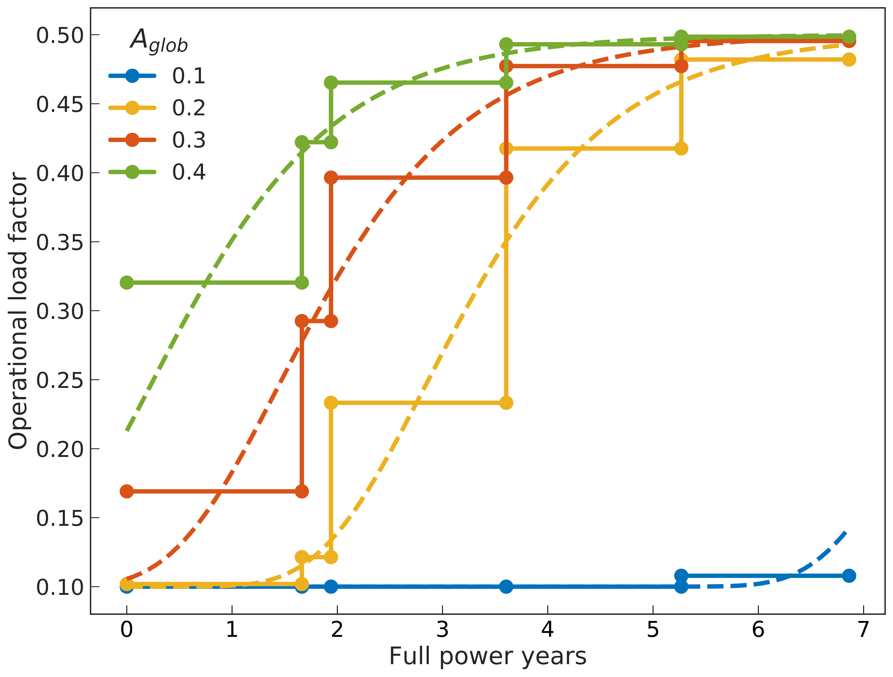
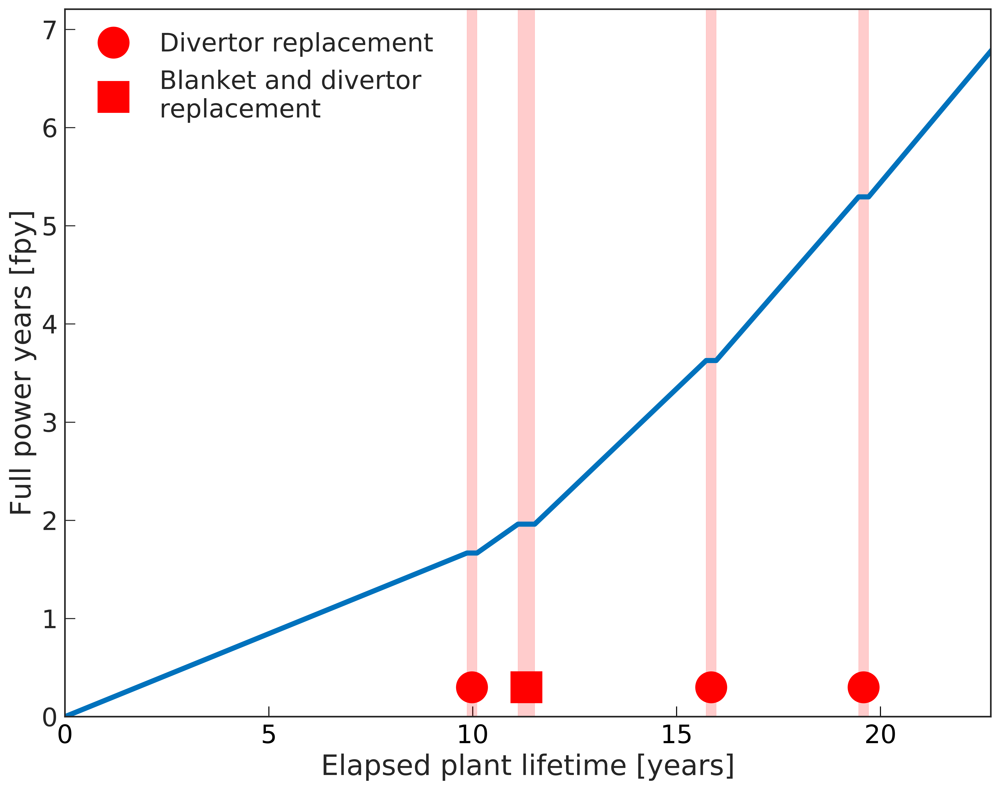
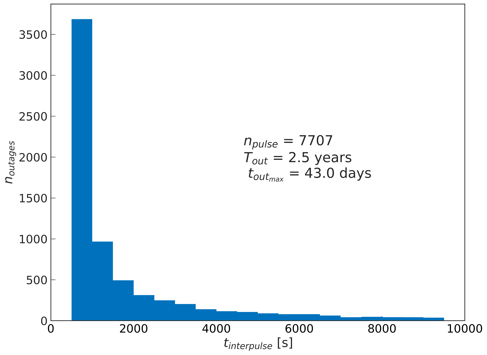
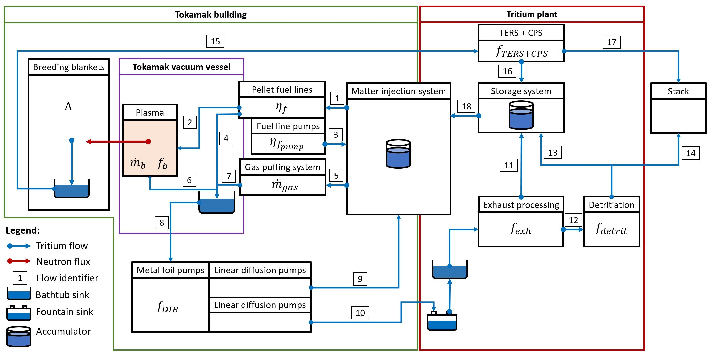
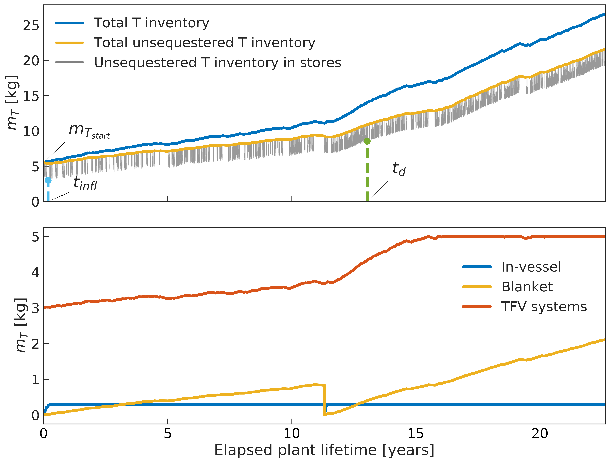
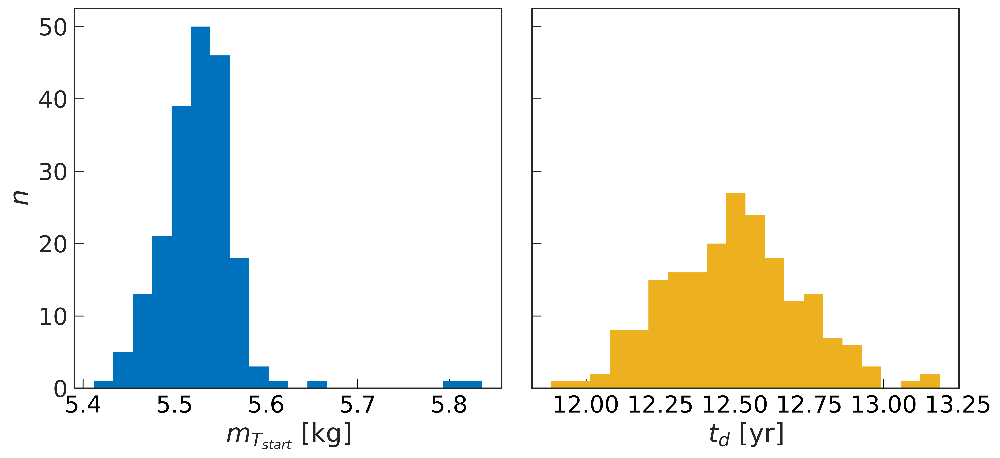

fuel_cycle
==========

The following documentation is mostly an extract from: `DEMO tritium fuel cycle: performance, parameter explorations, and design space constraints <https://www.sciencedirect.com/science/article/pii/S092037961930167X>`_, Coleman, Hörstensmeyer and Cismondi, *Fusion Engineering and Design* v **141** pp79-90 (2019)

Introduction
------------

One of the overarching goals of a DEMO-class device is to demonstrate
tritium self-sufficiency in a fusion power plant for the first time. A
future power reactor will necessarily require a start-up inventory of
tritium, :math:`m_{T_{start}}`, before commencing fully fledged D-T
operations for electricity production. In Europe, it is also presently
considered necessary for DEMO to provide a tritium fuel start-up
inventory for a subsequent prototype fusion power plant at a certain
doubling time, :math:`t_{d}`. At present, there is no model capable of
estimating :math:`m_{T_{start}}` or :math:`t_{d}` for the EU-DEMO, which
features a Direct Internal Recycling (DIR) loop in its fuel cycle, and
is characterised by low load factors (:math:`\sim`\ 0.2-0.3). This paper
introduces a simplified dynamic tritium fuel cycle model capable
estimating :math:`m_{T_{start}}` and :math:`t_{d}`, which has been
specifically designed to take into account the effects of low reactor
load factors and irregular operation.

Parameter definitions
---------------------

Tritium start-up inventory: :math:`m_{T_{start}}`
#################################################

The tritium start-up inventory, :math:`m_{T_{start}}`, is the amount of
tritium required for a DEMO-class device to complete its mission without
ever requiring an external supply of T. It is theoretically possible to
start up a reactor in D-D, and progressively breed sufficient T to
operate a D-T reactor normally [Zheng_2016]_;
however, the time, cost, and complexity of such an endeavour have yet to
be comprehensively assessed. A commissioning phase prior to full-power
D-T operations (likely to be mostly D-D plasma operations) will
undoubtedly produce some net tritium, although at present it is
generally assumed that a certain amount of tritium will need to be
purchased from an external supplier. Konishi et al. have done some
modelling work assuming extensive D-D commissioning activities and claim
that trivial amounts of externally sourced T would be required to begin
D-T operations in earnest [Konishi_2017]_.

Here, we operate on the basis that the origin of the tritium is
irrelevant: an amount, :math:`m_{T_{start}}`, will be needed regardless.

Previous studies over many decades point to a large uncertainty in
:math:`m_{T_{start}}`, with estimates ranging from 0.5 to 25 kg for a
1-2 GW fusion power reactor
[Ni_2013]_, [Kuan_1999]_. Recent developments
in the EU-DEMO tritium fuel cycle design, most notably with the advent
of the Direct Internal Recycling (DIR) cycle
[Day_2013]_, have aimed to drastically reduce
the cycle time and inventory, although to what degree has not yet been
made clear.

Reactor doubling time: :math:`t_{d}`
####################################

Here we define the doubling time, :math:`t_{d}`, as: the duration, from
the date of first commercial operation to the first moment in time at
which a reactor generates a surplus of T, equal to
:math:`m_{T_{start}}`, without affecting its own operational schedule.
This assumes that a future reactor would need the same amount of tritium
as a DEMO device. Although possibly incorrect, it is nonetheless a
reasonable assumption in the absence of any better information. Note
that the “doubling” does not actually correspond to a doubling of the T
inventory in a DEMO device, but of the number of reactors.

Whilst the need to provide tritium for a future reactor is widely
accepted, exactly when such a need might arise in the life of the
reactor has never been seriously considered in design studies. It would
be relatively trivial for DEMO to provide tritium for a new reactor at
the end of its life, as it no longer requires tritium for its own
operations. Without any further guidance, we propose some reasoning to
frame this requirement further. A fusion reactor beyond DEMO will only
be built if DEMO is a success. It is likely that DEMO will only be
considered a success after several years of operation, which we suggest
here should to be (as a minimum) somewhere in the second phase of
operation, with the second blanket set installed.

Note that if one believes that a DEMO-class reactor can create enough
tritium from commissioning in D-D as Konishi et al. suggest [Konishi_2017]_, then the issue of reactor
doubling time is a moot point.

Required tritium breeding ratio: :math:`\Lambda_r`
##################################################

The breeding blanket in a DEMO-class device must produce sufficient
tritium to offset the losses in the system through burning, decay, and
sequestration, and losses to the environment. Several studies have
investigated what tritium breeding ratio (TBR), :math:`\Lambda_r`, would
be required to achieve this overarching requirement, with values
typically in the range :math:`\Lambda_r` = 1.05-1.15. However, in the
recent EU-DEMO studies a “target” value for the TBR has been set at
:math:`\Lambda_t` = 1.10 [Fischer_2015]_, which accounts for additional
uncertainties in data and design.

This work will attempt to provide supporting analysis for a reasonable
design requirement for the required TBR, :math:`\Lambda_r`, which will,
in effect, amount to: :math:`\Lambda_r = 1+\Delta_{FC}`. The
:math:`\Lambda` values discussed here are actual TBR values; i.e. the
number of tritons actually created in the system, for every D-T fusion
reaction (on average), see Equation :eq:`TBR`.

.. math::
   :label: TBR

   \Lambda = \frac{\partial{m}_{T_{bred}}/{{\partial{t}}}}{\partial{m}_{T_{burnt}}/{{\partial{t}}}}

Although we note that :math:`\Lambda` will vary over the life of the
plant, as materials transmute, or batch processing breeding systems
(e.g. pebble beds) deplete, we ignore these effects in our analyses.

Uncertainties due to design and modelling assumptions, nuclear data, and
lithium burn-up must be accounted for above and beyond the TBR values we
discuss here. Similarly, we offer no comment as to how to treat TBR
estimations in neutronics models. Further gains on the required TBR for
design margins (e.g. a loss budget for non-breeding volumes),
:math:`\Delta_M`, and uncertainties, :math:`\Delta_U`, must be accounted
for in the definition of the target TBR, where
:math:`\Lambda_t=\Lambda_r+\Delta_M+\Delta_U`.

More detail on the exact definition of the target TBR can be found in [Fischer_2020]_.

Load factor: :math:`A_{glob}`
#############################

It is clear that the operation of a first-of-a-kind (FOAK) fusion power
reactor will be fraught with difficulties, and that less than ideal
operation should be anticipated.

For clarity, we define an overall fusion load factor target,
:math:`A_{glob}`, as the fraction of time spent operating at full plasma
power over the lifetime of the plant from the end of commissioning to
the end of all scheduled operations, see Equation :eq:`atot`:

.. math::
   :label: atot

   A_{glob} = \frac{T_{fpy}}{T_{calendar}}

where :math:`T_{calendar}` is the duration in years for DEMO to produce
a total energy equal to :math:`P_{fus}T_{fpy}`.

Assuming one blanket replacement, four divertor replacements, and
otherwise perfect operation (i.e. two-hour pulses take place every 600
seconds except during maintenance), one can easily determine that, with
the assumptions discussed above, the total, ideal reactor lifetime is
10.19 calendar years. In other words, the maximum achievable load factor
of the EU-DEMO is 6.86/10.19 = 0.67.

This would, of course, be an unreasonable value to assume for a FOAK
fusion power reactor. A target availability factor of 0.3 is presently
assumed for the EU-DEMO [Federici_2018]_. Note
that the above definition of load factor differs subtly from that of an
availability factor, which is when the reactor is *able* to operate (not
necessarily at nameplate capacity).

The fusion load factor in the first phase of operation after
commissioning is likely to be very low (e.g. 10%), resulting in large
ranges of intervals between pulses: from the minimum possible time
between pulses, up to years if a serious failure occurs. This presents a
unique challenge for the DEMO tritium fuel cycle, as it must cope with
the pressures of rapid delivery during sequential pulses with no
failures, while producing enough tritium to account for decay losses
over long periods of time when none is being produced.

Planned operations for the EU-DEMO
##################################

The total lifetime of the EU-DEMO device and its operational phases are
defined in terms of material damage in the EUROfer first wall at the
outboard equatorial midplane. A total lifetime of 70 dpa is assumed,
with a “starter” blanket being used in a first operational phase, up to
20 dpa, followed by the second operational phase (with a second blanket
set), running a further 50 dpa [Cismondi_2018]_.

For a fusion power, :math:`P_{fus}`, of 2037 MW [Wenninger_2017]_, we assume a EUROfer damage
rate of 10.2 dpa/fpy at the blanket first wall at the equatorial
midplane, as per [Pereslavtsev_2016]_ and
similar to values presented in [Fischer_2016]_, and for the divertors
(CuCrZr), we assume a total lifetime of 5 dpa, with a damage rate of 3
dpa/fpy, as suggested in [Federici_2017]_.

Once components reach the end of their (scheduled) lifetime, the reactor
must be shut down, and the components must be remotely replaced. For the
EU-DEMO we assume a full blanket replacement duration of 250 days, and a
full divertor replacement duration of 150 days, which include all
reactor shutdown and restart activities. Naturally, in-vessel components
will need to be replaced before the end of their scheduled life (due to
failures); however, these activities are technically unplanned
maintenance activities and cannot be predicted.

In this work we take the EU-DEMO1 2015 design point
[Federici_2016]_, [Wenninger_2017]_ as a
reference, which is a pulsed device, with a pulse length,
:math:`t_{pulse}`, of two hours. We assume that the inter-pulse duration
will be dictated by the recharge time for the central solenoid (CS),
:math:`t_{CS}`, which we assume is 600 s. The other factor which could
affect this time is the time needed to pump down the vessel back to its
base pressure after the extinction of the plasma from the previous
pulse.

Ramp-up and ramp-down periods are assumed during a pulse, in which the
plasma current (and power) will be steadily brought up to full
operational load. For simplicity, we assume here that no fusion takes
place during this time. The ramp-up and ramp-down rates are assumed to
be :math:`r_{ramp}` = 0.1 MA/s, as in [Vincenzi_2017]_.

The EU-DEMO plasma current, :math:`I_{p}`, is 19.8 MA, and, as such, the
flat-top duration, :math:`t_{flat-top}`, is 1.89 hours. In order to
fulfil its target of 70 dpa, the EU-DEMO must operate for a duration,
:math:`T_{fpy}`, of 6.86 full-power years, the equivalent of
approximately 32,000 full-power D-T pulses over the lifetime of the
plant.

Tritium fuel cycle model
------------------------

Literature and motivations
##########################

DEMO will be the first nuclear fusion power plant to demonstrate a
closed fuel cycle, and as such will impose strong requirements on its
tritium, fuelling, and vacuum (TFV) systems, as well as the breeding
blanket, safety, and waste systems.

Previous seminal works by Abdou et al.
[Abdou_1986]_, [Kuan_1999]_, and colleagues
[Kuan_1995]_, [Sawan_2006]_ have
for years been the reference(s) for tritium fuel cycle models for next
generation devices. These authors have built very detailed analytical
models of the global tritium fuel cycle, accounting for many and varied
loss terms, and including a variety of system and sub-system parameters.

The situation as we see it today differs in two important respects from
that addressed by these previous works.

Firstly, recent developments in the tritium fuel cycle in Europe have
led us to consider a continuous DIR of the fuel cycle
[Day_2013]_, and different fuel cycle parameters
based on developments in R&D. This modifies the typical fuel cycle
functional block diagram and the performance values for the TFV systems
(most notably the plasma exhaust reserve time), and has the potential to
reduce the complexity and size of the fuel cycle, and improve the
performance of the system in terms of the required :math:`m_{T_{start}}`
and :math:`t_{d}`.

Secondly, although Kuan and Abdou’s analytical model
[Kuan_1999]_ includes terms for the overall reactor
load factor, most calculations are done assuming high availability
factors [1]_. Though these authors show results for far lower load
factors, the terms are applied as averages to make the model
time-independent. This approximation is justifiable for the ranges of
availability they considered as realistic at the time (50% to 100%), and
the authors themselves note that the range of insensitivity is between
65% to 100% [Kuan_1999]_. However, Kuan and Abdou’s
results for reactor availabilities around and below 30% are cause for
concern: high TBRs (:math:`\geq`\ 1.3) are required to maintain the same
performance.

Given the substantially lower load factors considered in the EU-DEMO
studies (typically :math:`\sim20-30\%`) we were motivated to consider a
Monte Carlo approach for the simulation of randomised DEMO timelines,
coupled with a simplified fuel cycle model to estimate the fuel cycle
performance. For example, if, during the first operational phase, one or
more lengthy unplanned outages take place, this could have a driving
effect on the required tritium start-up inventory.

Finally, an additional motivation is simply that dynamic tritium fuel
cycle models capable of estimating :math:`m_{T_{start}}` and
:math:`t_{d}` do not exist at present in the EU. More detailed studies
of the EU-DEMO TFV systems are being carried out, as are much
higher-fidelity models of the full fuel cycle over the course of a
single reactor pulse. However, these are too slow for us to model the
performance over the lifetime of the plant, and are best used to inform
a lower-fidelity model, such as the one presented here. We note that
this approach is similar to that of Kuan and Abdou
[Kuan_1999]_, who used more detailed dynamic models
(e.g. CFTSIM [Busigin_1998]_), which
simulate phenomena at much shorter timescales, to estimate parameters in
their global analytical model.

.. _availability:

Global availability model
#########################

It is clear that, in its early stages of operation, DEMO will encounter
various issues associated with the operation of a FOAK reactor. Given
existing operational experience, it would be unwise to expect a high
level of plant availability in these early phases, and even more
unrealistic to expect predictable operation. Here we argue that it will
be difficult for DEMO to stick to regular operational schedules, and
that many unplanned maintenance phases are likely to occur, the likes of
which we cannot meaningfully predict today.

Here we introduce additional definitions:

#. An operation period, defined as the period between two planned
   maintenance intervals (of either the divertors or the blankets).

#. The operational load factor, :math:`a_{n}`, which is defined as the
   fraction of time spent operating at full plasma power within a given
   operation period, :math:`n`.

In order to obtain a realistic view of how the availability of a FOAK
might develop throughout its life, we posit that the operational
availability of the plant will evolve over time following a sigmoid-like
function. General experience with reliability, availability,
maintainability, and inspectability (RAMI) issues leads us to expect
high failure rates and low availability at the start of life (infant
mortality) and end of life (wear-out failures), and yet on FOAK systems
we also expect a degree of learning and improvement with experience to
take place. A sigmoid function for the operational load factor gives a
flat performance at the start of life, and assumes some improvement in
performance gained through operational experience, which is then limited
by end of life component failures.

Thus, we propose a sigmoid (Gompertz) parameterisation of the
operational load factor of the reactor over its life:

.. math::
   :label: at

   a(t) = a_{min} + (a_{max}-a_{min})\text{exp}\bigg({\frac{-\text{ln}(2)}{\text{exp}(-ct_{G_{infl}})}\text{exp}(-ct)}\bigg)

where :math:`t` is time (fpy), :math:`a_{min}` and :math:`a_{max}` are
the minimum and maximum operational load factors, :math:`t_{G_{infl}}`
is the inflection point of the Gompertz function (fpy), and :math:`c` is
the learning rate (fpy\ :math:`^{-1}`). The choice of a Gompertz
parameterisation was made to enable minimum and maximum value
constraints to be implemented. Based on expert opinion, :math:`a_{min}`
and :math:`a_{max}` were set at 0.1 and 0.5, respectively, and :math:`c`
was fixed at 1.

We then discretise Equation :eq:`at` on a per-operation-period basis,
maintaining the same overall load factor, :math:`A_{glob}`. As the
operation periods vary in duration, the discretisation cannot be done by
simple integration of :math:`a(t)`, and instead we apply a
discretisation function :math:`g` to get: :math:`\bar{a}(i) = g(a(t))`
and then frame a simple optimisation problem to find
:math:`t_{G_{infl}}` which satisfies the constraints of :math:`a_{min}`
and :math:`a_{max}` for the same total fusion duration:

.. math::
   :label: amin

   \min_{\forall t_{infl} \in [0, T_{DEMO}]} A_{glob}T_{DEMO}-\sum_{i=0}^{n_{periods}}a_{i}T_{i}

Solving Equation :eq:`amin` gives a vector of operational load
factors, :math:`\bar{a}`, per phase, where
:math:`\sum_{i=0}^{n_{periods}} a_{i}T_{i} = A_{glob}T_{DEMO}`, where
:math:`T_{i}` is the total duration of the phase. :numref:`Atot_a`
shows the operational load factors over the life of the plant for a
given overall load factor.

   Operational load factors in DEMO periods for specified global load
   factors, :math:`A_{glob}`. The dashed lines shows :math:`a(t)` and
   the solid lines show the discretisation per operation period where
   :math:`\int a(t) = \int g(a(t))`.

Mapping these operational load factors to each period of DEMO operation,
we can observe the progression in load factor throughout the life,
assuming perfectly regular operation, see :numref:`linear`.

   Operation periods in a typical DEMO timeline. The blue curve shows
   the fpy accumulation as a function of calendar years; its slope in
   each operation period is equal to :math:`a_{i}`.

Timeline generation
###################

In reality, however, the operation of DEMO is unlikely to be purely
regular. We believe it is likely
enough that the inter-pulse durations vary in a range of ways such that
they may differ substantially from the ideal inter-pulse down-time,
:math:`t_{interpulse}`, of :math:`t_{interpulse}` = :math:`t_{CS}`.

To compensate for our fundamental lack of knowledge regarding RAMI
issues for DEMO, we have combined the known
planned maintenance operations (those dictated by the levels of neutron
damage in the in-vessel components) and inter-pulse/ramp durations with
a series of random outages selected from a log-normal distribution. This
approach is designed to mimic the relatively unpredictable operational
schedules of FOAK devices and present-day tokamaks.

The total fusion time within a given operation period is prescribed (see
section :ref:`availability` above), and the number of pulses is calculated
to match this fusion time. The total duration of the non-fusion time is
computed according to the prescribed availability. For simplicity and
speed of computation, we assume that all pulses last the full pulse
length, :math:`t_{pulse}`. Although unrealistic, the effect of varying
pulse lengths is relatively small, as the inter-pulse durations are
assigned a wide variation thanks to the distribution selected. The
duration of the outages is between :math:`t_{CS}` and :math:`+\infty`,
although as the integral of the distribution and the number of samples
are prescribed, in practice a single outage can last up to several
months, depending upon the prescribed operational load factor. Figure
`1`_ shows an indicative distribution of randomly generated inter-pulse
durations for an operation period.

   A randomly generated log-normal distribution of inter-pulse
   durations, for :math:`a` = 0.41. :math:`n_{pulse}` is the number of
   pulses, :math:`T_{out}` is the total outage time, and
   :math:`t_{out_{max}}` is the maximum inter-pulse duration within the
   period.

The choice of a log-normal distribution here is relatively arbitrary,
and it is worth pointing out that other distributions can significantly
alter on the maximum duration of the outages. This in turn can have an
effect on the tritium fuel cycle performance.

For each operation period, a distribution of inter-pulse durations is
generated and is used to generate partly randomised operational
timelines for DEMO, following the methodology above. From the fusion
power, :math:`P_{fus}`, one can then calculate the rate of neutron
production during each pulse, integrate over time, and, from previously
mentioned neutronics studies, estimate the damage of the critical
reactor components over the lifetime of the reactor. Figure `1`_ shows
for illustration purposes the fraction of component lifetime (the
material damage at a point in time over the neutron budget for each
component/material) for the divertors, the blankets, the toroidal field
coils and the vacuum vessel. The latter two are irreplaceable lifetime
components, and are shown for information only, assuming typical EU-DEMO
neutron fluxes and maximum fluences (3.25 dpa for the vacuum vessel, 10
MGy for the TF coil insulation).

.. figure:: damage.png
   :name: damage

   Upper: reactor fpy as a function of calendar years; lower: component
   damage as a function of calendar years. The dips in the blanket and
   divertor curves indicate when these components are replaced.

Simplified T fuel cycle
#######################

The simplified T fuel cycle modelled here is a reduced model: it
contains no direct solution of any chemical balance equations. Instead,
fuel cycle systems are modelled simplistically with a handful of
parameters describing their performance. At this high level, no
distinction is made in the fuel cycle block diagram for the different
blanket types; instead our model is designed to be independent of
technology choices, modelling differences in technologies simply as
different performance parameters. Since many of the fuel cycle systems
and technologies do not yet exist, we feel it is legitimate to model
them as simple actuators with performance parameters that are indicative
of the underlying physics processes taking place in them. For instance,
we model the metal foil pumps simply as a separation fraction,
:math:`f_{DIR}`, where :math:`f_{DIR}` of the flow entering the metal
foil pumps is transported to the pellet injection system, and the
remainder is transported to the exhaust processing system.

The block diagram of the simplified T fuel cycle model shown in :numref:`tfvblock` is based on the presently considered EU-DEMO TFV
system design, described in
[Hörstensmeyer_2018]_. The main features of
this fuel cycle architecture are briefly summarised here:

#. There are three main tritium recycling loops: the direct internal
   loop, the exhaust processing loop, and the outer detritiation loop,
   where progressively lower concentrations of tritium are managed.

#. The matter injection system supplies solid fuel to the plasma, and
   gas (D, T, and other gases) to the in-vessel environment for first
   wall protection purposes. The gaseous T is injected continuously
   during the pulse at a rate, :math:`\dot{m}_{gas}`, is assumed never
   to be fused, and is not accounted for in the calculation of the
   burn-up fraction, :math:`f_b`.

#. The solid fuel enters the tokamak vacuum vessel in the form of frozen
   pellets travelling at high speeds through pellet fuel lines. The
   process is lossy, with a fuelling efficiency, :math:`\eta_f`.
   Dedicated pumps on the fuel lines recover some of the lost tritium
   back to the matter injection system, with an efficiency,
   :math:`\eta_{f_{pump}}`. The rest is assumed to enter the vacuum
   vessel in gaseous form, and has no chance of entering the plasma or
   being fused.

#. Tritium bred in the breeding blankets is extracted in the tritium
   extraction and recovery system (TERS). Tritium which permeates to the
   blanket coolant(s) is extracted in the coolant purification system
   (CPS).

#. The tritium which cannot be extracted from the flue gases eventually
   exits the system at the stack, where regulatory requirements on
   environmental releases of tritium will have to be met.

The tritium flows and parameterisations are summarised in Table
:numref:`simpleTsummary`.

Where reasonable, we have lumped parameters so as to reduce the number
of variables in the model. For instance, the time for tritium to travel
through the plasma, the in-vessel environment, the metal foil pumps, and
the linear diffusion pumps (in either branch of the DIR loop) is one
parameter: :math:`t_{pump}`.

   Block diagram of the simplified T fuel cycle model, showing the
   modelled flows of tritium between sub-systems, the locations of the
   tritium sinks and accumulators, including the schematic locations of
   the sub-systems within the tokamak, tokamak hall, and the tritium
   plant.

The TERS and the CPS have been lumped in the model, as the CPS in
particular has almost no effect on :math:`m_{T_{start}}` or
:math:`t_{d}`. It does, however, play a role when it comes to
determining the total release rate of tritium from the plant. The TERS
recovers the tritium from the intended production stream (be it pebble
beds or liquid lithium lead), whereas the CPS purifies the blanket
coolant from any tritium which permeates into the primary coolant loop
(be it helium or water). The design of the blanket, of course, has a
significant effect on the performance of both of these systems, as the
technologies being considered are very different. Simplifying these
important differences out in our model, we model this part of the system
as a leak rate of the tritium flow from the blanket, :math:`r_{leak}`,
which is handled by the CPS, and the rest, :math:`1-r_{leak}`, which is
dealt with by the TERS. This is then simplified into a single factor in
the model, see Equation :eq:`terscps`.

.. math::
   :label: terscps

   f_{TERS+CPS} = r_{leak}f_{CPS}+(1-r_{leak})f_{TERS}

Given that the TERS will handle most of the tritium flow coming from the
blanket, the duration of the actions of the TERS, :math:`t_{TERS}`, is
modelled and the CPS duration is assumed to be the same. This
simplification is only acceptable because it is assumed that
:math:`r_{leak}` is relatively small, i.e. that the CPS will feed very
little tritium to the stores.

Tritium accumulators are modelled in the storage system to represent the
long-term storage of the tritium inventory, in the form of uranium beds,
and in the matter injection system. Here there will be a buffer storage
of tritium to meet the minute-to-minute and day-to-day operational
tritium storage requirements. The model is set up in such a way that
there is never a lack of tritium in the accumulators, which would mean
the plasma would be unable to operate as scheduled.

An initial start-up inventory is assumed and the model is run over the
full reactor lifetime. The point of minimum inventory is located and the
model is re-run with an adjusted start-up inventory until convergence.

The radioactive decay of tritium is accounted for at all locations in
the model.

.. _simpleTsummary:

.. table:: Simplified T fuel cycle model flows and durations, ignoring the contributions of the sink terms used to model tritium retention

   +---------+-------------------------------------+--------------------+
   | Flow ID | :math:`\dot{m}_{i}`                 | :math:`t_{i}`      |
   |         |                                     |                    |
   +=========+=====================================+====================+
   | 1       | :math:`\frac{\dot{m}_{b}}           | :math:`t_{freeze}` |
   |         | {f_{b}{\eta}_{f}}`                  |                    |
   +---------+-------------------------------------+--------------------+
   | 2       | :math:`\frac{\dot{m}_{b}}{f_{b}}`   | 0                  |
   +---------+-------------------------------------+--------------------+
   | 3       | :math:`{\eta}_{                     | 0                  |
   |         | f_{pump}}(1-{\eta}_{f})\dot{m}_{1}` |                    |
   +---------+-------------------------------------+--------------------+
   | 4       | :math:`(1-{\eta}_{f                 | 0                  |
   |         | _{pump}})(1-{\eta}_{f})\dot{m}_{1}` |                    |
   +---------+-------------------------------------+--------------------+
   | 5       | :math:`\dot{m}_{gas}`               | 0                  |
   +---------+-------------------------------------+--------------------+
   | 6       | :math:`\dot                         | 0                  |
   |         | {m}_{b}\Big(\frac{1}{f_{b}}-1\Big)` |                    |
   +---------+-------------------------------------+--------------------+
   | 7       | :math:`\dot{m}_{gas}`               | 0                  |
   +---------+-------------------------------------+--------------------+
   | 8       | :math:`\dot{m}_{4}                  | 0                  |
   |         | +\dot{m}_{6}+\dot{m}_{7}`           |                    |
   +---------+-------------------------------------+--------------------+
   | 9       | :math:`f_{DIR}\dot{m}_{8}`          | :math:`t_{pump}`   |
   +---------+-------------------------------------+--------------------+
   | 10      | :math:`(1-f_{DIR})\dot{m}_{8}`      | :math:`t_{pump}`   |
   +---------+-------------------------------------+--------------------+
   | 11      | :math:`f_{exh}\dot{m}_{10}`         | :math:`t_{exh}`    |
   +---------+-------------------------------------+--------------------+
   | 12      | :math:`(1-f_{exh})\dot{m}_{10}`     | :math:`t_{exh}`    |
   +---------+-------------------------------------+--------------------+
   | 13      | :math:`f_{detrit}\dot{m}_{12}`      | :math:`t_{detrit}` |
   +---------+-------------------------------------+--------------------+
   | 14      | :math:`(1-f_{detrit})\dot{m}_{12}`  | 0                  |
   +---------+-------------------------------------+--------------------+
   | 15      | :math:`\Lambda\dot{m}_{b}`          | 0                  |
   +---------+-------------------------------------+--------------------+
   | 16      | :math:`f_{TERS+CWPS}\dot{m}_{15}`   | :math:`t_{TERS}`   |
   +---------+-------------------------------------+--------------------+
   | 17      | :math:`(1-f_{TERS+CPS})             | 0                  |
   |         | \dot{m}_{15}`                       |                    |
   +---------+-------------------------------------+--------------------+
   | 18      | :math:`\dot{m}_{4}+\dot             | 0                  |
   |         | {m}_{11}+\dot{m}_{13}+\dot{m}_{16}` |                    |
   +---------+-------------------------------------+--------------------+

Bathtub and fountain tritium retention models
#############################################

Logical models are used here to mimic known tritium retention behaviour
in some systems. These models have no basis in chemistry or in the
physics of tritium transport.

The “bathtub” model is intended to mimic the retention of tritium in
metal surfaces which are exposed to flows of gaseous tritium. In reality
there are many complex physical phenomena governing this effect, in
particular for materials undergoing irradiation, such as the tungsten
first wall. We make no attempt to model these effects, and opt for an
extremely simple model in which a certain fraction :math:`{\eta}`
(“release rate”) of the tritium flow through an environment,
:math:`\dot{m}_{in}`, over a timestep, :math:`\Delta t`, is retained in
the environment as a local T sink with inventory :math:`I`, up until a
certain maximum inventory :math:`I_{max}` is reached, at which point the
outgoing flow, :math:`\dot{m}_{out}`, equals the incoming flow, see
Equation :eq:`bathtub`. Note that exponential term after
:math:`(1-\eta)\dot{m}_{in}` accounts for sequestered tritium which
decays within the timestep.

.. math::
   :label: bathtub

   \begin{aligned}
   &\textrm{if}~I~\leq~I_{max}~\textrm{then} \\
   &~~~~~~I\leftarrow Ie^{-\lambda \Delta t}+(1-\eta)\dot{m}_{in}\dfrac{e^{-\lambda \Delta t}(e^{\lambda \Delta t}-1)}{e^{\lambda}-1}\\
   &~~~~~~\dot{m}_{out}=\eta \dot{m}_{in}\\
   &\textrm{else}\\
   &~~~~~~I\leftarrow I_{max}\\
   &~~~~~~\dot{m}_{out} = \dot{m}_{in}\\
   &\textrm{end}
   \end{aligned}

Other components, such as cryogenic distillation columns, require a
certain minimum inventory in order to operate effectively. Here we
reduce this behaviour to a simple minimum T inventory required for
operation, a so-called “fountain” model, see Equation :eq:`fountain`.

.. math::
   :label: fountain

   \begin{aligned}
   &\textrm{if}~I~\leq~I_{max}~\textrm{then} \\
   &~~~~~~I\leftarrow Ie^{-\lambda \Delta t}\\
   &~~~~~~\dot{m}_{out}=\dot{m}_{in}\\
   &\textrm{else}\\
   &~~~~~~I\leftarrow Ie^{-\lambda \Delta t}+\dot{m}_{in}\dfrac{e^{-\lambda \Delta t}(e^{\lambda \Delta t}-1)}{e^{\lambda}-1}\\
   &~~~~~~\dot{m}_{out} = 0\\
   &\textrm{end}
   \end{aligned}

In both tritium retention models, any sequestered tritium lost to decay
must be replenished. This means that any saturated tritium sink can
still draw tritium from the fuel cycle, as it will replenish any
depleted tritium until its saturation point is reached.

Bathtub models have been used to represent tritium sequestration in the
in-vessel environment (predominantly due to tritium take-up in the
tungsten plasma-facing components) and the blankets. The sequestered
tritium in the blankets is due to absorption in the structural materials
(i.e. EUROfer), functional materials (e.g. pebbles/coatings), and the
coolant and purge fluid loop(s). The importance of this sink depends on
the blanket technology used; a helium-cooled pebble bed (HCPB) and a
water-cooled lithium lead (WCLL) blanket are expected to behave rather
differently. We ignore these differences in our model.

We use a single instance of the fountain model coupled to a bathtub
model as a lumped parameter for the entire tritium plant exhaust
processing systems, :math:`I_{TFV_{min}}`. In reality there will be
several different processing systems handling the flow in the tritium
plant. The TFV systems are likely to be operated continuously, so this
parameter can be thought of as the overall amount of tritium flowing
through the tritium plant at any one time in steady-state operation.
While this is a significant simplification, it keeps the number of
parameters low enough to perform comprehensive design space exploration
exercises. Given the importance of this parameter in determining the
start-up inventory, in future work this number must be derived from more
detailed modelling work, with accurate representations of the various
TFV systems.

Note that during a reactor shutdown, all tritium which is not
sequestered in the sinks would be moved into long-term storage (uranium
beds) for safety purposes. We do not model these flows as we assume that
no tritium is gained or lost (except for decay) during these movements.

Legal tritium release limits
############################

In the fuel cycle model, there is only one point where the tritium can
be released to the environment: the stack. Based on the mass flows in
each stream, and assuming that all sinks are saturated, a conservative
analytical relation can be derived for the amount of tritium released to
the environment over a given annual period, see Equation :eq:`legal`:

.. math::
   :label: legal   

   \begin{gathered}
   \dot{m}_{release} = A_{max}\Bigg[\bigg(\dot{m}_{b}\bigg[\bigg(\dfrac{1}{f_{b}}-1\bigg)+(1-{\eta}_{f_{pump}})
       \frac{1-{\eta}_{f}}{f_{b}{\eta}_{f}}\bigg]+\dot{m}_{gas}\bigg)\\~~~~~~~~\times(1-f_{DIR})(1-f_{exh})
       (1-f_{detrit}) \\+ \Lambda\dot{m}_{b}(1-f_{TERS+CPS})\Bigg]
   \end{gathered}

where :math:`\dot{m}_{b}` is the burn rate dictated by the fusion power,
and :math:`A_{max}` is the peak load factor achieved over any
one-calendar-year period in the DEMO lifetime, see Equation
:eq:`amax`.

.. math::
   :label: amax

   A_{max} = \text{max}\Bigg(\frac{dt_{fus}}{t_{j}-t_{i}} \forall t_{i} \in \langle 0, T_{DEMO}-1 \rangle\Bigg) , \text{where}\ t_{j} = t_{i}+1

According to present assumptions, the total legal limit within any given
calendar-year period is 9.9 g of T (gaseous and liquid forms)
[Johnston_2017]_. The above equation enables a
relative understanding of the importance of sub-system performance
parameters in determining the tritium release rate. Additional
contributions from in-vessel component detritiation and accidents should
also be accounted for, yet lie beyond the scope of this simple
parameterisation.

Calculation of :math:`m_{T_{start}}` and :math:`t_{d}`
######################################################

:numref:`default` shows the evolution of the DEMO plant and
tritium sink inventories over an indicative reactor lifetime. The upper
plot shows the total site tritium inventory (blue line), the total
unsequestered tritium inventory (yellow line), and the tritium in the
storage system (grey line), :math:`m_{T_{store}}`. The high frequency
oscillations in :math:`m_{T_{store}}` are due to the tritium being
circulated around the system during operation.

The start-up inventory is found by solving the fuel cycle model using
Picard iterations: starting from an an initial guess of the tritium
start-up inventory, the model is run until the point of minimum
inventory is equal to :math:`I_{TFV_{min}}`, see Equation
:eq:`picard`. The point of minimum tritium inventory is also
referred to as the inventory inflection point, which occurs as
:math:`t_{infl}`, see e.g. :numref:`default`.

.. math::
   :label: picard

   \begin{aligned}
   &m_{T_{start}} = 0\\
   &\textrm{while}~\Delta_{m} \not\approx 0~\textrm{do}\\
   &~~~~~~m_{T_{store}}[0] = m_{T_{start}}\\
   &~~~~~~\textrm{run model}\\
   &~~~~~~\Delta_{m}=\textrm{min}(m_{T_{store}})-I_{TFV_{min}}\\
   &~~~~~~m_{T_{start}} \leftarrow m_{T_{start}}-\Delta_{m}\\
   &\textrm{end}
   \end{aligned}

The doubling time is calculated as the first point in time at which the
reactor is able to release an amount :math:`m_{T_{start}}` from the
storage system, without affecting the reactor’s ability to operate. In
other words, when the T inventory in the stores permanently exceeds a
threshold of: :math:`I_{TFV_{min}}+m_{T_{start}}`, see Equation
:eq:`t_d`.

.. math::
   :label: t_d

   t_d = t\Big\lbrack \text{max}\Big(\text{argmin}\Big(\big\lvert m_{T_{store}}-I_{TFV_{min}}-m_{T_{start}}\big\rvert \Big)\Big) \Big\rbrack

This method to calculate :math:`t_{d}` is flawed as it relies on
knowledge of the full reactor life. In reality, such “future”
information would not be available, and a decision to release large
amounts of tritium to a future reactor without jeopardising the
operational capabilities of the existing DEMO would be more complex.
This simplification is, however, trivial in the light of the other
uncertainties in the model and our assumptions.

The lower plot in :numref:`default` shows the amount of tritium
sequestered (i.e. trapped) in the various sinks. The in-vessel tritium
sink (blue line) saturates almost immediately as it sees the highest
flux of tritium and has a relatively low saturation limit in this
default case. The TFV systems (orange line) start with the minimum
inventory specified and eventually saturate at the maximum. The blanket
inventory (yellow line) does not saturate in this example, and is reset
to zero (along with the in-vessel inventory) when the blankets are
replaced at the end of the first operational phase. The dip in the
in-vessel and blanket inventories corresponds to the replacement of the
in-vessel components (plasma-facing surfaces and blankets), where the
sequestered tritium in the in-vessel components is not considered to be
recovered in any way (a conservative assumption).

   Indicative time-series of the tritium fuel cycle model for the
   default DEMO values. Upper: moveable tritium inventories, showing the
   values of :math:`m_{T_{start}}` and :math:`t_{d}`; lower: tritium
   sink inventories.

For a given design point (:math:`A_{glob}`, :math:`P_{fus}`,
:math:`t_{flattop}`, :math:`t_{ramp}`, :math:`t_{CS}`), 200 timelines
are randomly generated. The fuel cycle model is then run for a given set
of reactor and fuel cycle parameters (:math:`f_{b}`,
:math:`\eta_{fuel}`, :math:`f_{DIR}`, :math:`t_{DIR}`,
:math:`t_{freeze}`, etc.) for the partly randomised fusion power
signals, and :math:`m_{T_{start}}` and :math:`t_{d}` are calculated from
the time-series of the tritium inventories.

The distributions of :math:`m_{T_{start}}` and :math:`t_{d}` for the
default case are shown in :numref:`distribution`, and the results summarised in
:numref:`defaultresults`.

   Distributions of :math:`m_{T_{start}}` and :math:`t_{d}` for 200
   randomly generated timelines with default DEMO assumptions

.. _defaultresults:

.. table:: Default results for :math:`m_{T_{start}}` and :math:`t_{d}`, over 200 runs

      ======================== ========================== ==================
      Value                    :math:`m_{T_{start}}` [kg] :math:`t_{d}` [yr] 
      ======================== ========================== ==================
      Mean                     5.52                       12.53              
      95\ :sup:`th` percentile 5.58                       12.94              
      Maximum                  5.78                       13.14              
      ======================== ========================== ==================

.. rubric:: Footnotes

.. [1]
   We use the term load factor here, whereas Kuan and Abdou and many in the community use
   availability. The two are closely related, and mathematically
   identical if the reactor is operated at nameplate capacity exactly
   whenever it is available to operate. In Kuan and Abdou’s model, and
   the work presented here, the terms are equivalent.

.. rubric:: References

.. [Zheng_2016] S. Zheng, D. B. King, L. Garzotti, E. Surrey, and T. N. Todd, Fusion reactor start-up without an external tritium source, Fusion Engineering and Design, vol. 103, pp. 13–20, Feb. 2016

.. [Konishi_2017] S. Konishi, R. Kasada, and F. Okino, Myth of initial loading tritium for DEMO: Modelling of fuel system and operation scenario, Fusion Engineering and Design, vol. 121, pp. 111–116, Oct. 2017

.. [Ni_2013] M. Ni, Y. Wang, B. Yuan, J. Jiang, and Y. Wu, Tritium supply assessment for ITER and DEMOnstration power plant, Fusion Engineering and Design, vol. 88, pp. 2422–2426, Oct. 2013

.. [Kuan_1999] W. Kuan and M. A. Abdou, A New Approach for Assessing the Required Tritium Breeding Ratio and Startup Inventory in Future Fusion Reactors, Fusion Technology, vol. 35, pp. 309–353, May 1999

.. [Day_2013] C. Day and T. Giegerich, The Direct Internal Recycling concept to simplify the fuel cycle of a fusion power plant, Fusion Engineering and Design, vol. 88, pp. 616–620, Oct. 2013

.. [Fischer_2015] U. Fischer, C. Bachmann, I. Palermo, P. Pereslavtsev, and R. Villari, Neutronics requirements for a DEMO fusion power plant, Fusion Engineering and Design, vol. 98-99, pp. 2134–2137, Oct. 2015

.. [Fischer_2020] U. Fischer, L.V. Boccaccini, F. Cismondi, M. Coleman, C. Day, Y. Hörstensmeyer, F. Moro, P. Pereslavtsev, Required, achievable and target TBR for the European DEMO, Fusion Engineering and Design, Volume 155, 2020, 111553, ISSN 0920-3796

.. [Federici_2018] G. Federici, C. Bachmann, L. Barucca, W. Biel, L. Boccaccini, R. Brown, C. Bustreo, S. Ciattaglia, F. Cismondi, M. Coleman, V. Corato, C. Day, E. Diegele, U. Fischer, T. Franke, C. Gliss, A. Ibarra, R. Kembleton, A. Loving, F. Maviglia, B. Meszaros, G. Pintsuk, N. Taylor, M. Q. Tran, C. Vorpahl, R. Wenninger, and J. H. You, DEMO design activity in Europe: Progress and updates, Fusion Engineering and Design, June 2018

.. [Cismondi_2018] F. Cismondi, L. V. Boccaccini, G. Aiello, J. Aubert, C. Bachmann, T. Barrett, L. Barucca, E. Bubelis, S. Ciattaglia, A. Del Nevo, E. Diegele, M. Gasparotto, G. Di Gironimo, P. A. Di Maio, F. Hernandez, G. Federici, I. Fernndez-Berceruelo, T. Franke, A. Froio, C. Gliss, J. Keep, A. Loving, E. Martelli, F. Maviglia, I. Moscato, R. Mozzillo, Y. Poitevin, D. Rapisarda, L. Savoldi, A. Tarallo, M. Utili, L. Vala, G. Veres, and R. Zanino, Progress in EU Breeding Blanket design and integration, Fusion Engineering and Design, May 2018

.. [Wenninger_2017] R. Wenninger, R. Kembleton, C. Bachmann, W. Biel, T. Bolzonella, S. Ciattaglia, F. Cismondi, M. Coleman, A. J. H. Donn, T. Eich, E. Fable, G. Federici, T. Franke, H. Lux, F. Maviglia, B. Meszaros, T. Ptterich, S. Saarelma, A. Snickers, F. Villone, P. Vincenzi, D. Wolff, and H. Zohm, The physics and technology basis entering European system code studies for DEMO, Nuclear Fusion, vol. 57, no. 1, p. 016011, 2017

.. [Pereslavtsev_2016] P. Pereslavtsev, Generic neutronics analyses for DEMO including the development of a global MCNP model,” Tech. Rep. EFDA D 2M7HN3, 2016

.. [Fischer_2016] U. Fischer, C. Bachmann, J. C. Jaboulay, F. Moro, I. Palermo, P. Pereslavtsev, and R. Villari, Neutronic performance issues of the breeding blanket options for the European DEMO fusion power plant, Fusion Engineering and Design, vol. 109-111, pp. 1458–1463, Nov. 2016

.. [Federici_2017] G. Federici, W. Biel, M. Gilbert, R. Kemp, N. Taylor, and R. Wenninger, European DEMO design strategy and consequences for materials, Nuclear Fusion, vol. 57, p. 092002, Sept. 2017

.. [Federici_2016] G. Federici, C. Bachmann, W. Biel, L. Boccaccini, F. Cismondi, S. Ciattaglia, M. Coleman, C. Day, E. Diegele, T. Franke, M. Grattarola, H. Hurzlmeier, A. Ibarra, A. Loving, F. Maviglia, B. Meszaros, C. Morlock, M. Rieth, M. Shannon, N. Taylor, M. Q. Tran, J. H. You, R. Wenninger, and L. Zani, Overview of the design approach and prioritization of R&D activities towards an EU DEMO, Fusion Engineering and Design, vol. 109-111, pp. 1464–1474, Nov. 2016

.. [Vincenzi_2017] P. Vincenzi, R. Ambrosino, J. F. Artaud, T. Bolzonella, L. Garzotti, G. Giruzzi, G. Granucci, F. Kchl, M. Mattei, M. Q. Tran, and R. Wenninger, EU DEMO transient phases: Main constraints and heating mix studies for ramp-up and ramp-down, Fusion Engineering and Design, vol. 123, pp. 473–476, Nov. 2017

.. [Abdou_1986] M. A. Abdou, E. L. Vold, C. Y. Gung, M. Z. Youssef, and K. Shin, Deuterium-Tritium Fuel Self-Sufficiency in Fusion Reactors, Fusion Technology, vol. 9, pp. 250–285, Mar. 1986

.. [Kuan_1995] W. Kuan, M. A. Abdou, and R. S. Willms, Time-dependent tritium inventories and flow rates in fuel cycle components of a tokamak fusion reactor, Fusion Engineering and Design, vol. 28, pp. 329–335, Mar. 1995

.. [Sawan_2006] M. E. Sawan and M. A. Abdou, Physics and technology conditions for attaining tritium self-sufficiency for the DT fuel cycle, Fusion Engineering and Design, vol. 81, pp. 1131–1144, Feb. 2006

.. [Chen_2016] H. Chen, L. Pan, Z. Lv, W. Li, and Q. Zeng, Tritium fuel cycle modeling and tritium breeding analysis for CFETR, Fusion Engineering and Design, vol. 106, pp. 17–20, May 2016

.. [Busigin_1998] A. Busigin and P. Gierszewski, CFTSIM-ITER dynamic fuel cycle model, Fusion Engineering and Design, vol. 39-40, pp. 909–914, Sept. 1998

.. [Hörstensmeyer_2018] Y. N. Hörstensmeyer, B. Butler, C. Day, and F. Franza, Analysis of the EU-DEMO fuel cycle elements: Intrinsic impact of technology choices, Fusion Engineering and Design, 2018

.. [Johnston_2017] J. Johnston, DEMO Plant Safety Requirements Documents (PSRD), Tech. Rep. EFDA D 2MKFDY, Culham Centre for Fusion Energy - EUROfusion, 2017

