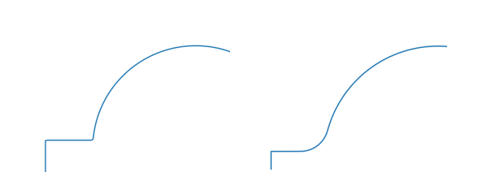

Geometry Parameterisation
-------------------------

For flexibility in design of certain shapes such as TF coils bluemira has some
parameterised shapes that can be used in isolation or as part of optimisation
routines.

Our currently available parameterisations are:

* :py:class:`bluemira.geometry.parameterisations.PrincetonD`
* :py:class:`bluemira.geometry.parameterisations.TripleArc`
* :py:class:`bluemira.geometry.parameterisations.SextupleArc`
* :py:class:`bluemira.geometry.parameterisations.PolySpline`
* :py:class:`bluemira.geometry.parameterisations.PictureFrame`

please click on the above classes to be taken to our API documentation of each class.

PrincetonD
^^^^^^^^^^

.. plot::
    :caption: Princeton D

    from bluemira.geometry.parameterisations import PrincetonD
    PrincetonD().plot(labels=True)

The famous PrincetonD only has a few customisations available the inside lim radius, x1,
the outer lim radius, x2, and the z offset, dz.

TripleArc
^^^^^^^^^

.. plot::
    :caption: Triple Arc

    from bluemira.geometry.parameterisations import TripleArc
    TripleArc().plot(labels=True)

The TripleArc has more customisations than show here including the length of inboard
straight section, sl, and the small and middle arc angles (a1 and a2). Please see the
API documentation for more information

SextupleArc
^^^^^^^^^^^

.. plot::
    :caption: Sextuple Arc

    from bluemira.geometry.parameterisations import SextupleArc
    SextupleArc().plot(labels=True)

The Sextuple are has the basic customisations as shown above along with the arc radii
(r1 - r5) and the arc angles (a1-a5).

Polyspline
^^^^^^^^^^

.. plot::
    :caption: Polyspline

    from bluemira.geometry.parameterisations import PolySpline
    PolySpline().plot(labels=True)

This is Simon McIntosh's Poly-Bézier-spline geometry parameterisation with 19 variables
please see the API documentation for all the variables.

PictureFrame
^^^^^^^^^^^^

.. plot::
    :caption: PictureFrame

    from bluemira.geometry.parameterisations import PictureFrame
    PictureFrame().plot(labels=True)

The PictureFrame parameterisation has the most customisation options. The classic
PictureFrame is shown above but there are further options. All the options can be
used together if desired. Engineering constraints will have to be
considered closely when taking these parameterisations further.

Tapered Inner Leg
"""""""""""""""""

.. plot::
    :caption: Tapered PictureFrame

    from bluemira.geometry.parameterisations import PictureFrame
    PictureFrame(inner="TAPERED_INNER").plot(labels=True)

The Tapered PictureFrame coil type is similar to a regular PictureFrame shaped TF coil
with the extra option of the inboard leg of the coil can have a taper.

The inboard leg can also be called the 'tapered centrepost' and is sometimes treated
as a separate entity from the rest of the TF coil.

The aim of a tapered centerpost is to reach the lowest aspect ratio possible, while
keeping a relatively low resistive heating value (heating is reduced with the
top/bottom coil legs having larger cross-sectional areas)

Other options also include rounded corners at the outboard leg. These are generally
driven by manufacturing constraints

These coils are also designed with Bucking Cylinders, flush with the inboard face of the
coil. The bucking cylinders aim to reduce the radial displacement generated by the
electromagnetic centering forces, therefore reducing the hoop forces in the coil.

Curved Top or Bottom Legs
"""""""""""""""""""""""""

.. plot::
    :caption: Curved PictureFrame

    from bluemira.geometry.parameterisations import PictureFrame
    PictureFrame(upper="CURVED", lower="FLAT").plot(labels=True)

The Curved Pictureframe (“CP”) shape is a variant of the regular Pictureframe
coils with either one or both of the top and bottom legs domed. This is mainly to make
room for a long-legged divertor, while keeping the PF coils as close as possible to the
plasma.

The parameterisation of the curve is dependent on a few factors.
The Chord height and length can be evaluated from the input parameters:

.. math::

    \alpha = tan^{-1}⁡ (0.5 w/h)

With the angle swept by the arc calculated as:

.. math::

    \theta = 2 (\pi - 2 \alpha)

And the radius:

.. math::

    r = 0.5 w/sin ⁡(\theta/2)

The resulting parameterisation can be seen below

.. plot:: geometry/semi_circle_chord.py main

    Chord Parameters

Top/Bottom Leg Domes:

For the top and bottom legs, first a ‘basic’ arc is defined as above, with the chord
height and width defined below as:

.. math::

    h = z - z_{peak}

    w = x2 - x3

This, alone, would result in a sharp corner between the straight portion at the inboard
side of the of the top/bottom leg and the curved section as show in
:numref:`fig:curve` (a).
A second curve must be defined to smooth out this corner , resulting in a smooth curve
as shown in :numref:`fig:curve` (b).

    Base Arc (a) Arc with transitioning (b)

Smoothing Curve:

To  define the smoothing curve a tangency condition is defined between the end point of the transitioning
curve and some point ‘A = (x_A, z_A)’ on the ‘basic’ Top/Bottom Leg arc. The basic curve is then ‘clipped’
so that it starts at ‘A’ instead of its original point, with the transitioning curve occupying the remaining
space. The radius of the joint curve must be set as an input.

The Joint Curve and Final Dome arc swept angles can therefore be defined:

.. math::

    \theta_j = cos^{-1} ⁡[(r_{leg} cos⁡ (0.5 \theta_{leg-basic} ) + r_j)/(r_{leg} + r_j )]

.. math::

    \theta_{leg-final} = \alpha_{leg} - (\theta_{leg-basic}/2 - \theta_j )

The above parameters define the CP coil loop. The innermost loop is then offset and built in accordance with
the TF coil build procedures.
