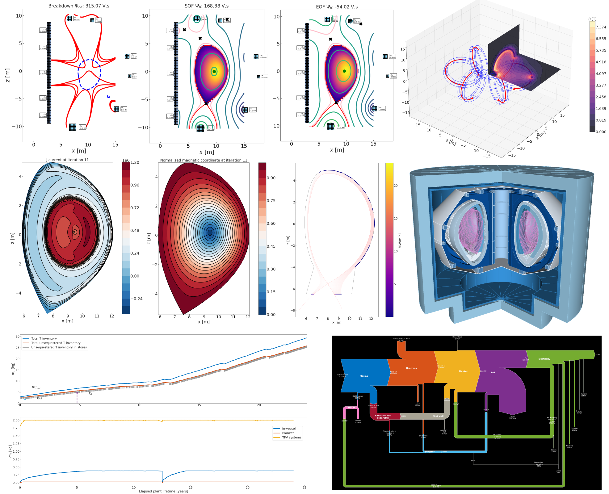

Welcome to bluemira's documentation!
=====================================

The documentation is divided into the following sections:

*  :ref:`getting-started`, where you can learn more about the code and how to install it
*  :ref:`bluemira-modules`, where you can learn more about the individual modules
*  :ref:`dev-docs`, where you can find the API reference, and more developer-focused documentation

.. toctree::
   :maxdepth: 1
   :caption: Getting started
   :name: getting-started

   Introduction <introduction>
   Installation <installation>
   Conventions <conventions>
   Examples <examples>

.. toctree::
   :maxdepth: 1
   :caption: Bluemira Modules
   :name: bluemira-modules

    Base <base/base>
    Balance of Plant <balance_of_plant/balance_of_plant>
    Interfaces to external codes <codes/codes>
    2-D fixed and free boundary equilibrium solvers <equilibria/equilibria>
    Fuel cycle model <fuel_cycle/fuel_cycle>
    Geometry module <geometry/geometry>
    Mesh modules <mesh/mesh>
    Magnetostatics <magnetostatics/magnetostatics>
    Materials <materials/materials>
    Optimisation <optimisation/optimisation>
    Radiation transport solvers <radiation_transport/radiation_transport>
    Structural module <structural/structural>
    Utilities <utilities/utilities>

.. toctree::
   :maxdepth: 1
   :caption: Developer Documentation
   :name: dev-docs

   Configuring SSH keys <developer/ssh>
   Logging customisation <developer/logging>
   Generating ParameterFrames <developer/gen_params>
   Module API Reference <autoapi/index>
   Release Workflow <developer/release_workflow>
   FAQs <developer/faq>
