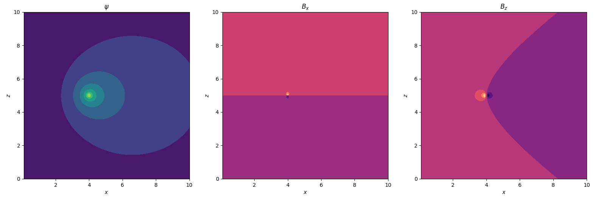
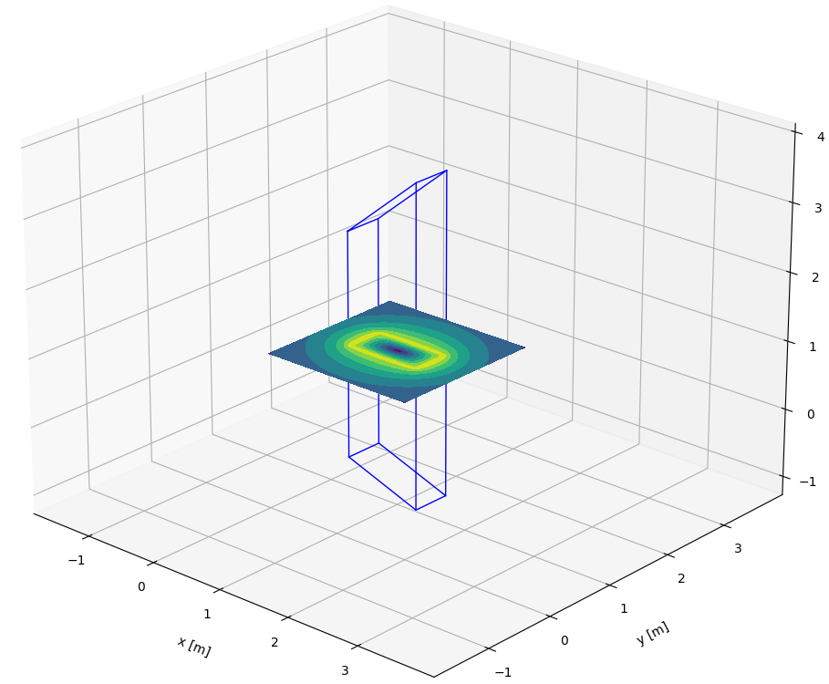
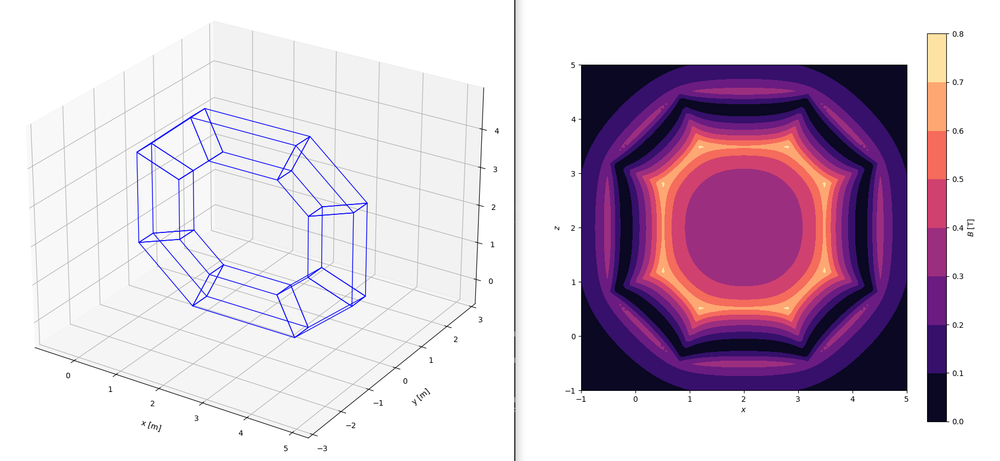
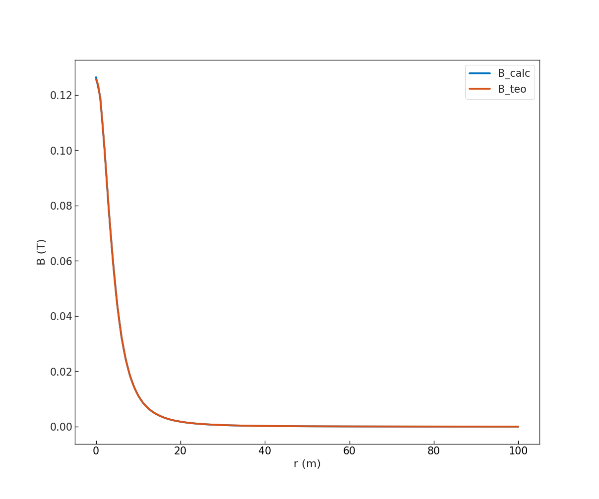

Magnetostatics
==============

A collection of analytical and semi-analytical calculation tools to evaluate magnetic
field from arbitrary coils.

2-D current sources
-------------------

The following relations are for circular current sources about the :math:`z`-axis.

Green's functions
#################

The Green’s functions for poloidal magnetic flux, radial magnetic field,
and vertical magnetic field at a point :math:`(x, z)` due to a unit
current source at point :math:`(x_c, z_c)`:

.. literalinclude:: doc_greens.py
    :language: python

To obtain the actual :math:`\psi`, :math:`B_x`, and :math:`B_z` in V.s / rad and T,
simply multiply the Green's functions by the current at the source point in Ampères.

.. Note::
    The above Green's functions are effectively for an infinitely thin filament and
    diverge logarithmically as the evaluation point approaches the source point.

.. Warning::
    The above Green's functions should only be used for :math:`x` > 0. Errors and
    garbage are to be expected for :math:`x` <= 0.

Semi-analytical functions
#########################

For a circular coil of rectangular cross-section, a semi-analytic reduction of the 3-D
Biot-Savart law is used, as developed by [Zhang_2012]_. Numerical integration is used in
one dimension, and some singularities in the equations are resolved numerically and
analytically.

.. literalinclude:: doc_semianalytic.py
    :language: python

.. figure:: pic_semianalytic.png
    :name: fig:semianalytic

.. Hint::
    The above semi-analytical functions are best used for points inside or near the
    current source. If you favour speed over accuracy, for points further away from the
    current source, you are better off using some quadratures of Green's functions.

3-D current sources
-------------------

Several options are available for calculating magnetic fields due to three-dimensional
current sources.

Biot-Savart
###########

The `Biot-Savart equation <https://en.wikipedia.org/wiki/Biot%E2%80%93Savart_law>`_
can be solved assuming the current sources are thin wires, as is done in the
``BiotSavartFilament`` object.

A ``radius`` argument can be specified, which makes use of a square decay law for values
inside the filament ``radius``. The field from a filament thus reaches a maximum at the
surface of the filament.

.. literalinclude:: doc_biotsavart.py
    :language: python

.. figure:: pic_biotsavart.png
    :name: fig:biotsavart

.. Note::
    The discretisation of geometry input should be carefully checked. In general, many
    points will give better approximations to long, thin wires.

Semi-analytical
###############

If the infinitely thin approximation is not appropriate for your use case, consider
using one of the ``RectangularCrossSectionCurrentSource`` objects.

Trapezoidal prisms
******************

A ``TrapezoidalPrismCurrentSource`` object is used for straight bars of uniform
current density, with taperings at either end. The magnetic field can be calculated at
any point, following equations described in [Babic_2005a]_ and [Babic_2005b]_.

.. literalinclude:: doc_trapezoidal.py
    :language: python

The tapering at either end of the current source is to facilitate treatment of
curvilinear circuits. As the tapering is only in one plane however, this treatment
is only directly applicable to planar curvilinear circuits.

The ``ArbitraryPlanarRectangularXSCircuit`` is a utility provided to enable the user to
easily set up a planar circuit with a rectangular cross-section using
``TrapezoidalPrismCurrentSource`` objects.

.. literalinclude:: doc_planar.py
    :language: python

Circular arcs
*************

A ``CircularArcCurrentSource`` object is used for circular arcs of uniform current
density. The magnetic field can be calculated at any point, following equations
described in [Feng_1985]_.

.. literalinclude:: doc_circular.py
    :language: python

.. figure:: pic_circular.png
    :name: fig:circular

Finite element
--------------

The implementation of the magnetostatic Finite Element solver is limited to
2D axially symmetric problems.
In such an approximation, the Maxwell equations, as function of the poloidal
magnetic flux (:math:`\Psi`), are reduced to the form ([Zohm_2015]_, page 25):

.. math::
    :label: strong_form

    r^2 \nabla\cdot\left(\frac{\nabla\Psi}{r^2}\right) = 2
    \pi r \mu_0 J_{\Phi}

whose weak formulation, considering null Dirichlet boundary conditions,
is defined as ([Villone_2013]_):

.. math::
    :label: weak_form

    \int_{D_p} {\frac{1}{r}}{\nabla}{\Psi}{\cdot}{\nabla} v \,dr\,dz = 2
    \pi \mu_0 \int_{D_p} J_{\Phi} v \,dr\,dz

where :math:`v` is the basis element function of the defined functional subspace
:math:`V`.

.. literalinclude:: doc_fem_single_coil.py
    :language: python

.. rubric:: References

.. [Zhang_2012] D. Zhang, C. S. Koh, An Efficient Semianalytic Computation Method of Magnetic Field for a Circular Coil With Rectangular Cross Section, IEEE Transactions on Magnetics, 2012, pp. 62-68
.. [Babic_2005a] S. Babic and C. Aykel, An improvement in the calculation of the magnetic field for an arbitrary geometry coil with rectangular cross section, International Journal of Numerical Modelling, Electronic Networks, Devices and Fields, 2005, vol. 18, pp. 493-504
.. [Babic_2005b] S. Babic and C. Aykel, An improvement in the calculation of the magnetic field for an arbitrary geometry coil with rectangular cross section - Erratum, International Journal of Numerical Modelling, Electronic Networks, Devices and Fields, 2005
.. [Feng_1985] Z. X. Feng, The treatment of singularities in calculation of magnetic field using integral method, IEEE Transactions on Magnetics, 1985, vol. 21
.. [Zohm_2015] H. Zohm, Magnetohydrodynamic Stability of Tokamaks, Wiley-VCH, Germany, 2015
.. [Villone_2013] VILLONE, F. et al. Plasma Phys. Control. Fusion 55 (2013) 095008, https://doi.org/10.1088/0741-3335/55/9/095008
