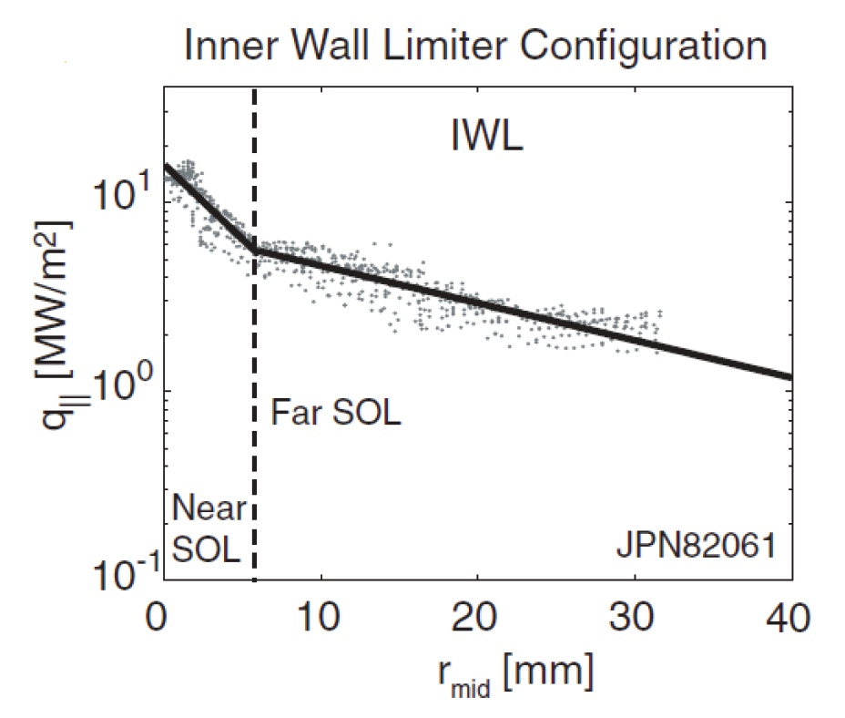
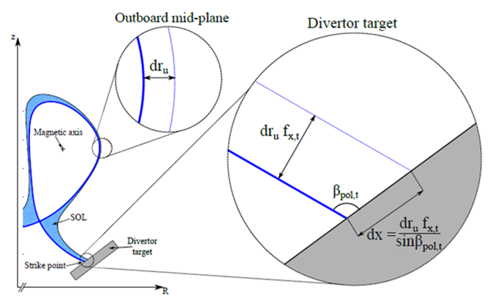

Advection transport
===================

To estimate the heat fluxes due to charged particles travelling along open field lines,
``bluemira`` has a very simple advection transport model, in which a double exponential
decay law is used to model the particles in the scrape-off layer. It assumes fully
attached operation, and as such results for the divertor regions in particular should be
ignored if detached operation is expected. The model is predominantly intended to be
used to calculate the charged particle heat fluxes on the first wall.

Heat Flux Model
---------------
A tokamak plasma can be seen as separated in two regions, the core and the
scrape-off layer (SOL).
The core-plasma is confined on nested closed flux surfaces. Of these closed surfaces,
the outermost is called Last Closed Flux Surface (LCFS).
The flux surfaces outside the LCFS belong to the SOL, they intersect the tokamak wall
and relevant field lines are open.
Collisional and turbulent processes lead the core plasma,
to diffuse and outflow into the SOL.
The model assumes the plasma to flow the magnetic flux
surfaces in the SOL, assuming the radial transport generated by drift and turbulence
is negligible in the far SOL.

Perpendicular and parallel transport in the SOL is introduced assuming an exponential
decay of plasma density and temperature moving away from the LCFS in the radial direction.

The exhaust power (:math:`P_{SOL}`) is assumed to enter the SOL at the Outboard
Mid-Plane (OMP - the subscript “u” is used for this location, meaning “upstream”)
and it separates into two flows, one towards the inner divertor, another to the
outer divertor.

.. figure:: SOL_power_sharing.png
   :name: fig:SOL_power_sharing
   :align: center

   Schematic of the model for the SOL power sharing between inner and outer divertors. Illustrated, as an example, a LFS Snowflake Minus divertor.

The heat flux along the field lines in the SOL is usually assumed to decay
exponentially with the distance from the LCFS at the OMP, :math:`r_u`:

.. math::

   q_{\parallel}(r_u) = q_{\parallel,0}e^{-r_u/\lambda_q}

Where :math:`q_{\parallel,0}` is the flux at the separatrix, and :math:`\lambda_q`
is the heatflux decay length in the SOL.

To be more precise, the SOL exhibits two different regions [Nespoli_2017]_:

- A “near” SOL, extending a few mm from the LCFS, characterized by a steep profile of :math:`q_{\parallel}`
  and responsible for the peak heat loads in the divertor region;
- A “far” SOL, typically some cm wide, with a flatter profile of :math:`q_{\parallel}`
  and responsible for most of the heat deposited onto the first wall.

   Parallel heat flux radial profile in JET.

The parallel heat flux radial profile :math:`q_{\parallel}` is then better described by a sum of two
exponentials, associated with the two different regions:

.. math::

   q_{\parallel}(r_u) = q_{n}e^{-r_u/\lambda_{q, near}} + q_{f}e^{-r_u/\lambda_{q, far}}

Where :math:`\lambda_n` and :math:`\lambda_f` are the near and far SOL decay lengths and :math:`q_n` and :math:`q_f`
are the associated heat flux magnitudes.

According to the above expression, the code calculates the radial profile of the
poloidal component of the heat flux at the OMP, assuming :math:`P_{SOL}` distributed
between near and far scrape off layer:

.. math::

   q_{p,u}(r_u) = \dfrac{P_{SOL,n}e^{-r_u/\lambda_n}}{2 \pi R(r_u)\lambda_n} + \dfrac{P_{SOL,f}e^{-r_u/\lambda_f}}{2 \pi R(r_u)\lambda_f}

At the OMP, the heat flux parallel to the magnetic field :math:`q_{\parallel,u}` and parallel to
the poloidal component of the field :math:`q_{p,u}` are related by :math:`q_{\parallel,u} = q_{p,u}(B_{tot,u}/B_{p,u)}`.

To compute the heat flux at the target location, one must consider that each poloidal
flux surface has a “width”, evaluated at the outboard mid-plane and indicated here as :math:`dr_u` [Maurizio_2020]_.

   Description of the SOL scalar coordinate :math:`dr_{u}` , defined at the outboard mid-plane,
   and its relation to the SOL scalar coordinate dx, defined at the divertor target.

Such flux surface width varies when moving poloidally around the confined plasma or along
the divertor leg. The ratio of the width at the target and at the OMP
is called target poloidal flux expansion.

.. math::

   f_{x,t} = \dfrac{dr_t}{dr_u} = \dfrac{R_{u}B_{p,u}}{R_{t}B_{p,t}}

Where :math:`R_u` and :math:`B_{p,u}` are major radius and poloidal magnetic field at the outboard midplane,
and :math:`R_t` and :math:`B_{p,t}` are major radius and poloidal magnetic field at the target.

Since the power entering a flux tube at the OMP location is equal to the power that exits
the same flux tube at the target, :math:`2\pi R_{u} dr_{u} q_{p,u} = 2\pi R_{t} dr_{u} f_{x,t} q_{p,t}`
the poloidal heat flux component at the target can be calculated as:

.. math::

   q_{p,t} = q_{p,u}\frac{R_u}{R_t}\frac{1}{f_{x,t}}

From the poloidal component, at the target, the perpendicular heat flux component is calculated
considering the angle between flux surface and target surface:

.. math::

   q_{\perp,𝑡} = q_{p,t}sin\beta_t

.. rubric:: References

.. [Nespoli_2017] NESPOLI, Federico. Scrape-Off Layer physics in limited plasmas in TCV. s.l.: EPFL, 2017

.. [Maurizio_2020] MAURIZIO, Roberto. Investigating Scrape-Off Layer transport in alternative divertor geometries on the TCV tokamak. s.l.: EPFL, 2020.

In practice
-----------

Two input objects are required to perform the analysis:

* an Equilibrium object, representing the equilibrium state of the plasma and the associated coils
* a geometry object, representing the first wall (i.e. all potentially flux-intercepting surfaces).
  The geometry must be closed.

See the example: :doc:`../examples/radiation_transport/heat_flux_calculation`.
