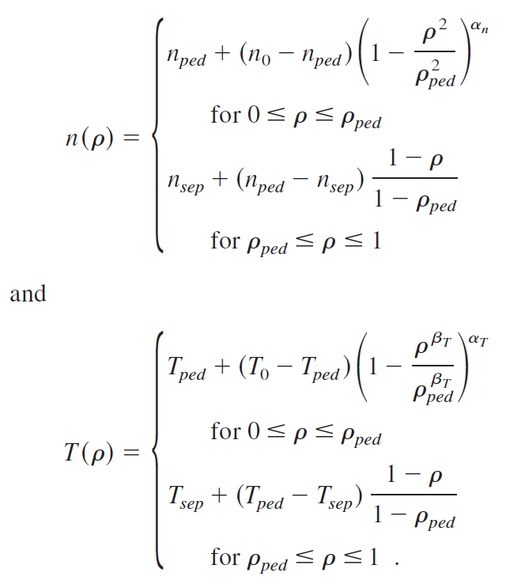
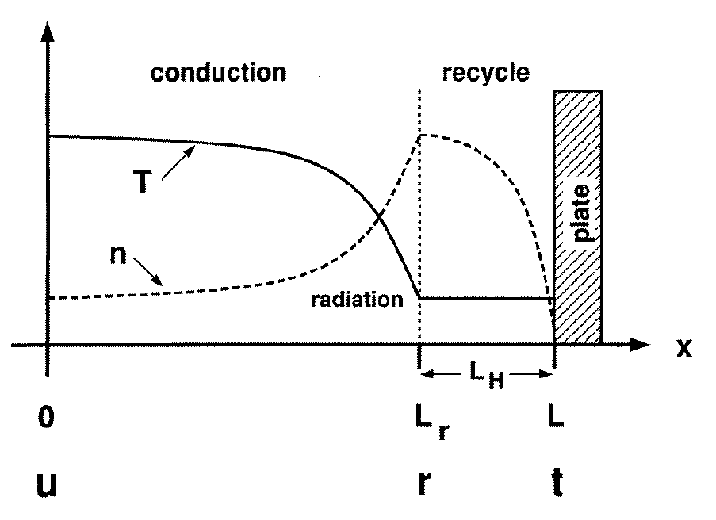
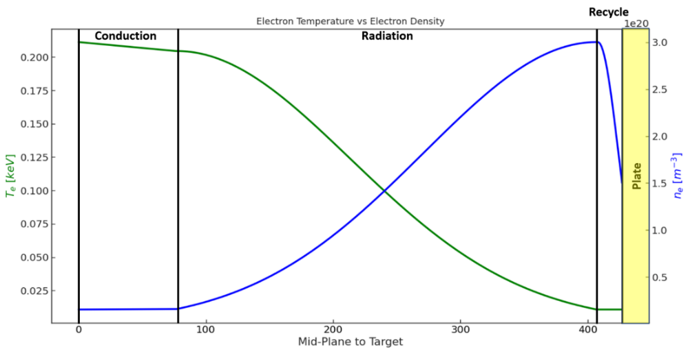
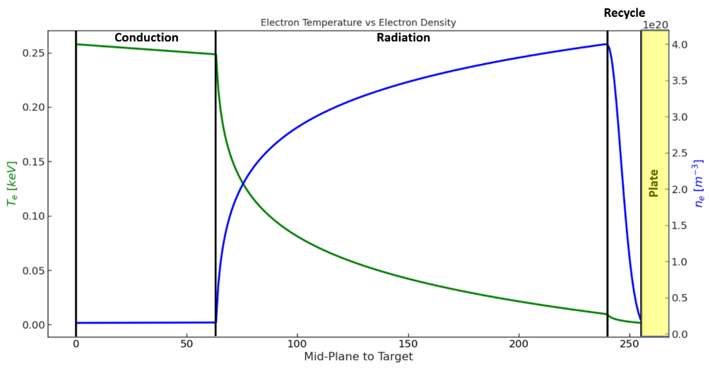

Radiation
=========

To calculate the radiation source, ``bluemira`` has a model, in which the power exhausted
within the core plasma is accounted using a simple model for the radial energy transport
at the plasma edge [Post_1995]_:

.. math::

   Q_{\perp} = -k \frac{\partial T}{\partial r} \Rightarrow \frac{\partial Q_{\perp}}{\partial r} = -n_{e} n_{z} L_{z}(T_{e})

where *k* is the heat conductivity, *r* is the radial coordinate, :math:`n_{e}` is the electron
density, :math:`n_{z}` is the density of the impurity ion, :math:`L_{z}` is the radiative power loss
function.

For the SOL, where the parallel heat conduction is dominant over the radial transport,
the equation becomes:

.. math::

   \frac{\partial Q_{\parallel}}{\partial x} = -n_{e} n_{z} L_{z}(T_{e})

where *x* is here the parallel coordinate.

Finally, the radiation source calculation relies on the assessment of temperature and density.

Core Radiation Model
--------------------
The core radiation is based on the mid-plane values of electron temperature and
electron density. Ideally, these values can be provided in form of array.
Additionally, ``bluemira`` has a model to calculate temperature and density based on
[Kovari_2014]_.

where subscripts *0*, *ped* and *sep*, denote values at the centre :math:`(\rho = 0)`,
the pedestal :math:`(\rho = \rho_{ped})` and the separatrix :math:`(\rho = 1)`, respectively.
:math:`\rho` is the nondimensional radial coordinate, here expressed as function of the
normalised poloidal flux, and approximated as :math:`\rho = \sqrt{\psi_{N}}`.
The density and temperature peaking parameters :math:`\alpha_{n}` and :math:`\alpha_{T}` and
the second exponent :math:`\beta_{T}` can be chosen by the user.

The radiation per unit volume is calculated using radiative power loss functions calculated
from quantum mechanics codes and tabulated in the *Atomic Data and Analysis Structure*
(ADAS) database. For each impurity, the total power lost per unit volume by all
line-radiation processes (including bremsstrahlung) is given by [Johner_2011]_:

.. math::

   \frac{dP_{line,Imp}}{dV} = -n_{Imp} n_{e} P_{line-LF,Imp}(n_{e},T_{e})

where :math:`n_{Imp}` is the density of the impurity ion and :math:`f_{Imp}` is the
impurity fraction, defined as :math:`f_{Imp} = n_{Imp}/n_{e}`. :math:`P_{line-LF,Imp}`
is the mentioned radiative power loss function, and it has a weak dependence from electron
density.

For a given set of impurities and relevant impurity contents, the model can output the
radiation per unit volume associated to each specie, as well as the total radiation value.
Giving a set of closed flux surfaces, a 2-D radiation source map is produced
(R, z coordinates) assuming constant electron density and electron temperature along the
flux surfaces.

Scrape-off Layer radiation model
--------------------------------
To calculate the Scrape-off Layer (SoL) radiation source, the model is inspired by the
*Two Point Model* [Stangeby_2000]_ and its application in [Pitcher_1997]_. The model proposed
by Pitcher assumes that the divertor acts as sinks for energy, momentum and charged particles.
The energy sink is primarily related to line radiation from fuel species and seeded impurities,
the momentum loss comes from the friction between plasma ions and neutrals (i.e. charge-exchange
and elastic scattering), and the charged particle sink is associated to the recombination at
the target plate. Thus, it is possible to distinguish two regions: The *conduction* region,
covering most part of the SoL, that contains no particle sink and in which heat is only
volumetrically dissipated through impurity radiation and added throuh cross-field effects.
The *recycle* region, generally localized near the divertor targets where most of the particle,
heat and momentum sink and sources appears. In the recycling region the temperature can be assumed
constant, due to strong parallel convection. This assumes that volumetric energy losses are
relatively small. Assumption which may drop in reality, especially at low divertor temperatures.

   Schematic proposed by Pitcher of the two-point model. In a flux tube a conduction
   and recycling region can be identified. *u*: upstream; *r*: recycling region entrance; *t*: target plate.

The model in ``bluemira`` follows Pitcher's model and adds a fourth key location point,
the start of the radiation region, to enhance the flexibility. Density and temperature parallel
profiles are interpolated through these key location points for every SOL flux surface.

.. figure:: T_drop_det.PNG
   :scale: 40 %
   :name: fig:T_drop_det
   :align: center

   Schematic adapted from Pitcher, displaying the four key locations where local values of temperature
   and density need to be calculated.

At the separatrix, the key location values of temperature and density are defined as follow.

The **upstream** is usually taken at the mid-plane, where most of the power is assumed to enter the SOL.
The upstream density is a required external input, while the upstream temperature is calculated in the
hypothesis of conduction-limited regime, with the power purely conducted out of the main plasma.
Calculating the temperature as function of the parallel distance, and assuming a significant temperature
drop along the SOL, the local upstream value is calculaed as [Stangeby_2000]_:

.. math::

   T_u \simeq  \left( \frac{7}{2} \frac{\left(\frac{P_{SOL}}{A_{q \parallel}}\right)L}{k_0} \right) ^{2/7}

where :math:`k_0` is the heat parallel conductivity, :math:`ds_{\parallel}` is the parallel
distance along the SOL, *L* is the total parallel distance from the upstream to the target,
:math:`P_{SOL}` is the power entering at the upstream, :math:`A_{q \parallel}`
is the cross-sectional area of the SOL for power flow.

The **radiation region** starts above the X-point, as most of the radiative loss occurs near the divertor,
due to the steep parallel temperature gradients [Pitcher_1997]_. In ``Bluemira``, the actual position is
a user choice. The temperature decay stops at the entrance to recycling region. As for the upstream
temperature, the temperature at the start of the radiation region is calculated as function of the
parallel distance:

.. math::

   T_{rad,in} = \left[ T_u^{7/2} - \frac{7}{2} q_{\parallel} \frac{L_{rad,in}}{k_0} \right] ^{2/7}

where :math:`L_{rad,in}` is the poloidal distance between the upstream and the start of the radiation region.

Assuming no friction losses between the upstream and the start of the radiation region, and introducing
the local temperature-gradient factor as :math:`f_T \equiv T_u / T_{rad,in}`, the density at the start
of the radiation region is calculated assuming constant total pressure and Mach = 0.

.. math::

   n_{rad,in} = n_u f_T

The **recycling region** power loss is below the X-point. Here, the temperature is calculated using the
extended two-point model, which includes the hydrogen recycle loss energy, by invoking the upstream
forcing function, :math:`F_u` [Stangeby_2000]_.

.. math::

   T_{Fu} = F_u \left( 1+ \frac{\epsilon / \gamma}{T_{Fu}} \right)^{-2}

where :math:`\epsilon` is the electron cooling energy per ionization event, and :math:`\gamma` is the
sheath transmission coefficient. :math:`\epsilon` is a function of :math:`(T_e, n_e)`, but as
approximation it can be taken constant, and equal to 25 eV.

As the model neglects physical processes such as power transfer to neutrals, volume recombination,
and hydrogen molecular processes, the value :math:`F_u=14.3eV` is regime limit. The corresponding
temperature is :math:`T_{Fu} = T_{Fu}^{crit} = \epsilon / \gamma \approx 3.57eV`.
Therefore, the recycling region starts with a temperature assigned as:

.. math::

   T_{recycling} = \begin{cases}
   T_{Fu} &\text{if $F_u > F_u^{min}$}\\
   3.57eV &\text{if $F_u < F_u^{min}$}
   \end{cases}

The density is calculated considering the local temperature-gradient factor, :math:`f_T \equiv T_u/T_{recycling}`:

.. math::
   n_{recycling} = n_u f_T

At the **target location**, for sufficiently high temperature (:math:`T_t > 10eV`), friction processes
can be neglected. Thus, the fractional loss of pressure due to friction, :math:`f_m`, is assumed to be 1.
On the other hand, for temperatures lower than 10 eV, detachment conditions occur. In this condition,
:math:`f_m` is assigned to be 0.1, and the target temperature 1.5 eV.
Following the calculated temperature at the recycling region start (:math:`T_{recycling}`), target
temperature and target density are assigned as:

.. math::

   T_t = \begin{cases}
   T_{recycling} &\text{if $T_{recycling} > 10eV$}\\
   1.5eV &\text{if $T_{recycling} < 10eV$}
   \end{cases}

and

.. math::

   n_t = \begin{cases}
   1 \cdot n_{recycling}/2 &\text{if $T_{recycling} > 10eV$}\\
   n_t = 0.1 \cdot n_{recycling}/2 &\text{if $T_{recycling} < 10eV$}
   \end{cases}

Having calculated the four key density and temperature values in proximity of the separatrix,
the same parameters are calculated for each SOL flux surface applying a radial exponential decay,
with temperature decay length and density decay length proportional to the power decay length.
For the conduction limited regime, the relations are [Stangeby_2000]_:

.. math::
   \lambda_{q_{\parallel}} = \frac{2}{7} \lambda_T

and,

.. math::
   T(r) = T_0 e^{(-r/\lambda_T)}
.. math::
   n(r) = n_0 e^{(-r/\lambda_n)}

Once defined the key location values of electron temperature and electron density
for every SOL flux surface, the poloidal profiles are defined by interpolation.
In the :math:`recycle` region, if :math:`T_{recycling} > 10eV`,
the electron temperature remains constant, and the electron density drop is weaker.

   In case of :math:`T_{recycling} > 10eV`, the temperature within the recycle
   region remains constant, and the density drop is less strong.

In contrast, if :math:`T_{recycling} < 10eV`, the electron temperature drops,
and the electron density drop is larger.

   The exponential profile makes the temperature decay and density increase faster.

As final result, each point of each SOL flux surface is assigned with an electron
temperature value and an electron density value. Having access to an atomic database
for impurities (e.g., ADAS) for the radiative power loss rates, it is possible to
calculate the 2-D distribution of the total radiated power density :math:`[MW/m^3]`.

.. rubric:: References

.. [Post_1995] Post et al., Physics of Plasmas 2, 2328-2336 (1995).
.. [Kovari_2014] Kovari et al., Fusion Engineering and Design 89.12 (2014): 3054-3069.
.. [Johner_2011] Johner., Fusion Science and Technology 59.2 (2011): 308-349
.. [Stangeby_2000] Stangeby, The plasma boundary of magnetic fusion devices. Vol.224.
   Philadelphia, Pennsylvania: Institute of Physics Pub., 2000
.. [Pitcher_1997] Pitcher et al., Plasma Physics and Controlled Fusion 39.6 (1997): 779.
