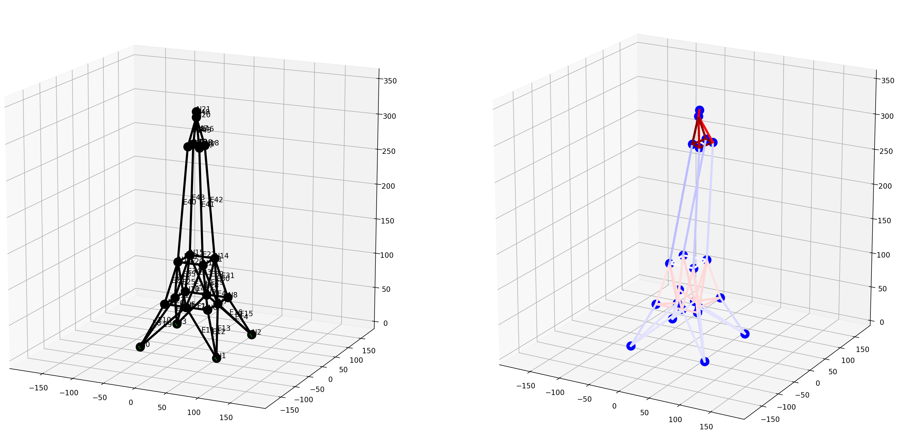
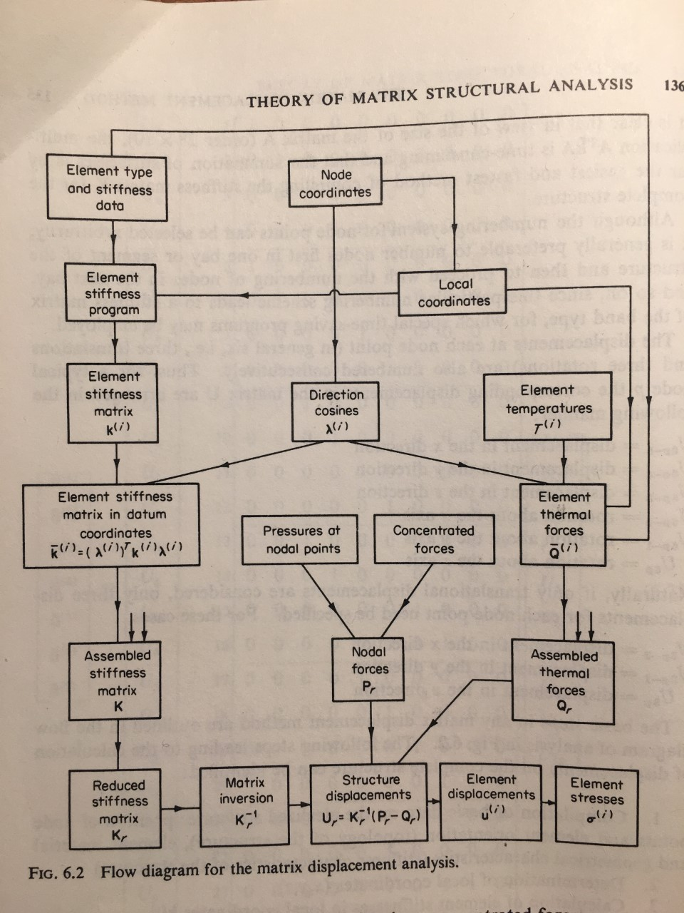
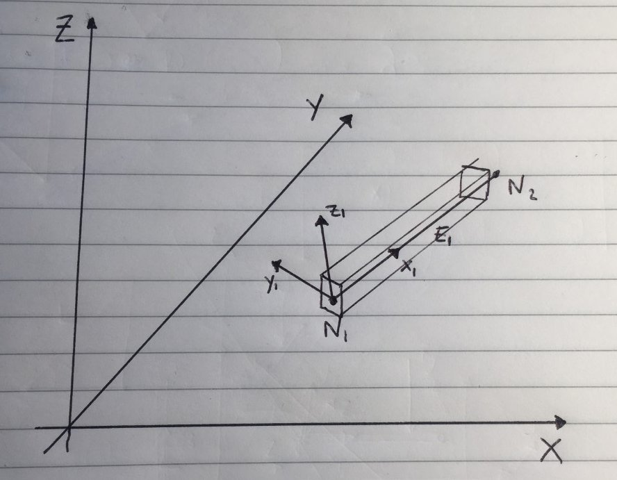

structural
==========

This module is a simple 3-D beam finite element model, based on the
“Matrix Displacement Method” a.k.a. “Direct Stiffness Method”. It is
suitable for statically indeterminate structures. The notation used in
this module follows the Theory of Matrix Structural Analysis, (mostly
Chapter 6).

J. S. Przemieniecki: Theory of Matrix Structural Analysis (1968), ISBN 13: 9780070509047,
which actually made that structural matrix course I failed in university
look like it might make sense when using computers.

“Craig” a.k.a. JWock82 (`PyNite <https://github.com/JWock82/PyNite>`_) and Runar Tenfjord a.k.a. tenko
(`feapy <https://github.com/tenko/feapy>`_) whose modules were
useful examples at the time, if not quite what I was looking for.

Overview
--------

The general idea is:

.. math:: \mathbf{U} = \mathbf{K^{-1}}(\mathbf{P}-\mathbf{Q})

where:

- :math:`\mathbf{U}` is the vector of displacements
- :math:`\mathbf{K}` is the global stiffness matrix
- :math:`\mathbf{P}` is the vector of nodal forces
- :math:`\mathbf{Q}` is the vector of thermal and distributed forces mapped to the nodes

The structure of the module aims to follow closely the flow diagram in
the Theory of Matrix Structural Analysis:

Coordinates
-----------

Global x, y, z coordinates are used as in the :ref:`rest of the code base <global_coordinates>`:

Element local coordinates
~~~~~~~~~~~~~~~~~~~~~~~~~

Here, local x, y, z coordinates are as follows:

Note that the handed-ness of the coordinate system is the same as the
global one, and does not follow a conventional structural analysis
coordinate system for the directions of the y and z axes (which are
typically inverted, or named z and x, respectively).
