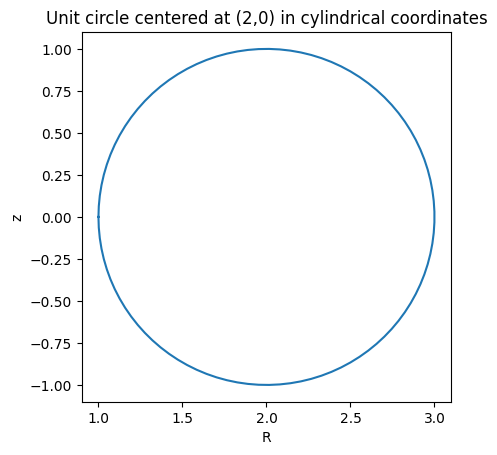
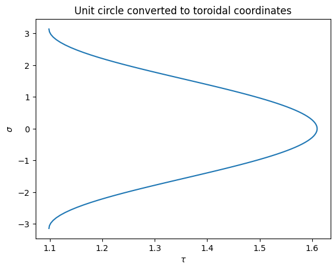
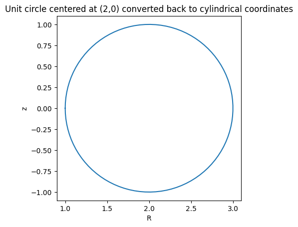
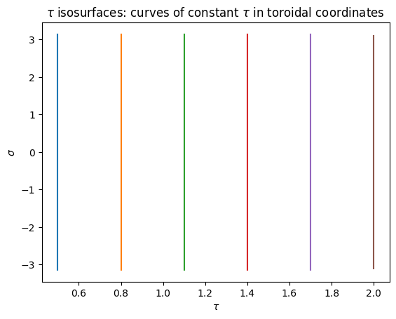
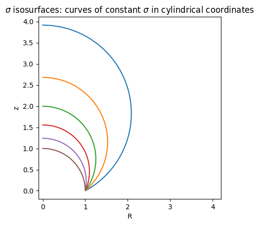
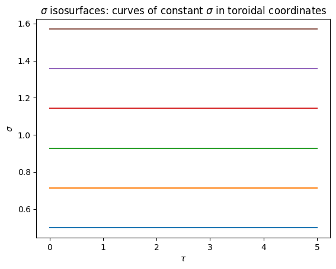

utilities
=========

Example of toroidal coordinate transform
----------------------------------------

Demonstrate  the conversion between cylindrical and toroidal coordinate systems
using the Bluemira functions `cylindrical_to_toroidal` and `toroidal_to_cylindrical`. We denote toroidal coordinates by (:math:`\tau`, :math:`\sigma`, :math:`\phi`) and cylindrical coordinates by (:math:`R`, :math:`z`, :math:`\phi`).

Imports
    .. code-block:: python

        import matplotlib.pyplot as plt
        import numpy as np

        from bluemira.utilities.tools import (
            cylindrical_to_toroidal,
            toroidal_to_cylindrical,
        )

.. figure:: images/toroidal-coordinates-diagram-wolfram.png
    :name: fig:toroidal-coordinates-diagram-wolfram

This diagram is taken from
`Wolfram MathWorld <https://mathworld.wolfram.com/ToroidalCoordinates.html>`_ and shows a
toroidal coordinate system. It uses (:math:`u`, :math:`v`, :math:`\phi`) whereas we use (:math:`\tau`, :math:`\sigma`,
:math:`\phi`).

In toroidal coordinates, surfaces of constant :math:`\tau` are non-intersecting tori of
different radii, and surfaces of constant :math:`\sigma` are non-concentric spheres of
different radii which intersect the focal ring.

We are working in the poloidal plane, so we set :math:`\phi = 0`, and so are looking at a
bipolar coordinate system. We are transforming about a focus :math:`(R_0, z_0)` in the
poloidal plane.

Here, curves of constant :math:`\tau` are non-intersecting circles of different radii that
surround the focus and curves of constant :math:`\sigma` are non-concentric circles
which intersect at the focus.

To transform from toroidal coordinates to cylindrical coordinates about the focus in
the poloidal plant :math:`(R_0, z_0)`, we have the following relations:

.. math::
    R = R_0 \frac{\sinh\tau}{\cosh\tau - \cos\sigma}\\
    z - z_0 = R_0 \frac{\sin\tau}{\cosh\tau - \cos\sigma}

where we have :math:`0 \le \tau < \infty` and :math:`-\pi < \sigma \le \pi`.

The inverse transformations are given by:

.. math::
    \tau = \ln \frac{d_1}{d_2}

.. math::
    \sigma = \text{sign}(z - z_0) \arccos \frac{d_1^2 + d_2^2 - 4 R_0^2}{2 d_1 d_2}

where we have

.. math::
    d_1^2 = (R + R_0)^2 + (z - z_0)^2\\
    d_2^2 = (R - R_0)^2 + (z - z_0)^2

Converting a unit circle
------------------------
We will start with an example of converting a unit circle in cylindrical coordinates to
toroidal coordinates and then converting back to cylindrical using the Bluemira functions `cylindrical_to_toroidal` and `toroidal_to_cylindrical`.
This unit circle is centered at the point (2,0) in the poloidal plane.

Original circle:

    .. code-block:: python

        theta = np.linspace(-np.pi, np.pi, 100)
        x = 2 + np.cos(theta)
        y = np.sin(theta)
        plt.plot(x, y)
        plt.title("Unit circle centered at (2,0) in cylindrical coordinates")
        plt.xlabel("R")
        plt.ylabel("z")
        plt.axis("square")
        plt.show()

Convert this circle to toroidal coordinates:

    .. code-block:: python

        tau, sigma = cylindrical_to_toroidal(R=x, R_0=2, Z=y, z_0=0)
        plt.plot(tau, sigma)
        plt.title("Unit circle converted to toroidal coordinates")
        plt.xlabel(r"$\tau$")
        plt.ylabel(r"$\sigma$")
        plt.show()

Convert this back to cylindrical coordinates to recover the original unit circle centered at (2,0) in the poloidal plane:

    .. code-block:: python

        rs, zs = toroidal_to_cylindrical(R_0=2, z_0=0, tau=tau, sigma=sigma)
        plt.plot(rs, zs)
        plt.title("Unit circle centered at (2,0) converted back to cylindrical coordinates")
        plt.xlabel("R")
        plt.ylabel("z")
        plt.axis("square")

Curves of constant :math:`\tau` and :math:`\sigma`
--------------------------------------------------
When plotting in cylindrical coordinates, curves of constant :math:`\tau` correspond to
non-intersecting circles that surround the focus :math:`(R_0, z_0)`, and curves of constant
:math:`\sigma` correspond to non-concentric circles that intersect at the focus.

1. Curves of constant :math:`\tau` plotted in both cylindrical and toroidal coordinates

Set the focus point to be :math:`(R_0, z_0) = (1,0)`. We plot 6 curves of constant :math:`\tau` in cylindrical coordinates

    .. code-block:: python

        # Define the focus point
        R_0 = 1
        z_0 = 0

        # Create array of 6 tau values, 6 curves of constant tau will be plotted
        tau = np.linspace(0.5, 2, 6)
        sigma = np.linspace(-np.pi, np.pi, 200)

        rlist = []
        zlist = []
        # Plot the curve in cylindrical coordinates for each constant value of tau
        for t in tau:
            rs, zs = toroidal_to_cylindrical(R_0=R_0, z_0=z_0, sigma=sigma, tau=t)
            rlist.append(rs)
            zlist.append(zs)
            plt.plot(rs, zs)

        plt.axis("square")
        plt.xlabel("R")
        plt.ylabel("z")
        plt.title(r"$\tau$ isosurfaces: curves of constant $\tau$ in cylindrical coordinates")
        plt.show()

.. figure:: images/constant-tau-cylindrical.png
    :name: fig:constant-tau-cylindrical

Now convert to toroidal coordinates using `cylindrical_to_toroidal` and plot - here curves of constant :math:`\tau` are straight lines

    .. code-block:: python

        taulist = []
        sigmalist = []
        for i in range(len(rlist)):
            tau, sigma = cylindrical_to_toroidal(R_0=R_0, z_0=z_0, R=rlist[i], Z=zlist[i])
            taulist.append(tau)
            sigmalist.append(sigma)
            plt.plot(tau, sigma)

        plt.xlabel(r"$\tau$")
        plt.ylabel(r"$\sigma$")
        plt.title(r"$\tau$ isosurfaces: curves of constant $\tau$ in toroidal coordinates")
        plt.show()

2. Curves of constant :math:`\sigma` plotted in both cylindrical and toroidal coordinates:

Set the focus point to be :math:`(R_0, z_0) = (1,0)`. We plot 6 curves of constant :math:`\sigma` in cylindrical coordinates

    .. code-block:: python

        # Define the focus point
        R_0 = 1
        z_0 = 0

        # Create array of 6 sigma values, 6 curves of constant sigma will be plotted
        sigma = np.linspace(0.5, np.pi / 2, 6)
        tau = np.linspace(0, 5, 200)

        rlist = []
        zlist = []
        # Plot the curve in cylindrical coordinates for each constant value of sigma
        for s in sigma:
            rs, zs = toroidal_to_cylindrical(R_0=R_0, z_0=z_0, sigma=s, tau=tau)
            rlist.append(rs)
            zlist.append(zs)
            plt.plot(rs, zs)

        plt.axis("square")
        plt.xlabel("R")
        plt.ylabel("z")
        plt.title(
            r"$\sigma$ isosurfaces: curves of constant $\sigma$ in cylindrical coordinates"
        )
        plt.show()

Now convert to toroidal coordinates using `cylindrical_to_toroidal` and plot - here curves of constant :math:`\sigma` are straight lines

    .. code-block:: python

        taulist = []
        sigmalist = []
        for i in range(len(rlist)):
            tau, sigma = cylindrical_to_toroidal(R_0=R_0, z_0=z_0, R=rlist[i], Z=zlist[i])
            taulist.append(tau)
            sigmalist.append(sigma)
            plt.plot(tau, sigma)

        plt.xlabel(r"$\tau$")
        plt.ylabel(r"$\sigma$")
        plt.title(r"$\sigma$ isosurfaces: curves of constant $\sigma$ in toroidal coordinates")
        plt.show()

